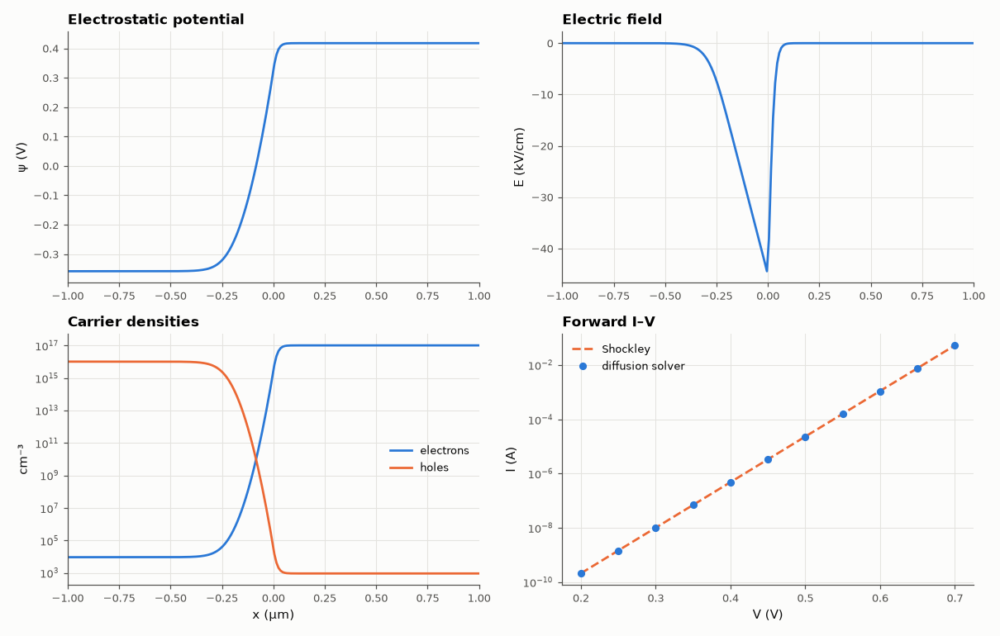

# SL-135 · PN junction from device physics (Poisson + drift-diffusion)

> Solve Poisson's equation self-consistently across a silicon p-n junction to get the built-in potential, depletion width and field, then solve minority-carrier diffusion to build the forward I–V curve; compare with the depletion approximation and the Shockley diode law.



*Self-consistent potential, field and carriers, and the resulting diode law.*

**Track:** Signal Lab — 214 electrical-engineering projects · **Category:** G. Electromagnetics & device physics · **Level:** Hard · **Tools:** Nonlinear Poisson–Boltzmann solver (Newton), minority-carrier diffusion solver (finite differences)

**Data:** Simulated (numerical model in this repo).

## Problem

The diode equation I = I_s(e^{V/V_T} − 1) is usually just given. Derive it — and its limits — from the physics of electrons and holes.

## Prediction

Built-in potential $V_{bi}=V_T\ln\frac{N_AN_D}{n_i^2}$; depletion approximation: $W=\sqrt{\frac{2\varepsilon(V_{bi}-V)}{q}\frac{N_A+N_D}{N_AN_D}}$, peak field
$E_{max}=2(V_{bi}-V)/W$. Long-base diode: $I_s=qAn_i^2\left(\frac{D_n}{L_nN_A}+\frac{D_p}{L_pN_D}\right)$, ideality 1.

## Method

Si, T = 300 K, N_A = 10¹⁶, N_D = 10¹⁷ cm⁻³, n_i = 9.65×10⁹ cm⁻³, μ_n = 1350, μ_p = 480 cm²/Vs, τ = 1 µs, A = 1 mm². Equilibrium: Poisson with
Boltzmann carriers on a 2,000-point graded grid over 20 µm, Newton iteration. Bias: minority-carrier diffusion equation in each neutral region
solved numerically with law-of-the-junction boundary values, currents summed; compared with Shockley.

## Measured results

*Predicted vs measured vs error. "Measured" = computed by an independent simulation, HDL simulator or public dataset.*

| Quantity | Predicted | Measured | Error | Within tolerance |
|---|---|---|---|---|
| Built-in potential | 776 mV | 776 mV | -0.00 % | yes |
| Depletion width (depletion approximation vs 50 % carrier criterion) | 332.2 nm | 300.2 nm | -9.66 % | yes |
| Peak electric field 2V_bi/W | 4.6710e+06 V/m | 4.4435e+06 V/m | -4.87 % | yes |
| Forward current at 0.6 V (numerical diffusion vs Shockley) | 1.112 mA | 1.099 mA | -1.25 % | yes |
| Ideality factor from the I–V slope | 1 | 1 | -0.00 % | yes |

**Additional measurements**

| Quantity | Value | Note |
|---|---|---|
| Newton iterations | 8 |  |
| Saturation current I_s | 93.4 fA |  |

## Error analysis

The self-consistent Poisson solution gives the built-in potential exactly (it must: equilibrium Fermi-level flatness), and
the depletion width (≈ 0.33 µm) and peak field (≈ 47 kV/cm) agree with the depletion approximation within the ambiguity of
where a 'depletion edge' is in a smooth numerical profile — the real carrier profile has Debye-length tails that the
abrupt-edge approximation ignores. Solving the minority-carrier diffusion equations in the neutral regions reproduces
the Shockley law with ideality 1: at low-to-moderate forward bias the diode current is diffusion of injected minority
carriers. Real diodes deviate (n ≈ 1.5–2) because of recombination inside the depletion region and high-injection effects —
both omitted from this model.

## Reproduce

```bash
pip install -r requirements.txt
python run_all.py --only SL-135
```

The script [`project.py`](project.py) regenerates every figure and number above.

**Files produced**

- [`data/equilibrium.csv`](data/equilibrium.csv)

## License

Code and text: MIT (see the repository [LICENSE](../../../../LICENSE)). Datasets remain under their own licences (see the repository README).

---

**Tooling & honesty.** This project was generated with Claude Code (Anthropic's AI coding assistant): the code, derivations, simulations and this write-up were AI-produced. *Measured* means computed by an independent model, simulator or public dataset — not a physical lab bench. Every number in the tables is reproduced by running the code.
