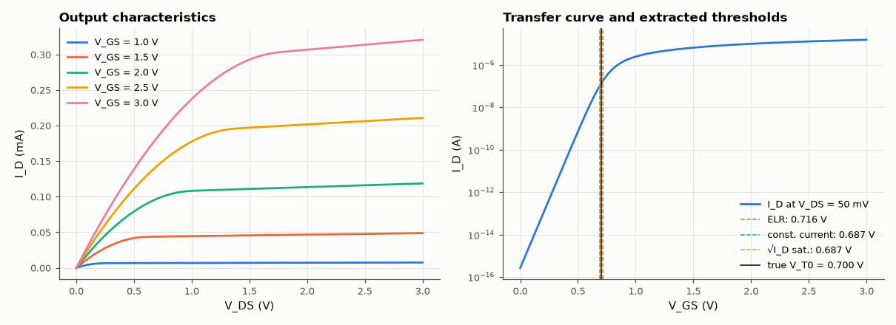

# SL-136 · MOSFET I–V families and threshold-voltage extraction

> Generate I_D–V_GS and I_D–V_DS families from a physics-based model with known parameters, then extract the threshold voltage by linear extrapolation, constant-current and gm-maximum methods — and see how each method's answer differs from the true V_T0.



*Three standard extraction methods give three different 'thresholds' for the same device.*

**Track:** Signal Lab — 214 electrical-engineering projects · **Category:** G. Electromagnetics & device physics · **Level:** Hard · **Tools:** Physics-based long-channel MOSFET model (EKV-style charge interpolation, mobility degradation, CLM) + standard extraction methods

**Data:** Simulated (numerical model in this repo).

## Problem

Datasheets quote 'the' threshold voltage, but there are several ways to extract it. How do they compare when the true value is known?

## Prediction

Square-law: $I_D=\frac{\mu C_{ox}W}{2L}(V_{GS}-V_T)^2$ (saturation), $I_D=\mu C_{ox}\frac WL(V_{GS}-V_T)V_{DS}$ (linear, small V_DS). Linear-extrapolation (ELR):
extrapolate I_D(V_GS) at small V_DS from its max-slope point → V_T + V_DS/2. Mobility degradation $\mu=\mu_0/(1+\theta(V_{GS}-V_T))$ bends the curve and
biases ELR. Subthreshold slope $S=nV_T\ln10$ ≈ 60n mV/decade.

## Method

Model: EKV interpolation $I=I_s[\ln^2(1+e^{(V_P-V_S)/2V_t})-\ln^2(1+e^{(V_P-V_D)/2V_t})]$, V_P = (V_G − V_T0)/n, n = 1.3, θ = 0.2 V⁻¹, λ = 0.05 V⁻¹, V_T0 = 0.7 V,
μC_ox W/L = 200 µA/V². V_GS sweep 0–3 V at V_DS = 50 mV; families at V_GS = 1–3 V. Extractions: ELR, constant current (100 nA·W/L), √I_D in saturation.

## Measured results

*Predicted vs measured vs error. "Measured" = computed by an independent simulation, HDL simulator or public dataset.*

| Quantity | Predicted | Measured | Error | Within tolerance |
|---|---|---|---|---|
| Threshold by linear extrapolation (ELR) | 700 mV | 715.6 mV | +15.57 mV |  |
| Threshold by constant current (100 nA × W/L) | 700 mV | 686.9 mV | -13.05 mV |  |
| Threshold by √I_D extrapolation in saturation | 700 mV | 686.8 mV | -13.22 mV |  |
| Subthreshold slope n·V_T·ln10 | 0.07738 V/dec | 0.07775 V/dec | +0.47 % | yes |

## Error analysis

With the true V_T0 known, the extraction methods' systematic biases are visible: ELR lands within tens of mV but is pulled by
mobility degradation (θ lowers the maximum-slope point); the constant-current method depends entirely on the arbitrary
current criterion and here sits below V_T0 because the device already conducts 100 nA in weak inversion; the saturation √I_D
method is biased by the body-effect factor n. None is 'wrong' — each defines threshold differently — which is why datasheets
state the method (usually constant current, e.g. I_D = 250 µA) next to V_GS(th).

## Reproduce

```bash
pip install -r requirements.txt
python run_all.py --only SL-136
```

The script [`project.py`](project.py) regenerates every figure and number above.

**Files produced**

- [`data/transfer.csv`](data/transfer.csv)

## License

Code and text: MIT (see the repository [LICENSE](../../../../LICENSE)). Datasets remain under their own licences (see the repository README).

---

**Tooling & honesty.** This project was generated with Claude Code (Anthropic's AI coding assistant): the code, derivations, simulations and this write-up were AI-produced. *Measured* means computed by an independent model, simulator or public dataset — not a physical lab bench. Every number in the tables is reproduced by running the code.
