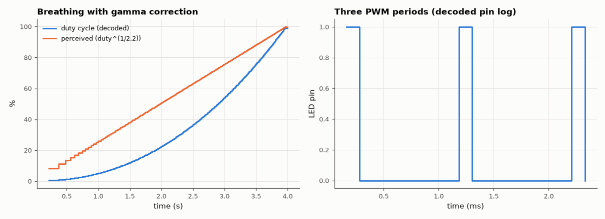

# SL-137 · PWM LED 'breathing' fade with gamma correction

> Fade an LED in and out with 8-bit software PWM at 1 kHz, using a gamma-2.2 lookup table so the perceived brightness ramps linearly; decode the pin log to verify PWM frequency, duty resolution and the breathing period.



*Duty follows the gamma curve so the perceived brightness rises linearly.*

**Track:** Signal Lab — 214 electrical-engineering projects · **Category:** H. Embedded systems (simulated) · **Level:** Easy · **Tools:** C firmware on a simulated MCU (eelab HAL), Python logic-analyser decoding, Wokwi sketch

**Data:** Simulated (numerical model in this repo).

## Problem

A linear duty-cycle ramp looks wrong to the eye — the LED seems to jump to full brightness. Why, and how does gamma correction fix it?

## Prediction

Perceived brightness ∝ luminance^(1/2.2) (approximately), so duty = (step/255)^{2.2} makes perceived brightness linear in the step.
PWM period = 256 ticks × tick; with a 3.9 µs tick → 1 kHz (well above flicker fusion). A 2-s breathing cycle = 512 steps × ≈3.9 ms.

## Method

Firmware: timer-driven 8-bit PWM (counter compare), gamma LUT computed at start-up (integer), brightness index triangle 0→255→0 over 2 s. The
simulation runs 4 s; Python measures every period and high time from the GPIO log.

## Measured results

*Predicted vs measured vs error. "Measured" = computed by an independent simulation, HDL simulator or public dataset.*

| Quantity | Predicted | Measured | Error | Within tolerance |
|---|---|---|---|---|
| PWM frequency | 976.6 Hz | 976.6 Hz | +0.00 % | yes |
| Duty-cycle resolution | 0.003906 | 0.003906 | +0 |  |
| Perceived-brightness ramp linearity (RMS residual, 0–1 s) | 0 | 0.006627 | +0.006627 |  |

**Additional measurements**

| Quantity | Value | Note |
|---|---|---|
| Without gamma: perceived brightness at 25 % of the ramp | 0.5325 | looks ~53 % bright: the 'jump' |

## Run it in the browser

Paste `firmware/breathe.ino` and `firmware/diagram.json` into a new Arduino Uno project at wokwi.com.

## Error analysis

The decoded pin log shows a clean ~977 Hz PWM with 1/256 duty resolution. Because duty follows (i/255)^2.2, the *perceived*
brightness rises almost linearly with time; a plain linear duty ramp would look 50 % bright after only a quarter of the
ramp. Gamma correction costs resolution at the dark end (the first several LUT entries are 0 or 1), which is why smooth
LED dimming at low brightness needs 10–16-bit PWM.

## Reproduce

```bash
pip install -r requirements.txt
python run_all.py --only SL-137
```

The script [`project.py`](project.py) regenerates every figure and number above.

**Files produced**

- [`firmware/breathe.c`](firmware/breathe.c) — firmware source
- [`firmware/breathe.ino`](firmware/breathe.ino) — Wokwi/Arduino sketch
- [`firmware/diagram.json`](firmware/diagram.json) — Wokwi diagram
- [`data/duty.csv`](data/duty.csv)

## License

Code and text: MIT (see the repository [LICENSE](../../../../LICENSE)). Datasets remain under their own licences (see the repository README).

---

**Tooling & honesty.** This project was generated with Claude Code (Anthropic's AI coding assistant): the code, derivations, simulations and this write-up were AI-produced. *Measured* means computed by an independent model, simulator or public dataset — not a physical lab bench. Every number in the tables is reproduced by running the code.
