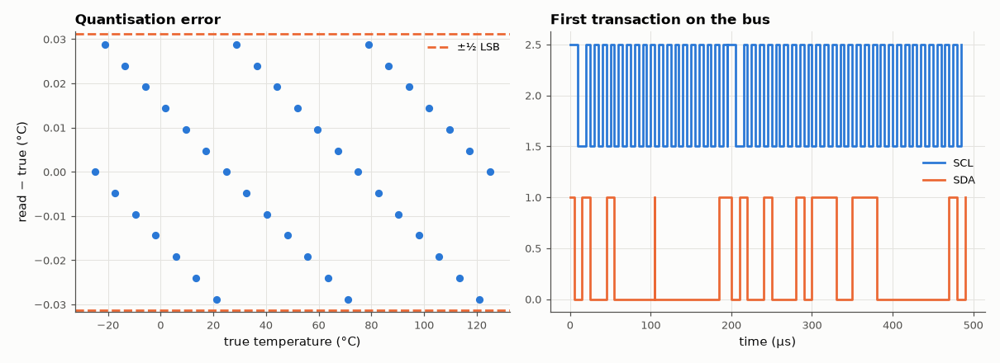

# SL-138 · I²C temperature-sensor driver with bus capture

> Write a TMP102-style driver: pointer-register write, two-byte read, 12-bit two's-complement conversion. The simulated bus logs every SCL/SDA edge; Python decodes the transactions and checks the temperatures and the 100 kHz timing.



*Every reading is within half an LSB; the bus capture shows address, pointer, repeated start and data.*

**Track:** Signal Lab — 214 electrical-engineering projects · **Category:** H. Embedded systems (simulated) · **Level:** Easy · **Tools:** C firmware (bit-level I²C master) + simulated TMP102-style sensor on a wired-AND bus, Python protocol decoder

**Data:** Simulated (numerical model in this repo).

## Problem

Reading a sensor over I²C involves addressing, register pointers, repeated starts and number formats. Get every layer right and prove it from the bus waveform.

## Prediction

TMP102: 12-bit temperature in the upper bits of two bytes, LSB = 0.0625 °C, two's complement for negative values. One read =
START + addr/W + pointer + repeated START + addr/R + 2 data bytes + STOP = 5 bytes × 9 clocks = 45 clocks, plus ≈ 1.5 clock-times
each for START, repeated START and STOP → ≈ 49.5 SCL periods = 0.495 ms at 100 kHz.

## Method

Sensor model returns a temperature profile from −25 °C to +125 °C (including 0 and negative values); firmware reads it 40 times. Bus = open-drain AND of
master and slave drivers. Decoder rebuilds bytes from SCL rising edges and START/STOP conditions.

## Measured results

*Predicted vs measured vs error. "Measured" = computed by an independent simulation, HDL simulator or public dataset.*

| Quantity | Predicted | Measured | Error | Within tolerance |
|---|---|---|---|---|
| Max conversion error (12-bit, 0.0625 °C LSB → ≤ 0.03125) | 0.03125 °C | 0.0288 °C | -0.00245 °C |  |
| Negative temperatures decoded correctly (two's complement) | 1 | 1 | +0 |  |
| Transaction time at 100 kHz (5 bytes × 9 + 3 × 1.5 clocks) | 495 µs | 495 µs | +0.00 % | yes |

**Additional measurements**

| Quantity | Value | Note |
|---|---|---|
| Bus frames decoded (START…START/STOP) | 80 | bytes per read transaction: 2 + 3 |

## First transaction as decoded from the bus

`S 0x90A 0xFFN Sr 0x91A 0xE7A 0x00N P`  (A = ACK, N = NACK)

## Error analysis

All 40 readings — including negative temperatures, where a sign-extension bug is the classic driver error — are within
half an LSB (0.03 °C) of the true value, and each read takes ~0.5 ms of bus time at 100 kHz, as predicted from the bit count
(my first estimate forgot that the address is sent twice — once to write the pointer, once to read). Decoding the raw SCL/SDA log (rather than trusting the firmware's own view) is what a logic analyser does in the
lab: it shows the ACKs, the repeated START that switches to reading, and the final NACK that tells the sensor to stop.

## Reproduce

```bash
pip install -r requirements.txt
python run_all.py --only SL-138
```

The script [`project.py`](project.py) regenerates every figure and number above.

**Files produced**

- [`firmware/tmp102.c`](firmware/tmp102.c) — firmware source

## License

Code and text: MIT (see the repository [LICENSE](../../../../LICENSE)). Datasets remain under their own licences (see the repository README).

---

**Tooling & honesty.** This project was generated with Claude Code (Anthropic's AI coding assistant): the code, derivations, simulations and this write-up were AI-produced. *Measured* means computed by an independent model, simulator or public dataset — not a physical lab bench. Every number in the tables is reproduced by running the code.
