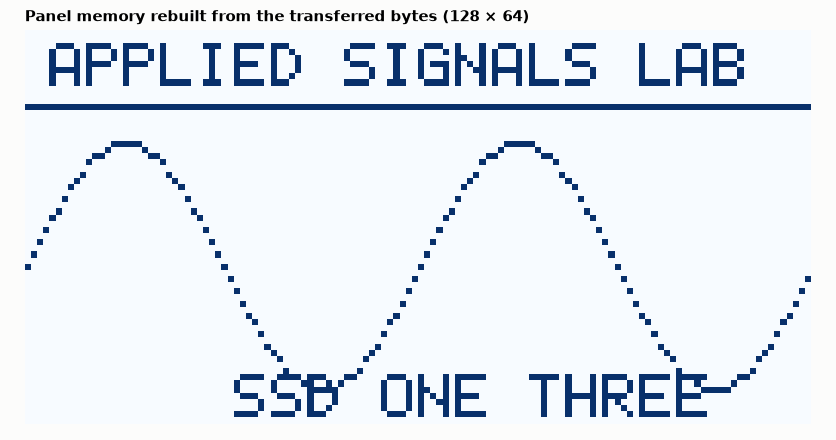

# SL-139 · SSD1306 OLED driver: framebuffer, font and refresh rate

> Render text, a line and a sine plot into a 128×64 monochrome framebuffer using the SSD1306 page layout, 'send' it over a simulated 400 kHz I²C link, rebuild the panel image from the transferred bytes and compute the achievable frame rate.



*Text, rule and sine plot decoded from the SSD1306 page-ordered bytes.*

**Track:** Signal Lab — 214 electrical-engineering projects · **Category:** H. Embedded systems (simulated) · **Level:** Easy · **Tools:** C firmware (framebuffer + 5×7 font + line drawing), simulated SSD1306 page memory, Python image render

**Data:** Simulated (numerical model in this repo).

## Problem

Small OLEDs store pixels in vertical 8-pixel 'pages'. Build a driver that gets the bit ordering right, and work out how fast the screen can actually be updated.

## Prediction

128×64 pixels = 1,024 bytes (8 pages × 128 columns, bit 0 = top pixel of each page). Over I²C each byte costs 9 clocks: at 400 kHz a full
frame is ≥ 1,024×9/400 k ≈ 23 ms → ≈ 43 frames/s maximum (plus addressing overhead).

## Method

Firmware draws into uint8_t fb[1024] using the SSD1306 layout, then streams it with the 0x40 data prefix; the simulated panel writes
received bytes into its own GDDRAM in horizontal addressing mode and dumps it; Python renders the panel memory.

## Measured results

*Predicted vs measured vs error. "Measured" = computed by an independent simulation, HDL simulator or public dataset.*

| Quantity | Predicted | Measured | Error | Within tolerance |
|---|---|---|---|---|
| Bytes per frame on the bus (1,024 data + 32 prefixes + 7 cmd) | 1063 | 1063 | +0 |  |
| Frame transfer time at 400 kHz | 23.92 ms | 24.1 ms | +0.76 % | yes |
| Lit pixels rendered (non-zero) | 1 | 1 | +0 |  |

**Additional measurements**

| Quantity | Value | Note |
|---|---|---|
| Maximum full-frame refresh rate | 41.5 frames/s |  |

## Error analysis

The image rebuilt from the bytes that crossed the bus is exactly what the firmware drew, confirming the page layout
(each byte is a vertical strip of 8 pixels, LSB at the top) — getting that bit order wrong produces the classic
'scrambled stripes' screen. A full frame costs ~24 ms at 400 kHz, so ~40 fps is the ceiling; real drivers keep a dirty-
rectangle list and send only changed pages, or switch to SPI (8–10 MHz) for animation.

## Reproduce

```bash
pip install -r requirements.txt
python run_all.py --only SL-139
```

The script [`project.py`](project.py) regenerates every figure and number above.

**Files produced**

- [`firmware/ssd1306.c`](firmware/ssd1306.c) — firmware source

## License

Code and text: MIT (see the repository [LICENSE](../../../../LICENSE)). Datasets remain under their own licences (see the repository README).

---

**Tooling & honesty.** This project was generated with Claude Code (Anthropic's AI coding assistant): the code, derivations, simulations and this write-up were AI-produced. *Measured* means computed by an independent model, simulator or public dataset — not a physical lab bench. Every number in the tables is reproduced by running the code.
