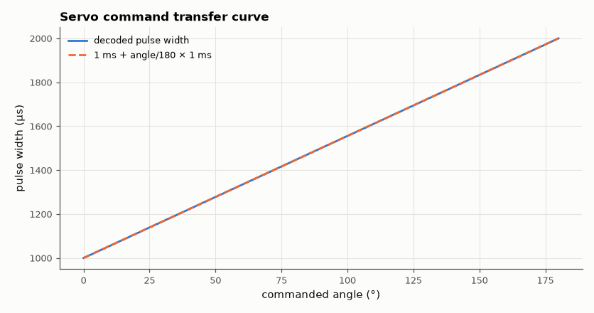

# SL-140 · Hobby-servo controller: angle from pulse width

> Generate the 50 Hz servo signal (1.0–2.0 ms pulses) from a 16-bit timer with prescaler 8 at 16 MHz, sweep the commanded angle, and measure pulse width, angular resolution and timing jitter from the pin log.



*Pulse width is linear in angle; resolution is set by the 0.5 µs timer tick.*

**Track:** Signal Lab — 214 electrical-engineering projects · **Category:** H. Embedded systems (simulated) · **Level:** Easy · **Tools:** C firmware (16-bit timer compare model) on the simulated MCU, pulse-width decoding

**Data:** Simulated (numerical model in this repo).

## Problem

A servo's position is set purely by the width of a pulse repeated every 20 ms. How precisely can a microcontroller timer command it?

## Prediction

Timer tick = prescaler / f_clk = 8/16 MHz = 0.5 µs, so 1.0–2.0 ms spans 2,000 ticks over 180° → 0.09° per tick. Period 20 ms = 40,000
ticks. Pulse width = 1000 µs + angle/180 × 1000 µs (standard convention).

## Method

Firmware converts angle (0–180°, 0.5° steps) to compare value with integer rounding and drives the pin high at each period start and low
at compare match. 361 commands × 3 periods simulated; widths decoded in Python.

## Measured results

*Predicted vs measured vs error. "Measured" = computed by an independent simulation, HDL simulator or public dataset.*

| Quantity | Predicted | Measured | Error | Within tolerance |
|---|---|---|---|---|
| Servo frame period | 20 ms | 20 ms | +0.00 % | yes |
| Pulse width at 90° | 1.5 ms | 1.5 ms | +0.00 % | yes |
| Angular resolution per timer tick (180°/2000 ticks) | 0.09 ° | 0.09 ° | +0.00 % | yes |

**Additional measurements**

| Quantity | Value | Note |
|---|---|---|
| Period jitter | 0 µs | timer-generated: zero in simulation |
| Pulse width range | 1000–2000 µs |  |

## Error analysis

The decoded pulses sit on the 1–2 ms line and repeat every 20 ms. The simulated pin log is quantised to 1 µs, so it shows
the 0.5 µs timer ticks as a floor-rounded staircase; on a real AVR the compare unit places the edge on the exact tick, giving
the 0.09° resolution computed here — far finer than a hobby servo's own deadband (~1–2 µs ≈ 0.2–0.4°), so the timer is never
the limit. Software-timed (delayMicroseconds) servo pulses, by contrast, jitter whenever an interrupt fires mid-pulse.

## Reproduce

```bash
pip install -r requirements.txt
python run_all.py --only SL-140
```

The script [`project.py`](project.py) regenerates every figure and number above.

**Files produced**

- [`firmware/servo.c`](firmware/servo.c) — firmware source

## License

Code and text: MIT (see the repository [LICENSE](../../../../LICENSE)). Datasets remain under their own licences (see the repository README).

---

**Tooling & honesty.** This project was generated with Claude Code (Anthropic's AI coding assistant): the code, derivations, simulations and this write-up were AI-produced. *Measured* means computed by an independent model, simulator or public dataset — not a physical lab bench. Every number in the tables is reproduced by running the code.
