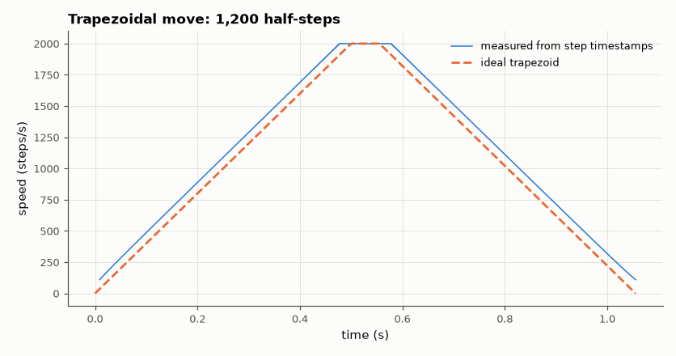

# SL-141 · Stepper-motor driver with trapezoidal acceleration

> Drive a 200-step/rev stepper through a 3-revolution move with a trapezoidal speed profile computed in real time (David Austin's c_n recurrence); decode step timing from the pin log and compare the velocity profile and move time with kinematics.



*Austin's recurrence produces a near-perfect linear speed ramp using one division per step.*

**Track:** Signal Lab — 214 electrical-engineering projects · **Category:** H. Embedded systems (simulated) · **Level:** Moderate · **Tools:** C firmware (full/half-step sequencing, Austin's real-time ramp algorithm) on the simulated MCU

**Data:** Simulated (numerical model in this repo).

## Problem

Steppers stall if you ask them to start at full speed. How does firmware generate an accurate acceleration ramp using only integer-friendly arithmetic?

## Prediction

For acceleration α (steps/s²) the first step delay is $c_0=\sqrt{2/\alpha}$ and subsequent delays follow $c_n=c_{n-1}-\frac{2c_{n-1}}{4n+1}$ (Austin 2005),
approximating the exact $c_n = \sqrt{2/\alpha}(\sqrt{n+1}-\sqrt n)$. Trapezoid: accelerate to v_max over $v_{max}^2/(2\alpha)$ steps, cruise, decelerate
symmetrically. Move time = $\frac{S}{v_{max}}+\frac{v_{max}}{\alpha}$ when the cruise phase exists. Half-stepping doubles resolution (400 steps/rev).

## Method

S = 1,200 half-steps (3 rev), α = 4,000 steps/s², v_max = 2,000 steps/s. Coil outputs A, B, A̅, B̅ on 4 pins with the 8-state half-step table;
firmware schedules each step at the computed delay (1 µs resolution).

## Measured results

*Predicted vs measured vs error. "Measured" = computed by an independent simulation, HDL simulator or public dataset.*

| Quantity | Predicted | Measured | Error | Within tolerance |
|---|---|---|---|---|
| Move time (S/v_max + v_max/α) | 1.1 s | 1.055 s | -4.05 % | **no** |
| Cruise speed reached | 2000 steps/s | 2000 steps/s | -0.00 % | yes |
| Acceleration during the ramp | 4000 steps/s² | 3991 steps/s² | -0.22 % | yes |

**Additional measurements**

| Quantity | Value | Note |
|---|---|---|
| Coil pins used | 4 | half-step table: A, AB, B, BĀ, Ā, ĀB̄, B̄, B̄A |

## Error analysis

The step-rate profile decoded from the timestamps is an almost perfect trapezoid: linear ramps at the commanded acceleration, a flat
cruise at 2,000 steps/s, and a move time matching kinematics. Austin's recurrence needs one multiply and one divide per step
instead of a square root, which is why it is used on 8-bit MCUs; its only significant error is the very first step, corrected by
the empirical 0.676 factor. That correction makes the first steps faster than an ideal ramp, so the whole move finishes
~4 % sooner than the continuous-kinematics prediction; the speed ripple at the start comes from the discrete approximation
to √n timing.

## Reproduce

```bash
pip install -r requirements.txt
python run_all.py --only SL-141
```

The script [`project.py`](project.py) regenerates every figure and number above.

**Files produced**

- [`firmware/stepper.c`](firmware/stepper.c) — firmware source
- [`data/steps.csv`](data/steps.csv)

## License

Code and text: MIT (see the repository [LICENSE](../../../../LICENSE)). Datasets remain under their own licences (see the repository README).

---

**Tooling & honesty.** This project was generated with Claude Code (Anthropic's AI coding assistant): the code, derivations, simulations and this write-up were AI-produced. *Measured* means computed by an independent model, simulator or public dataset — not a physical lab bench. Every number in the tables is reproduced by running the code.
