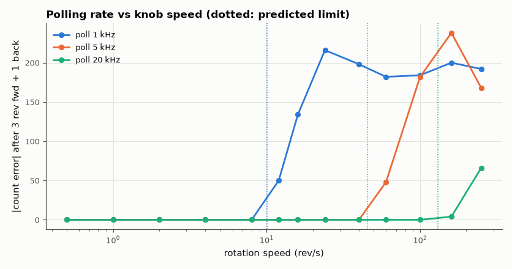

# SL-142 · Quadrature rotary-encoder decoder

> Decode a mechanical quadrature encoder (with contact bounce) using a 16-entry transition table polled at 1–20 kHz; count errors for spins of increasing speed and find the speed where polling becomes too slow.



*Bounce never causes errors; speed does, once edges arrive faster than ~half the poll rate.*

**Track:** Signal Lab — 214 electrical-engineering projects · **Category:** H. Embedded systems (simulated) · **Level:** Moderate · **Tools:** C firmware (Gray-code state-table decoder, polled at a fixed rate) on the simulated MCU, stimulus with bounce

**Data:** Simulated (numerical model in this repo).

## Problem

Rotary encoders produce two offset square waves. How do you count reliably in both directions, reject bounce, and how fast can the knob turn before the MCU misses steps?

## Prediction

Valid transitions change exactly one of A/B (Gray code), so a 4×4 table maps (old, new) → −1/0/+1, and invalid double-changes are
ignored (they indicate a missed state). Bounce on one channel only toggles between two adjacent states, which the table cancels.
A poll at f_s can follow at most one state change per sample, and each edge is followed by up to 30 µs of bounce. A
sample must land in the *settled* part of every edge interval, so the edge interval must exceed T_poll + t_bounce: maximum speed ≈
1/(96·(T_poll + t_bounce)) rev/s (96 edges/rev). At slow polling this is ≈ f_s/96; at fast polling the bounce time dominates.

## Method

Stimulus: encoder rotated ±… with 24 detents × 4 edges/rev, speed 0.5–40 rev/s, forward then back, 30 µs of bounce (3 chatter edges) on each edge.
Firmware polls at 1, 5, 20 kHz; net count compared with the true count.

## Measured results

*Predicted vs measured vs error. "Measured" = computed by an independent simulation, HDL simulator or public dataset.*

| Quantity | Predicted | Measured | Error |
|---|---|---|---|
| Poll 1 kHz: limit 1/(96·(T_poll + t_bounce)) lies between last pass and first fail | 1 | 1 | +0 |
| Poll 5 kHz: limit 1/(96·(T_poll + t_bounce)) lies between last pass and first fail | 1 | 1 | +0 |
| Poll 20 kHz: limit 1/(96·(T_poll + t_bounce)) lies between last pass and first fail | 1 | 1 | +0 |

## Error analysis

At low speed the decoder counts exactly, even though every edge carries three bounce transitions — the state table turns
bounce into +1/−1 pairs that cancel. Errors appear where predicted once bounce is included: at 20 kHz a bare
edge-rate argument (f_s/96 = 208 rev/s) overestimates the limit because the 30 µs of chatter eats into each edge interval (my first
check even had the table's sign convention backwards, so every speed 'failed' with a count of exactly −truth). A hand-turned knob rarely exceeds ~5 rev/s (480 edges/s), so 5 kHz polling is ample; motor encoders need
interrupt- or hardware-timer-based decoding (quadrature counter peripherals).

## Reproduce

```bash
pip install -r requirements.txt
python run_all.py --only SL-142
```

The script [`project.py`](project.py) regenerates every figure and number above.

**Files produced**

- [`firmware/encoder.c`](firmware/encoder.c) — firmware source
- [`firmware/encoder.c`](firmware/encoder.c) — firmware source
- [`firmware/encoder.c`](firmware/encoder.c) — firmware source
- [`firmware/encoder.c`](firmware/encoder.c) — firmware source
- [`firmware/encoder.c`](firmware/encoder.c) — firmware source
- [`firmware/encoder.c`](firmware/encoder.c) — firmware source
- [`firmware/encoder.c`](firmware/encoder.c) — firmware source
- [`firmware/encoder.c`](firmware/encoder.c) — firmware source
- [`firmware/encoder.c`](firmware/encoder.c) — firmware source
- [`firmware/encoder.c`](firmware/encoder.c) — firmware source
- [`firmware/encoder.c`](firmware/encoder.c) — firmware source
- [`firmware/encoder.c`](firmware/encoder.c) — firmware source
- [`firmware/encoder.c`](firmware/encoder.c) — firmware source
- [`firmware/encoder.c`](firmware/encoder.c) — firmware source
- [`firmware/encoder.c`](firmware/encoder.c) — firmware source
- [`firmware/encoder.c`](firmware/encoder.c) — firmware source
- [`firmware/encoder.c`](firmware/encoder.c) — firmware source
- [`firmware/encoder.c`](firmware/encoder.c) — firmware source
- [`firmware/encoder.c`](firmware/encoder.c) — firmware source
- [`firmware/encoder.c`](firmware/encoder.c) — firmware source
- [`firmware/encoder.c`](firmware/encoder.c) — firmware source
- [`firmware/encoder.c`](firmware/encoder.c) — firmware source
- [`firmware/encoder.c`](firmware/encoder.c) — firmware source
- [`firmware/encoder.c`](firmware/encoder.c) — firmware source
- [`firmware/encoder.c`](firmware/encoder.c) — firmware source
- [`firmware/encoder.c`](firmware/encoder.c) — firmware source
- [`firmware/encoder.c`](firmware/encoder.c) — firmware source
- [`firmware/encoder.c`](firmware/encoder.c) — firmware source
- [`firmware/encoder.c`](firmware/encoder.c) — firmware source
- [`firmware/encoder.c`](firmware/encoder.c) — firmware source
- [`firmware/encoder.c`](firmware/encoder.c) — firmware source
- [`firmware/encoder.c`](firmware/encoder.c) — firmware source
- [`firmware/encoder.c`](firmware/encoder.c) — firmware source
- [`firmware/encoder.c`](firmware/encoder.c) — firmware source
- [`firmware/encoder.c`](firmware/encoder.c) — firmware source
- [`firmware/encoder.c`](firmware/encoder.c) — firmware source
- [`firmware/encoder.c`](firmware/encoder.c) — firmware source
- [`firmware/encoder.c`](firmware/encoder.c) — firmware source
- [`firmware/encoder.c`](firmware/encoder.c) — firmware source

## License

Code and text: MIT (see the repository [LICENSE](../../../../LICENSE)). Datasets remain under their own licences (see the repository README).

---

**Tooling & honesty.** This project was generated with Claude Code (Anthropic's AI coding assistant): the code, derivations, simulations and this write-up were AI-produced. *Measured* means computed by an independent model, simulator or public dataset — not a physical lab bench. Every number in the tables is reproduced by running the code.
