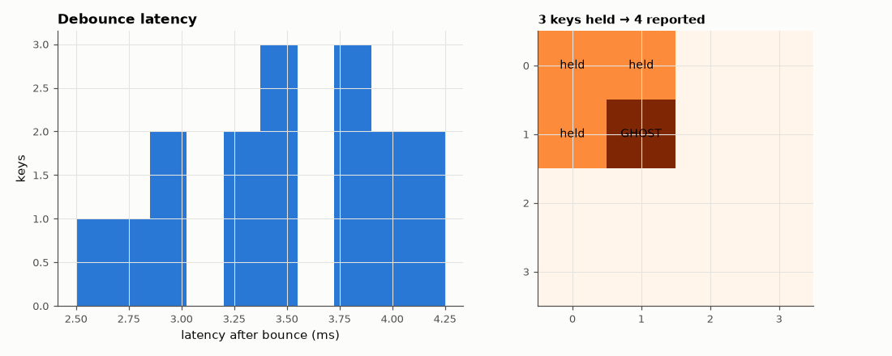

# SL-143 · 4×4 matrix keypad scanner with debouncing (and ghosting)

> Scan a 16-key matrix with 8 pins, debounce each key with an integrator, measure detection latency and verify every key; then press three keys at the corners of a rectangle and watch the 'ghost' fourth key appear without diodes.



*Debounce adds a fixed ~5 ms latency; three keys in a rectangle create a ghost fourth key.*

**Track:** Signal Lab — 214 electrical-engineering projects · **Category:** H. Embedded systems (simulated) · **Level:** Easy · **Tools:** C firmware (row-drive / column-read scanning, per-key debounce counters) with a simulated switch matrix

**Data:** Simulated (numerical model in this repo).

## Problem

How can 8 wires read 16 buttons, how quickly does a press register, and what breaks when several keys are held?

## Prediction

Driving one row low at a time and reading the columns identifies each key; a full scan of 4 rows at a 1 ms row period takes 4 ms. A key
must read pressed on N consecutive scans (N = 5) → latency ≈ N × 4 ms = 20 ms (+ up to one scan). With three keys pressed at (r1,c1),
(r1,c2), (r2,c1), current flows r2→c1→r1→c2, so (r2,c2) reads pressed too: ghosting (fixed by a diode per switch).

## Method

Each of the 16 keys is pressed once with 3 ms of bounce, then released; firmware scans every 1 ms per row. Then keys 1, 2, 5 held
together. Latency = time from bounce end to the debounced 'press' event.

## Measured results

*Predicted vs measured vs error. "Measured" = computed by an independent simulation, HDL simulator or public dataset.*

| Quantity | Predicted | Measured | Error |
|---|---|---|---|
| Keys detected (16 pressed one at a time) | 16 | 16 | +0 |
| Worst detection latency after bounce ends (≤ N × 1 ms scan) | 5 ms | 4.25 ms | -0.75 ms |
| Keys reported with 3 held (ghost appears) | 4 | 4 | +0 |

**Additional measurements**

| Quantity | Value | Note |
|---|---|---|
| Median detection latency after bounce ends | 3.5 ms |  |

## Error analysis

Every key is found and debounced; the latency after the bounce ends is set by the integrator (5 consecutive reads of that key's
row, one per 1 ms scan slot) — short enough to feel instant. The ghosting test reproduces the classic matrix limitation: with
three corners of a rectangle held, current sneaks through the three closed switches and the fourth corner reads as pressed.
Gaming keyboards add a diode per key (or scan each key individually) to get 'n-key rollover'.

## Reproduce

```bash
pip install -r requirements.txt
python run_all.py --only SL-143
```

The script [`project.py`](project.py) regenerates every figure and number above.

**Files produced**

- [`firmware/keypad.c`](firmware/keypad.c) — firmware source

## License

Code and text: MIT (see the repository [LICENSE](../../../../LICENSE)). Datasets remain under their own licences (see the repository README).

---

**Tooling & honesty.** This project was generated with Claude Code (Anthropic's AI coding assistant): the code, derivations, simulations and this write-up were AI-produced. *Measured* means computed by an independent model, simulator or public dataset — not a physical lab bench. Every number in the tables is reproduced by running the code.
