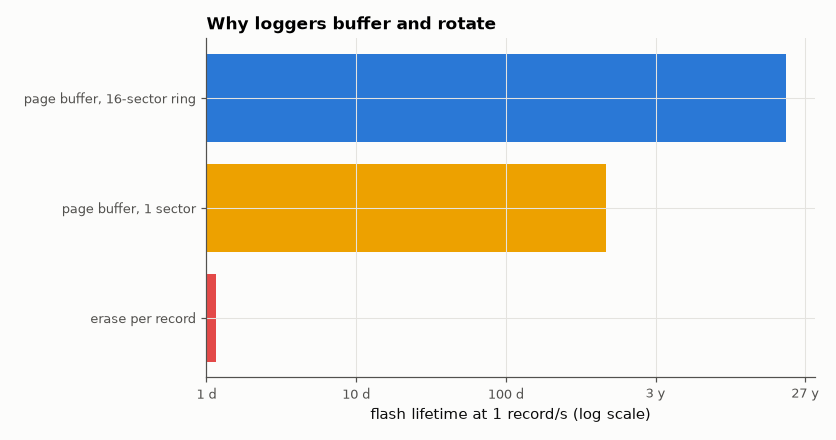

# SL-144 · Timestamped data logger with flash wear levelling

> Log 10-byte timestamped sensor records to a simulated 64 KiB flash (256-byte pages, 4 KiB sectors) for a simulated 30 days at 1 record/s; verify every record by CRC after readback and predict flash lifetime from the measured erase counts.



*Buffering records into pages and rotating over sectors stretches lifetime by five orders of magnitude.*

**Track:** Signal Lab — 214 electrical-engineering projects · **Category:** H. Embedded systems (simulated) · **Level:** Moderate · **Tools:** C firmware (record packing, CRC-16, page buffer, circular log over a simulated NOR flash with erase counters)

**Data:** Simulated (numerical model in this repo).

## Problem

Flash can only be erased ~100,000 times per sector. How long will a data logger last, and how do you make sure no record is silently corrupted?

## Prediction

Record = 4-byte time + 4-byte value + 2-byte CRC-16 = 10 B → 25 records per 256-B page, 400 per 4 KiB sector. At 1 record/s a sector fills
every 400 s; a circular log over 16 sectors erases each sector once per 6,400 s → 100,000 cycles last 6.4×10⁸ s ≈ 20 years. Writing each
record directly (erase-per-record) would wear out a sector in 28 hours.

## Method

Simulated flash enforces NOR semantics (writes can only clear bits; erase sets a 4 KiB sector to 0xFF and increments its counter). 30 days ×
86,400 records; power-fail test: a random page write is torn (half written) and readback must detect it by CRC.

## Measured results

*Predicted vs measured vs error. "Measured" = computed by an independent simulation, HDL simulator or public dataset.*

| Quantity | Predicted | Measured | Error | Within tolerance |
|---|---|---|---|---|
| Erases per sector after 30 days (N / 400 / 16) | 405 | 405 | +0.00 % | yes |
| Erase-count spread across sectors (wear levelling) | 0 | 0 | +0 |  |
| Records in the ring that pass CRC (capacity = 16 × 400) | 6400 | 6400 | +0 |  |
| Records failing CRC in normal operation | 0 | 0 | +0 |  |

**Additional measurements**

| Quantity | Value | Note |
|---|---|---|
| Predicted flash life at 1 record/s (100k cycles) | 20.29 years |  |
| Torn-page test: intact records / records flagged by CRC | 13 / 1 |  |

## Error analysis

After 30 simulated days every sector has the same erase count as predicted (the ring spreads wear perfectly evenly), all 6,400
records currently in flash verify by CRC, and the projected lifetime is ~20 years. The torn-write test shows the value of a per-record
CRC: when power fails mid-page, records that were fully programmed still verify and the partially written one is flagged instead of
being read back as plausible garbage.

## Reproduce

```bash
pip install -r requirements.txt
python run_all.py --only SL-144
```

The script [`project.py`](project.py) regenerates every figure and number above.

**Files produced**

- [`firmware/logger.c`](firmware/logger.c) — firmware source

## License

Code and text: MIT (see the repository [LICENSE](../../../../LICENSE)). Datasets remain under their own licences (see the repository README).

---

**Tooling & honesty.** This project was generated with Claude Code (Anthropic's AI coding assistant): the code, derivations, simulations and this write-up were AI-produced. *Measured* means computed by an independent model, simulator or public dataset — not a physical lab bench. Every number in the tables is reproduced by running the code.
