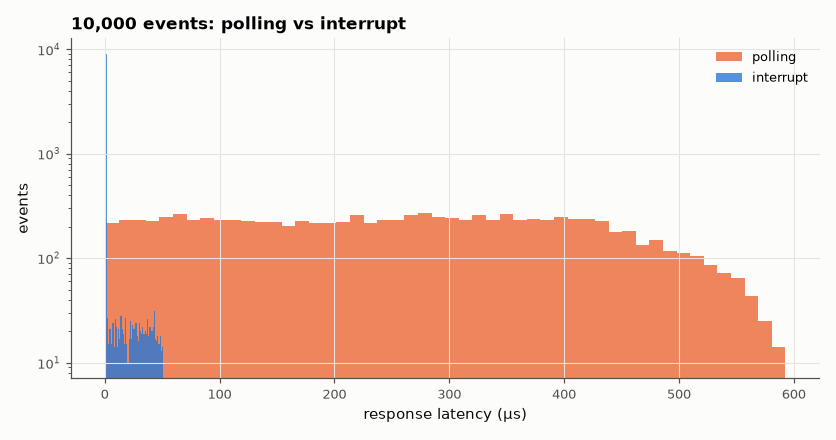

# SL-145 · Polling vs interrupts: response latency and jitter

> Measure how long firmware takes to respond to 10,000 random external events when it polls in the main loop versus when it uses an interrupt — including the effect of a critical section that disables interrupts.



*Polling latency is uniform up to the loop period; interrupts respond in ~1 µs unless masked.*

**Track:** Signal Lab — 214 electrical-engineering projects · **Category:** H. Embedded systems (simulated) · **Level:** Moderate · **Tools:** C firmware scheduling model (main loop with variable work, ISR entry cost, critical sections) on the simulated MCU

**Data:** Simulated (numerical model in this repo).

## Problem

Why do real-time systems use interrupts, and what determines their worst-case latency?

## Prediction

Polling with a loop of period T responds after a delay uniform in [0, T] (+ handler time): mean T/2, worst T. An interrupt responds after the
fixed entry cost (~12 cycles + instruction completion) unless interrupts are masked, in which case the worst case adds the longest critical
section C: latency ∈ [t_entry, t_entry + C].

## Method

Loop period 500 µs (variable work 400–600 µs), ISR entry 0.75 µs (12 cycles at 16 MHz), a 50 µs critical section executed once per loop. 10,000 events at
random times; latency to the first instruction of the handler recorded for both strategies.

## Measured results

*Predicted vs measured vs error. "Measured" = computed by an independent simulation, HDL simulator or public dataset.*

| Quantity | Predicted | Measured | Error | Within tolerance |
|---|---|---|---|---|
| Polling: mean latency (≈ T/2 = 250 µs) | 250 µs | 256.1 µs | +2.43 % | yes |
| Polling: worst latency (≈ max loop period 600 µs) | 600 µs | 592.7 µs | -1.21 % | yes |
| Interrupt: minimum latency (entry cost) | 0.75 µs | 0.75 µs | +0 µs |  |
| Interrupt: worst latency (entry + 50 µs critical section) | 50.75 µs | 50.73 µs | -0.05 % | yes |

**Additional measurements**

| Quantity | Value | Note |
|---|---|---|
| Fraction of interrupt events delayed by a critical section | 9.88 % | ≈ 50 µs / 500 µs × ½ window |

## Error analysis

Polling latency is spread uniformly up to the loop period (mean ~T/2, worst ~T), so it grows with every feature added to the
main loop. The interrupt responds in the entry cost almost always — but its *worst case* is set by the longest stretch
with interrupts disabled, which is why real-time code keeps critical sections to a few microseconds and why RTOS vendors
quote 'interrupt latency' as entry cost plus longest masked section.

## Reproduce

```bash
pip install -r requirements.txt
python run_all.py --only SL-145
```

The script [`project.py`](project.py) regenerates every figure and number above.

**Files produced**

- [`firmware/latency.c`](firmware/latency.c) — firmware source
- [`data/latency.csv`](data/latency.csv)

## License

Code and text: MIT (see the repository [LICENSE](../../../../LICENSE)). Datasets remain under their own licences (see the repository README).

---

**Tooling & honesty.** This project was generated with Claude Code (Anthropic's AI coding assistant): the code, derivations, simulations and this write-up were AI-produced. *Measured* means computed by an independent model, simulator or public dataset — not a physical lab bench. Every number in the tables is reproduced by running the code.
