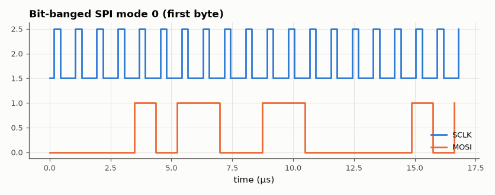

# SL-146 · Bit-banged SPI and its maximum clock rate

> Implement SPI in software on GPIO pins, count the CPU cycles per bit to predict the maximum SCLK, and decode the generated waveform to verify mode, bit order and data.



*MOSI changes while SCLK is low and is stable at every rising edge.*

**Track:** Signal Lab — 214 electrical-engineering projects · **Category:** H. Embedded systems (simulated) · **Level:** Moderate · **Tools:** C firmware (software SPI, modes 0 and 3) with a per-instruction cycle-cost model, logic-analyser decode in Python

**Data:** Simulated (numerical model in this repo).

## Problem

When a microcontroller lacks a free SPI peripheral, you toggle pins yourself. How fast can that go, and does the timing still meet the protocol?

## Prediction

Per bit: set MOSI (≈ 3 cycles for read-modify-write), SCLK high (2), read MISO (2), SCLK low (2), shift/loop (≈ 5) → ~14 cycles at 16 MHz
= 0.875 µs/bit → ≈ 1.14 MHz max SCLK, with an asymmetric duty cycle (high for 4 of 14 cycles).

## Method

Cycle-cost model inside the simulated HAL (cycles advance simulated time at 16 MHz). 64 bytes sent in modes 0 and 3; Python decodes SCLK/MOSI and measures
the period and duty; data compared with the sent bytes.

## Measured results

*Predicted vs measured vs error. "Measured" = computed by an independent simulation, HDL simulator or public dataset.*

| Quantity | Predicted | Measured | Error | Within tolerance |
|---|---|---|---|---|
| Mode 0: bytes decoded incorrectly (of 64) | 0 | 0 | +0 |  |
| Maximum SCLK (16 MHz / 14 cycles per bit) | 1.143 MHz | 1.144 MHz | +0.11 % | yes |
| SCLK high fraction (4 of 14 cycles) | 0.2857 | 0.286 | +3.2690e-04 |  |
| Mode 3: bytes decoded incorrectly (of 64) | 0 | 0 | +0 |  |

## Error analysis

The decoded waveform carries all 64 bytes correctly in both modes, and the clock runs at the ~1.1 MHz the cycle count predicts,
with a lopsided ~29 % high time — fine for SPI slaves, which care about setup/hold at the sampling edge, not duty cycle. A
hardware SPI peripheral on the same MCU runs at 8 MHz and frees the CPU, which is why bit-banging is a fallback, not a plan.

## Reproduce

```bash
pip install -r requirements.txt
python run_all.py --only SL-146
```

The script [`project.py`](project.py) regenerates every figure and number above.

**Files produced**

- [`firmware/softspi.c`](firmware/softspi.c) — firmware source

## License

Code and text: MIT (see the repository [LICENSE](../../../../LICENSE)). Datasets remain under their own licences (see the repository README).

---

**Tooling & honesty.** This project was generated with Claude Code (Anthropic's AI coding assistant): the code, derivations, simulations and this write-up were AI-produced. *Measured* means computed by an independent model, simulator or public dataset — not a physical lab bench. Every number in the tables is reproduced by running the code.
