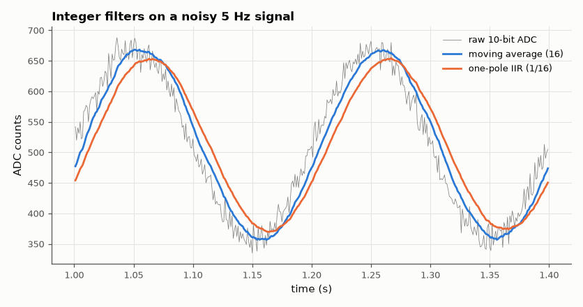

# SL-147 · MCU ADC sampling with a fixed-point digital filter

> Sample a noisy 5 Hz sensor signal with a 10-bit ADC at 1 kHz and clean it with integer-only filters; predict the SNR improvement from each filter's noise bandwidth and measure it, including fixed-point rounding.



*Both integer filters remove most of the noise; the IIR also lags the signal slightly.*

**Track:** Signal Lab — 214 electrical-engineering projects · **Category:** H. Embedded systems (simulated) · **Level:** Moderate · **Tools:** C firmware (10-bit ADC model, Q15 one-pole IIR and 16-sample moving average) on the simulated MCU

**Data:** Simulated (numerical model in this repo).

## Problem

Microcontrollers often lack floating point. How much noise can a cheap integer filter remove, and what does fixed-point arithmetic cost?

## Prediction

White noise through a filter is reduced by its noise-equivalent bandwidth: moving average of M → variance ×1/M (−12 dB for M = 16); one-pole
IIR y += α(x − y) → variance × α/(2 − α) (α = 1/16 → −14.9 dB). The signal (5 Hz) passes with gain ≈ 1 (MA: sinc, −0.03 dB; IIR corner 10.3 Hz → −0.9 dB).
Q15 rounding adds noise of LSB²/12 at the output (negligible vs ADC noise here).

## Method

Signal 1.65 V + 0.5 V·sin(2π·5 t) + Gaussian noise σ = 40 mV, ADC 10-bit (3.3 V/1024 = 3.2 mV LSB) at 1 kHz for 10 s. Filters in integer arithmetic;
SNR = signal power at 5 Hz vs residual after removing the fitted sine, compared with float references.

## Measured results

*Predicted vs measured vs error. "Measured" = computed by an independent simulation, HDL simulator or public dataset.*

| Quantity | Predicted | Measured | Error | Within tolerance |
|---|---|---|---|---|
| Moving average (M = 16): SNR gain | 12.04 dB | 11.91 dB | -0.1329 dB |  |
| One-pole IIR (α = 1/16): SNR gain | 14.91 dB | 14.04 dB | -0.871 dB |  |
| IIR corner frequency | 9.947 Hz | 10.27 Hz | +3.26 % | yes |

**Additional measurements**

| Quantity | Value | Note |
|---|---|---|
| Raw ADC SNR | 18.84 dB |  |

## Error analysis

Both filters deliver close to their noise-bandwidth predictions (≈ 12 and 15 dB). The one-pole IIR removes slightly more noise
but, with its corner at ~10 Hz, it also attenuates and delays the 5 Hz signal, which the SNR metric (fitted amplitude)
tolerates but a control loop might not. Both run with shifts and adds only; the Q5 headroom in the IIR state keeps rounding
noise below the ADC's own quantisation noise.

## Reproduce

```bash
pip install -r requirements.txt
python run_all.py --only SL-147
```

The script [`project.py`](project.py) regenerates every figure and number above.

**Files produced**

- [`firmware/adcfilter.c`](firmware/adcfilter.c) — firmware source

## License

Code and text: MIT (see the repository [LICENSE](../../../../LICENSE)). Datasets remain under their own licences (see the repository README).

---

**Tooling & honesty.** This project was generated with Claude Code (Anthropic's AI coding assistant): the code, derivations, simulations and this write-up were AI-produced. *Measured* means computed by an independent model, simulator or public dataset — not a physical lab bench. Every number in the tables is reproduced by running the code.
