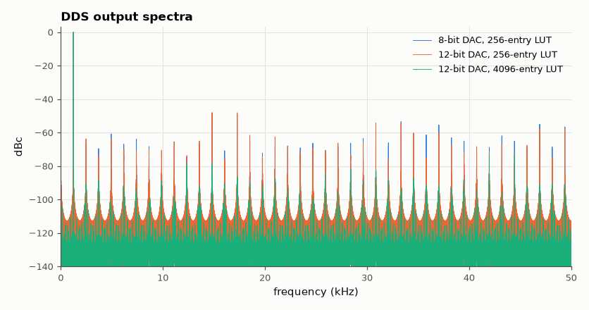

# SL-148 · DDS waveform generator (phase accumulator + DAC)

> Generate sine and triangle waves by direct digital synthesis; predict frequency resolution f_clk/2³², and spurious-free dynamic range from LUT phase truncation and DAC bits, then measure them with an FFT.



*Phase truncation (256-entry LUT) creates spurs near −48 dBc regardless of DAC resolution.*

**Track:** Signal Lab — 214 electrical-engineering projects · **Category:** H. Embedded systems (simulated) · **Level:** Moderate · **Tools:** C firmware (32-bit phase accumulator, 256-entry sine LUT, 8/10/12-bit DAC models) on the simulated MCU, spectral analysis

**Data:** Simulated (numerical model in this repo).

## Problem

How does a microcontroller make an arbitrary-frequency sine wave with only a table and an adder, and how pure is it?

## Prediction

Output frequency $f = \frac{\Delta\phi}{2^{32}}f_{clk}$ — resolution 23 µHz at 100 kHz. Amplitude quantisation to B bits gives SNR ≈ 6.02B + 1.76 dB; truncating
the phase to P = 8 bits (256-entry table) produces spurs at ≈ −6.02P dB → ≈ −48 dBc, which dominates for B ≥ 8.

## Method

f_clk (sample rate) = 100 kHz, target 1,234.567 Hz. DAC 8, 10, 12 bits; LUT 256 entries (phase truncated to 8 bits) and a 4,096-entry variant.
2¹⁶ samples, Blackman-Harris FFT, SFDR = carrier vs largest spur.

## Measured results

*Predicted vs measured vs error. "Measured" = computed by an independent simulation, HDL simulator or public dataset.*

| Quantity | Predicted | Measured | Error | Within tolerance |
|---|---|---|---|---|
| Actual output frequency (Δφ/2³²·f_clk) vs target | 1.235 kHz | 1.235 kHz | +0.00 % | yes |
| DAC 8-bit, LUT 256: SFDR (≈ min(6.02·P, 6.02·B + ~10)) | 48.16 dBc | 48.34 dBc | +0.1765 dBc |  |
| DAC 12-bit, LUT 256: SFDR (≈ min(6.02·P, 6.02·B + ~10)) | 48.16 dBc | 48.06 dBc | -0.09559 dBc |  |
| DAC 12-bit, LUT 4096: SFDR (≈ min(6.02·P, 6.02·B + ~10)) | 72.24 dBc | 72.78 dBc | +0.5372 dBc |  |

**Additional measurements**

| Quantity | Value | Note |
|---|---|---|
| Frequency resolution f_clk/2³² | 23.28 µHz |  |

## Error analysis

The phase accumulator hits the target frequency to within the 23 µHz resolution, anywhere in the band, which is DDS's key advantage
over dividing a clock. Spectral purity is limited by the weaker of two mechanisms: with an 8-bit DAC, amplitude quantisation;
with a 12-bit DAC but only 8 bits of phase into the table, phase-truncation spurs at ≈ −48 dBc dominate — adding DAC bits
does nothing until the LUT grows (or phase dithering is added). Commercial DDS chips use 12–14 bits of phase for this reason.

## Reproduce

```bash
pip install -r requirements.txt
python run_all.py --only SL-148
```

The script [`project.py`](project.py) regenerates every figure and number above.

**Files produced**

- [`firmware/dds.c`](firmware/dds.c) — firmware source
- [`firmware/dds.c`](firmware/dds.c) — firmware source
- [`firmware/dds.c`](firmware/dds.c) — firmware source

## License

Code and text: MIT (see the repository [LICENSE](../../../../LICENSE)). Datasets remain under their own licences (see the repository README).

---

**Tooling & honesty.** This project was generated with Claude Code (Anthropic's AI coding assistant): the code, derivations, simulations and this write-up were AI-produced. *Measured* means computed by an independent model, simulator or public dataset — not a physical lab bench. Every number in the tables is reproduced by running the code.
