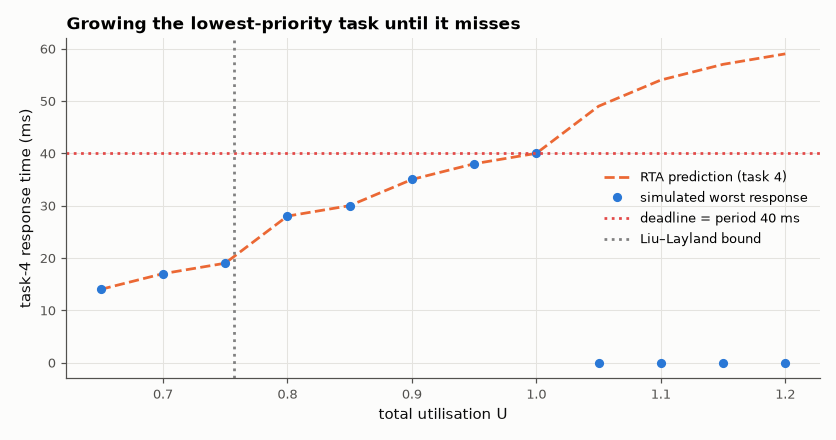

# SL-149 · Rate-monotonic RTOS scheduling: response times vs analysis

> Schedule four periodic tasks with rate-monotonic priorities in a preemptive kernel simulation; predict each task's worst-case response time with exact response-time analysis (RTA), measure it, and push the load until a deadline is missed.



*RTA predicts every worst-case response exactly; the task set stays schedulable well beyond the Liu–Layland bound.*

**Track:** Signal Lab — 214 electrical-engineering projects · **Category:** H. Embedded systems (simulated) · **Level:** Hard · **Tools:** C discrete-event simulation of a preemptive fixed-priority scheduler (1 µs resolution), response-time analysis in Python

**Data:** Simulated (numerical model in this repo).

## Problem

Can you prove a set of real-time tasks will always meet its deadlines before running it?

## Prediction

Liu & Layland: n tasks are schedulable under RM if $U=\sum C_i/T_i\le n(2^{1/n}-1)$ (0.757 for n = 4) — sufficient only. Exact RTA:
$R_i = C_i + \sum_{j<i}\lceil R_i/T_j\rceil C_j$, iterated to a fixed point; task i meets its deadline iff $R_i\le T_i$. Worst case at the critical instant (all
tasks released together).

## Method

Tasks (C, T) in ms: (1, 5), (2, 10), (3, 20), (4, 40) → U = 0.65; then C₄ increased until a miss. Kernel: 1 µs ticks, highest-priority ready task runs,
preemption at releases, 10 hyperperiods simulated; response time = completion − release.

## Measured results

*Predicted vs measured vs error. "Measured" = computed by an independent simulation, HDL simulator or public dataset.*

| Quantity | Predicted | Measured | Error |
|---|---|---|---|
| Task 1 (C=1 ms, T=5 ms): worst response time (RTA) | 1000 µs | 1000 µs | +0 µs |
| Task 2 (C=2 ms, T=10 ms): worst response time (RTA) | 3000 µs | 3000 µs | +0 µs |
| Task 3 (C=3 ms, T=20 ms): worst response time (RTA) | 7000 µs | 7000 µs | +0 µs |
| Task 4 (C=4 ms, T=40 ms): worst response time (RTA) | 1.4e+04 µs | 1.4e+04 µs | +0 µs |
| Utilisation at the first deadline miss (RTA prediction vs simulation) | 1.05 | 1.05 | +0 |

**Additional measurements**

| Quantity | Value | Note |
|---|---|---|
| Utilisation U | 0.65 | Liu–Layland bound for 4 tasks: 0.757 |

## Error analysis

Simulated worst-case response times equal the RTA fixed point exactly, because the simulation starts all tasks at the critical
instant (t = 0) where the analysis says the worst case occurs. The Liu–Layland bound (0.757) is only sufficient: with these
harmonic periods (each divides the next) the task set remains schedulable up to U = 1, and the first miss appears exactly
where RTA says R₄ exceeds 40 ms. Harmonic periods are a practical design trick for exactly this reason.

## Reproduce

```bash
pip install -r requirements.txt
python run_all.py --only SL-149
```

The script [`project.py`](project.py) regenerates every figure and number above.

**Files produced**

- [`firmware/rm_sched.c`](firmware/rm_sched.c) — firmware source
- [`firmware/rm_sched.c`](firmware/rm_sched.c) — firmware source
- [`firmware/rm_sched.c`](firmware/rm_sched.c) — firmware source
- [`firmware/rm_sched.c`](firmware/rm_sched.c) — firmware source
- [`firmware/rm_sched.c`](firmware/rm_sched.c) — firmware source
- [`firmware/rm_sched.c`](firmware/rm_sched.c) — firmware source
- [`firmware/rm_sched.c`](firmware/rm_sched.c) — firmware source
- [`firmware/rm_sched.c`](firmware/rm_sched.c) — firmware source
- [`firmware/rm_sched.c`](firmware/rm_sched.c) — firmware source
- [`firmware/rm_sched.c`](firmware/rm_sched.c) — firmware source
- [`firmware/rm_sched.c`](firmware/rm_sched.c) — firmware source
- [`firmware/rm_sched.c`](firmware/rm_sched.c) — firmware source
- [`firmware/rm_sched.c`](firmware/rm_sched.c) — firmware source
- [`data/sweep.csv`](data/sweep.csv)

## License

Code and text: MIT (see the repository [LICENSE](../../../../LICENSE)). Datasets remain under their own licences (see the repository README).

---

**Tooling & honesty.** This project was generated with Claude Code (Anthropic's AI coding assistant): the code, derivations, simulations and this write-up were AI-produced. *Measured* means computed by an independent model, simulator or public dataset — not a physical lab bench. Every number in the tables is reproduced by running the code.
