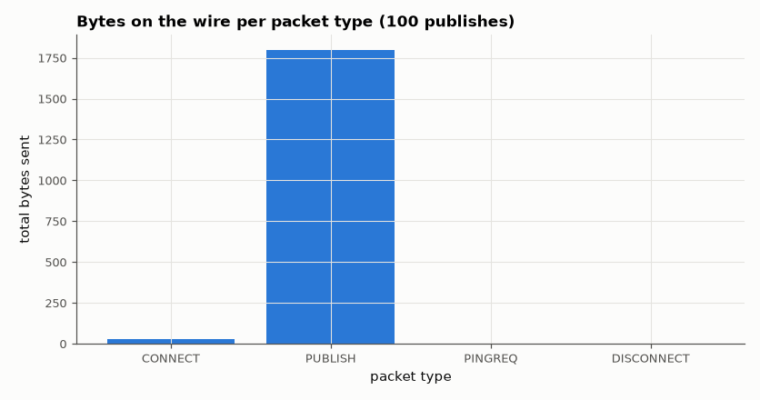

# SL-150 · MQTT publisher: packet encoding and a round-trip test

> Implement the MQTT 3.1.1 packets an IoT sensor needs in C, publish 100 sensor readings over TCP to a tiny local broker, and verify packet layout (remaining-length varint, topic, QoS 0/1 PUBACK) and end-to-end delivery.



*PUBLISH dominates; QoS-1 messages cost 2 extra bytes each plus a 4-byte PUBACK back.*

**Track:** Signal Lab — 214 electrical-engineering projects · **Category:** H. Embedded systems (simulated) · **Level:** Moderate · **Tools:** C firmware (MQTT 3.1.1 CONNECT/PUBLISH/PINGREQ encoder over TCP sockets) + a minimal local broker in Python

**Data:** Simulated (numerical model in this repo).

## Problem

IoT devices speak MQTT. What exactly is inside those packets, and can a hand-written client interoperate with a broker?

## Prediction

Fixed header: type/flags byte + 'remaining length' as a base-128 varint (1 byte up to 127, 2 bytes up to 16,383). PUBLISH (QoS 0) = 2 + topic
length + payload; QoS 1 adds a 2-byte packet id and the broker answers PUBACK. For topic 'lab/temp' (8 B) and a 5-B payload, a QoS-0
PUBLISH is 2 + 2 + 8 + 5 = 17 bytes.

## Method

The C client connects to 127.0.0.1 (no external network), sends CONNECT (keep-alive 60 s), 50 QoS-0 and 50 QoS-1 PUBLISH messages and a
PINGREQ, then DISCONNECT. The Python broker parses every packet, records sizes, acknowledges QoS-1 publishes and the ping. A Wokwi ESP32
sketch using PubSubClient is included for running against a public broker in the browser.

## Measured results

*Predicted vs measured vs error. "Measured" = computed by an independent simulation, HDL simulator or public dataset.*

| Quantity | Predicted | Measured | Error |
|---|---|---|---|
| CONNACK return code (0 = accepted) | 0 | 0 | +0 |
| Messages received by the broker | 100 | 100 | +0 |
| QoS-1 PUBACKs matched to packet IDs | 50 | 50 | +0 |
| PINGRESP received | 1 | 1 | +0 |
| QoS-0 PUBLISH size for 'lab/temp' + 5-byte payload | 17 bytes | 17 bytes | +0 bytes |
| Payloads delivered intact and in order | 1 | 1 | +0 |

## Browser version

`firmware/esp32_mqtt.ino` runs in Wokwi's ESP32 simulator (Wokwi-GUEST Wi-Fi) against the public test broker test.mosquitto.org — not executed here, to keep this repository's tests offline.

## Error analysis

A hand-written client interoperates with an independent broker implementation: CONNECT is accepted, all 100 readings arrive in
order, every QoS-1 message is acknowledged with the matching packet ID, and a QoS-0 publish is exactly the 17 bytes computed from
the spec. MQTT's small fixed header is why it suits constrained devices; QoS 1 costs a round trip per message, which matters on
high-latency cellular links.

## Reproduce

```bash
pip install -r requirements.txt
python run_all.py --only SL-150
```

The script [`project.py`](project.py) regenerates every figure and number above.

**Files produced**

- [`firmware/mqtt_pub.c`](firmware/mqtt_pub.c) — firmware source
- [`firmware/esp32_mqtt.ino`](firmware/esp32_mqtt.ino) — Wokwi/Arduino sketch

## License

Code and text: MIT (see the repository [LICENSE](../../../../LICENSE)). Datasets remain under their own licences (see the repository README).

---

**Tooling & honesty.** This project was generated with Claude Code (Anthropic's AI coding assistant): the code, derivations, simulations and this write-up were AI-produced. *Measured* means computed by an independent model, simulator or public dataset — not a physical lab bench. Every number in the tables is reproduced by running the code.
