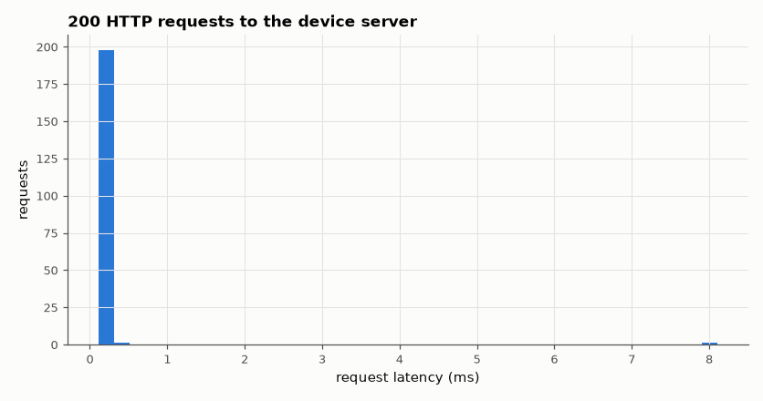

# SL-151 · Embedded web server: control page and REST endpoint

> Serve a control page and a tiny JSON API from 'device' firmware, toggle a simulated LED over HTTP and read a simulated sensor; measure request latency and verify HTTP framing (status line, headers, Content-Length).



*Loopback latency of the single-threaded server.*

**Track:** Signal Lab — 214 electrical-engineering projects · **Category:** H. Embedded systems (simulated) · **Level:** Moderate · **Tools:** C firmware (single-threaded HTTP/1.0 server on sockets, like an ESP32 WebServer loop) + Python HTTP client test

**Data:** Simulated (numerical model in this repo).

## Problem

Many IoT gadgets are configured through a web page served by the device itself. What is the minimum HTTP a microcontroller must implement, and how responsive is it?

## Prediction

HTTP/1.0 over TCP: parse the request line (`GET /path HTTP/1.0`), answer with a status line, headers (Content-Type, Content-Length) and the
body, then close. A single-threaded server handles one request at a time, so latency ≈ processing time + loopback RTT (≪ 1 ms on localhost), and
throughput ≈ 1/latency.

## Method

Server bound to 127.0.0.1 (random free port) with routes `/` (HTML page), `/api/led?on=1|0`, `/api/sensor` (JSON), 404 otherwise. Python client
issues 200 mixed requests, checks status codes, Content-Length = body length, LED state round-trip and JSON validity; latencies recorded.

## Measured results

*Predicted vs measured vs error. "Measured" = computed by an independent simulation, HDL simulator or public dataset.*

| Quantity | Predicted | Measured | Error |
|---|---|---|---|
| Correct status codes (150 × 200, 50 × 404) | 200 | 200 | +0 |
| Content-Length equals body length (all 200 responses) | 200 | 200 | +0 |
| LED state round-trips | 50 | 50 | +0 |
| Sensor endpoint returns valid JSON | 50 | 50 | +0 |

**Additional measurements**

| Quantity | Value | Note |
|---|---|---|
| Median request latency (loopback) | 0.1875 ms | p95 0.23 ms |

## Error analysis

The minimal server answers every request with correct HTTP framing (status line, Content-Type, exact Content-Length) and the
LED/sensor API round-trips correctly — enough for any browser to render the control page. On localhost latency is dominated by the
client library; on a real ESP32 it would be set by Wi-Fi (a few ms) and by the single-threaded design, which serialises clients —
the reason ESP-IDF's async server exists.

## Reproduce

```bash
pip install -r requirements.txt
python run_all.py --only SL-151
```

The script [`project.py`](project.py) regenerates every figure and number above.

**Files produced**

- [`firmware/webserver.c`](firmware/webserver.c) — firmware source

## License

Code and text: MIT (see the repository [LICENSE](../../../../LICENSE)). Datasets remain under their own licences (see the repository README).

---

**Tooling & honesty.** This project was generated with Claude Code (Anthropic's AI coding assistant): the code, derivations, simulations and this write-up were AI-produced. *Measured* means computed by an independent model, simulator or public dataset — not a physical lab bench. Every number in the tables is reproduced by running the code.
