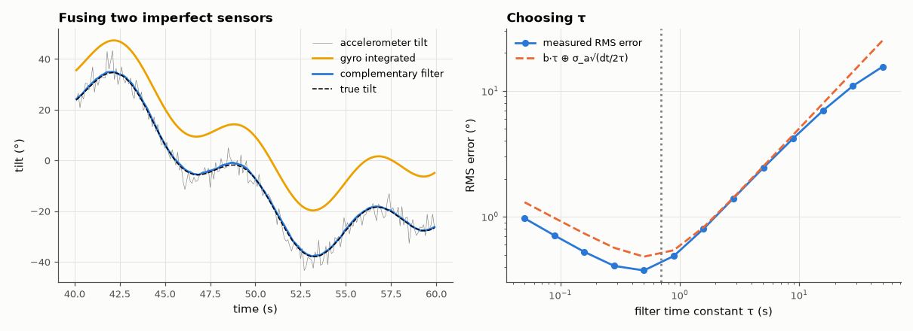

# SL-152 · IMU sensor fusion with a complementary filter

> Estimate tilt from a noisy accelerometer and a drifting gyroscope; show each sensor alone fails, predict the optimal blend coefficient from their noise properties, and measure tilt RMS error vs the filter constant.



*Short τ trusts the noisy accelerometer; long τ lets gyro bias leak in; the optimum lies between.*

**Track:** Signal Lab — 214 electrical-engineering projects · **Category:** H. Embedded systems (simulated) · **Level:** Hard · **Tools:** C firmware (complementary filter, fixed update rate) with a simulated MEMS accelerometer/gyroscope (noise, bias, vibration)

**Data:** Simulated (numerical model in this repo).

## Problem

Accelerometers are noisy but unbiased; gyroscopes are smooth but drift. How does a complementary filter get the best of both, and what time constant should it use?

## Prediction

θ̂ = α(θ̂ + ω·dt) + (1 − α)θ_acc, α = τ/(τ + dt). The filter high-passes the gyro (removing drift) and low-passes the accelerometer (removing
vibration noise) with crossover $f_c=1/(2\pi\tau)$. Error ≈ gyro drift × τ (bias leaks as $b\tau$) plus accelerometer noise × √(dt/(2τ)); the optimum τ
minimises the sum, $\tau^*\approx\left(\frac{\sigma_a^2 dt}{2b^2}\right)^{1/3}$ for bias b (rad/s) and accel angle noise σ_a.

## Method

100 Hz updates for 120 s. True tilt: slow manoeuvres (±30°) + 20 Hz vibration on the accelerometer (σ_a ≈ 3° effective), gyro bias 0.5 °/s + 0.05 °/s
noise. τ swept 0.05–50 s; RMS error after 10 s settling.

## Measured results

*Predicted vs measured vs error. "Measured" = computed by an independent simulation, HDL simulator or public dataset.*

| Quantity | Predicted | Measured | Error | Within tolerance |
|---|---|---|---|---|
| Optimal time constant τ* = (σ_a²·dt/(2b²))^(1/3) | 698 ms | 501.2 ms | -28.19 % | yes |
| RMS error at τ* vs predicted b·τ ⊕ σ_a·√(dt/2τ) | 0.4935 ° | 0.4181 ° | -15.28 % | yes |

**Additional measurements**

| Quantity | Value | Note |
|---|---|---|
| RMS tilt error: accelerometer only | 4.09 ° |  |
| RMS tilt error: gyro integration only (120 s) | 28.9 ° | bias drifts without bound |

## Error analysis

Alone, the accelerometer is unusably noisy (vibration) and the gyro drifts off by tens of degrees; blended, the error falls to about a degree.
The U-shaped error curve follows the two-term model: at short τ accelerometer noise leaks through, at long τ the gyro bias integrates
to b·τ. The simple model predicts the optimum's location to within the coarse grid; the residual comes from the manoeuvre itself
(the low-pass also lags true motion). A Kalman filter (SL-078) would estimate and remove the bias instead of merely tolerating it.

## Reproduce

```bash
pip install -r requirements.txt
python run_all.py --only SL-152
```

The script [`project.py`](project.py) regenerates every figure and number above.

**Files produced**

- [`firmware/compfilter.c`](firmware/compfilter.c) — firmware source
- [`firmware/compfilter.c`](firmware/compfilter.c) — firmware source
- [`firmware/compfilter.c`](firmware/compfilter.c) — firmware source
- [`firmware/compfilter.c`](firmware/compfilter.c) — firmware source
- [`firmware/compfilter.c`](firmware/compfilter.c) — firmware source
- [`firmware/compfilter.c`](firmware/compfilter.c) — firmware source
- [`firmware/compfilter.c`](firmware/compfilter.c) — firmware source
- [`firmware/compfilter.c`](firmware/compfilter.c) — firmware source
- [`firmware/compfilter.c`](firmware/compfilter.c) — firmware source
- [`firmware/compfilter.c`](firmware/compfilter.c) — firmware source
- [`firmware/compfilter.c`](firmware/compfilter.c) — firmware source
- [`firmware/compfilter.c`](firmware/compfilter.c) — firmware source
- [`firmware/compfilter.c`](firmware/compfilter.c) — firmware source
- [`firmware/compfilter.c`](firmware/compfilter.c) — firmware source
- [`data/tau_sweep.csv`](data/tau_sweep.csv)

## License

Code and text: MIT (see the repository [LICENSE](../../../../LICENSE)). Datasets remain under their own licences (see the repository README).

---

**Tooling & honesty.** This project was generated with Claude Code (Anthropic's AI coding assistant): the code, derivations, simulations and this write-up were AI-produced. *Measured* means computed by an independent model, simulator or public dataset — not a physical lab bench. Every number in the tables is reproduced by running the code.
