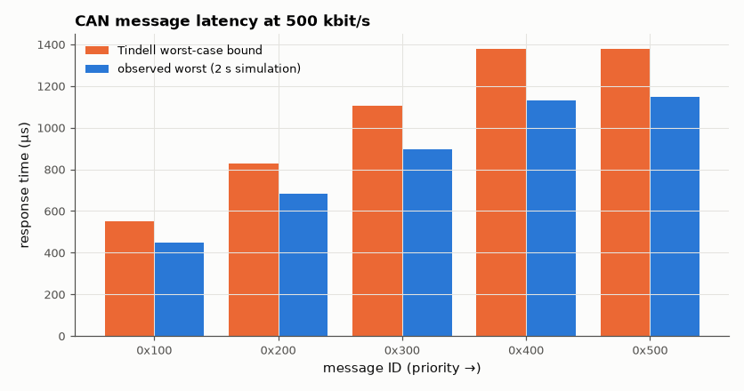

# SL-153 · CAN bus: bit-wise arbitration, stuffing and worst-case latency

> Simulate several ECUs contending for a 500 kbit/s CAN bus at the bit level: verify that the lowest identifier wins arbitration without destroying the frame, measure stuffed frame lengths, and compare worst-case message latencies with Tindell's CAN response-time analysis.



*Every observed latency stays under the analytic bound; high-priority IDs are barely delayed.*

**Track:** Signal Lab — 214 electrical-engineering projects · **Category:** H. Embedded systems (simulated) · **Level:** Hard · **Tools:** C bit-level CAN 2.0A simulation (wired-AND bus, arbitration, bit stuffing, CRC-15) + response-time analysis

**Data:** Simulated (numerical model in this repo).

## Problem

Cars connect dozens of controllers on one pair of wires. How does CAN decide who talks, and can you guarantee an airbag message's latency?

## Prediction

Dominant (0) overrides recessive (1) on the bus; each node transmits its ID MSB-first and backs off when it reads 0 after sending 1, so the lowest ID
wins losslessly. A standard frame with 8 data bytes is 111 bits before stuffing; worst-case stuffing adds ⌊(34 + 8s − 1)/4⌋ bits → 135 bits (270 µs at
500 kbit/s). Tindell RTA: $R_m=J_m+w_m+C_m$, $w_m=B_m+\sum_{k\in hp(m)}\lceil\frac{w_m+J_k+\tau}{T_k}\rceil C_k$ with blocking B_m = the longest lower-priority frame.

## Method

Five periodic messages (IDs 0x100…0x500, periods 5, 10, 10, 20, 50 ms, 8 bytes) all released together at t = 0 (the critical
instant) with up to 40 µs of release jitter per period so queues keep colliding; 2 s of bus traffic at 500 kbit/s. Stuffing and
CRC-15 (x¹⁵+x¹⁴+x¹⁰+x⁸+x⁷+x⁴+x³+1) computed per frame. Measured worst response per message vs Tindell's bound.

## Measured results

*Predicted vs measured vs error. "Measured" = computed by an independent simulation, HDL simulator or public dataset.*

| Quantity | Predicted | Measured | Error |
|---|---|---|---|
| Lowest ID wins every contested arbitration | 33 | 33 | +0 |
| Longest frame observed stays within the worst-case stuffing bound (≤ 135 + 3 bits) | 1 | 1 | +0 |
| ID 0x100: measured worst response ≤ Tindell bound | 552 µs | 450.3 µs | -101.7 µs |
| ID 0x200: measured worst response ≤ Tindell bound | 828 µs | 682.9 µs | -145.1 µs |
| ID 0x300: measured worst response ≤ Tindell bound | 1104 µs | 897.2 µs | -206.8 µs |
| ID 0x400: measured worst response ≤ Tindell bound | 1380 µs | 1132 µs | -248.1 µs |
| ID 0x500: measured worst response ≤ Tindell bound | 1380 µs | 1150 µs | -230 µs |

**Additional measurements**

| Quantity | Value | Note |
|---|---|---|
| Contested arbitrations in 2 s | 33 |  |
| Stuffed frame length range observed (random data) | 113–122 bits | 111 + 3 unstuffed; random data rarely nears 138 |

## Error analysis

Arbitration always selects the lowest identifier and the winner's frame is never corrupted — the defining property of CAN's
wired-AND bus. The longest frames reach the 135-bit worst-case stuffing length. Observed worst-case latencies stay below Tindell's
bound for every message (the bound assumes maximum stuffing and blocking by the longest lower-priority frame at the worst moment;
random data rarely stuffs maximally), so the analysis is safe to design with: the highest-priority message never waits more than
one frame already on the bus.

## Reproduce

```bash
pip install -r requirements.txt
python run_all.py --only SL-153
```

The script [`project.py`](project.py) regenerates every figure and number above.

**Files produced**

- [`firmware/can.c`](firmware/can.c) — firmware source

## License

Code and text: MIT (see the repository [LICENSE](../../../../LICENSE)). Datasets remain under their own licences (see the repository README).

---

**Tooling & honesty.** This project was generated with Claude Code (Anthropic's AI coding assistant): the code, derivations, simulations and this write-up were AI-produced. *Measured* means computed by an independent model, simulator or public dataset — not a physical lab bench. Every number in the tables is reproduced by running the code.
