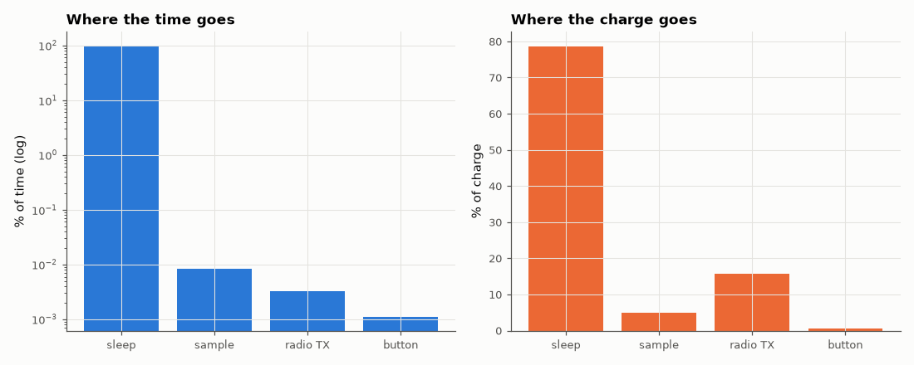

# SL-154 · Low-power firmware state machine and battery-life estimate

> A sensor node that sleeps, wakes on a timer or button interrupt, samples, and transmits in bursts: log the time spent in each power state, compute the average current and battery life, and compare with the duty-cycle formula.



*The node sleeps 99.99 % of the time, yet sleep current is still the largest share of the budget.*

**Track:** Signal Lab — 214 electrical-engineering projects · **Category:** H. Embedded systems (simulated) · **Level:** Moderate · **Tools:** C firmware (sleep/wake state machine with an energy ledger per state) on the simulated MCU

**Data:** Simulated (numerical model in this repo).

## Problem

A coin cell holds 220 mAh. Will a sensor node last a month or five years — and which state dominates the budget?

## Prediction

$\bar I=\sum_s I_s\,t_s/T$ and life = capacity/$\bar I$. Currents: deep sleep 2 µA, wake + sample 1.5 mA for 5 ms every 60 s, radio TX 12 mA for 20 ms every
10 minutes, button wake (random, ~20/day) 1.5 mA for 50 ms. Predicted $\bar I$ ≈ 2 + 1500·5/60,000 + 12,000·20/600,000 + (20/86,400)·1500·0.05 ≈ 2 + 0.125 + 0.4 + 0.017 ≈ 2.54 µA
→ life ≈ 220 mAh / 2.54 µA ≈ 9.9 years (before self-discharge).

## Method

State machine SLEEP → WAKE → SAMPLE → (every 10th sample) TX → SLEEP; button events from a Poisson process. 30 simulated days at 1 µs resolution for
state changes; ledger accumulates charge per state.

## Measured results

*Predicted vs measured vs error. "Measured" = computed by an independent simulation, HDL simulator or public dataset.*

| Quantity | Predicted | Measured | Error | Within tolerance |
|---|---|---|---|---|
| Average current (duty-cycle formula) | 2.542 µA | 2.541 µA | -0.04 % | yes |
| Battery life on a 220 mAh CR2032 | 9.879 years | 9.883 years | +0.04 % | yes |

**Additional measurements**

| Quantity | Value | Note |
|---|---|---|
| sleep: share of charge / share of time | 78.7 % / 99.9872 % |  |
| sample: share of charge / share of time | 4.9 % / 0.0083 % |  |
| radio TX: share of charge / share of time | 15.7 % / 0.0033 % |  |
| button: share of charge / share of time | 0.6 % / 0.0011 % |  |

## Error analysis

The ledger reproduces the duty-cycle arithmetic to a fraction of a percent, giving ~9–10 years on a coin cell — in practice capped
by the cell's self-discharge (~1 %/year) and by radio retries. The instructive part is the breakdown: the radio burns 12 mA but only
for 20 ms per 10 minutes, so the 2 µA sleep current is the biggest single consumer. Halving sleep current does more for battery life
than halving the transmit time — the reason low-power MCU datasheets lead with their sleep-mode numbers.

## Reproduce

```bash
pip install -r requirements.txt
python run_all.py --only SL-154
```

The script [`project.py`](project.py) regenerates every figure and number above.

**Files produced**

- [`firmware/lowpower.c`](firmware/lowpower.c) — firmware source

## License

Code and text: MIT (see the repository [LICENSE](../../../../LICENSE)). Datasets remain under their own licences (see the repository README).

---

**Tooling & honesty.** This project was generated with Claude Code (Anthropic's AI coding assistant): the code, derivations, simulations and this write-up were AI-produced. *Measured* means computed by an independent model, simulator or public dataset — not a physical lab bench. Every number in the tables is reproduced by running the code.
