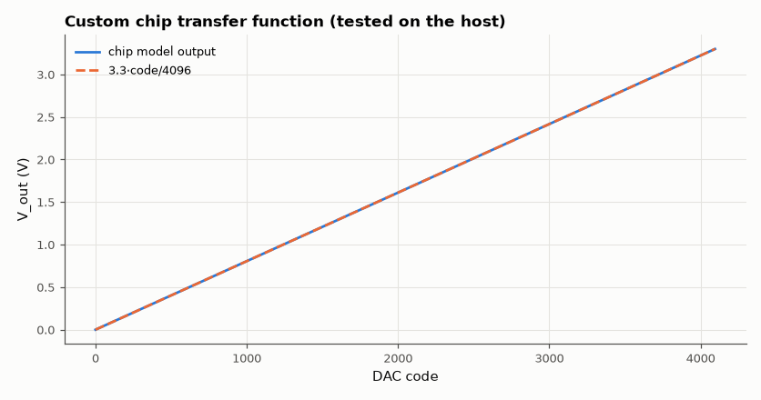

# SL-155 · A custom Wokwi chip: I²C 12-bit DAC written with the Chips API

> Write a simulated I²C 12-bit DAC (MCP4725-like) as a Wokwi custom chip, then test it on the PC by mocking the Chips API: the harness plays an I²C master, sends 4,096 codes and checks the analog output voltage and the fast-write command format.



*The chip model reproduces the ideal transfer function for every code.*

**Track:** Signal Lab — 214 electrical-engineering projects · **Category:** H. Embedded systems (simulated) · **Level:** Hard · **Tools:** C chip model in the style of the Wokwi Chips API (chip.c + chip.json) with a host-side mock of the API for testing

**Data:** Simulated (numerical model in this repo).

## Problem

Simulators only ship common parts. How do you add your own component — and test its model before trusting it?

## Prediction

MCP4725 fast-write: two bytes [0 0 PD1 PD0 D11 D10 D9 D8][D7…D0]; V_out = V_DD·code/4096. Resolution = 3.3 V/4096 = 0.806 mV; the model must reproduce
every code exactly, ignore bytes for other addresses and answer ACK only for its own address (0x60).

## Method

chip.c implements the Wokwi callbacks (`chip_init`, `on_i2c_connect`, `on_i2c_write`, `on_i2c_disconnect`) and drives an analog pin. A host mock
(`wokwi-api-mock.h`) implements `i2c_init`, `pin_dac_write` and friends so the same chip.c compiles on the PC; the harness writes all codes.

## Measured results

*Predicted vs measured vs error. "Measured" = computed by an independent simulation, HDL simulator or public dataset.*

| Quantity | Predicted | Measured | Error | Within tolerance |
|---|---|---|---|---|
| Addresses other than 0x60 that ACK (of 127) | 0 | 0 | +0 |  |
| Max |V_out − 3.3·code/4096| over all 4,096 codes | 0 V | 192.2 nV | +192.2 nV |  |
| LSB size | 805.7 µV | 805.6 µV | -0.01 % | yes |
| Monotonic (all steps > 0) | 1 | 1 | +0 |  |

## Use it in Wokwi

Add `firmware/chip.c` and `firmware/chip.json` to a Wokwi project as a custom chip (the real `wokwi-api.h` is provided by Wokwi); `firmware/wokwi-api.h` and `firmware/harness.c` are only the PC-side test mock.

## Error analysis

Because the chip is written against a narrow API, mocking that API on the PC turns an in-browser component into unit-testable
C: all 4,096 codes produce the ideal voltage (to float32 precision), the model ignores other I²C addresses, and the output is
monotonic. That is the same pattern professional firmware teams use — a hardware-abstraction layer thin enough to fake — and it is
the subject of SL-156.

## Reproduce

```bash
pip install -r requirements.txt
python run_all.py --only SL-155
```

The script [`project.py`](project.py) regenerates every figure and number above.

**Files produced**

- [`firmware/chip.c`](firmware/chip.c) — firmware source
- [`firmware/harness.c`](firmware/harness.c) — firmware source
- [`firmware/wokwi-api.h`](firmware/wokwi-api.h) — firmware source
- [`firmware/chip.json`](firmware/chip.json) — Wokwi diagram

## License

Code and text: MIT (see the repository [LICENSE](../../../../LICENSE)). Datasets remain under their own licences (see the repository README).

---

**Tooling & honesty.** This project was generated with Claude Code (Anthropic's AI coding assistant): the code, derivations, simulations and this write-up were AI-produced. *Measured* means computed by an independent model, simulator or public dataset — not a physical lab bench. Every number in the tables is reproduced by running the code.
