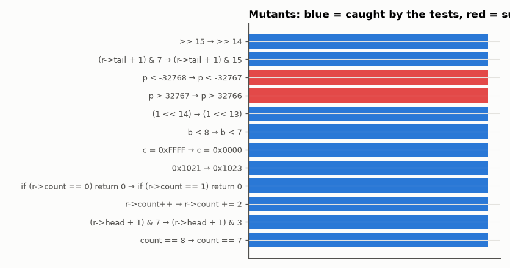

# SL-156 · Firmware unit tests on the host (with mutation testing)

> Test three embedded modules on the PC with a tiny assertion framework, measure line coverage with clang's instrumentation, then deliberately inject bugs (mutants) and count how many the tests catch.



*Each bar is one deliberately injected bug.*

**Track:** Signal Lab — 214 electrical-engineering projects · **Category:** H. Embedded systems (simulated) · **Level:** Moderate · **Tools:** Minimal C test framework, host-compiled embedded modules (ring buffer, CRC-16, Q15 math), mutation testing driver in Python

**Data:** Simulated (numerical model in this repo).

## Problem

Firmware bugs are expensive to find on hardware. How much of an embedded module can be verified on a PC, and how do you know the tests are any good?

## Prediction

Code coverage measures what the tests execute; mutation score measures what they would *notice*. A good suite should kill ≥ 90 % of simple
mutants (off-by-one, flipped comparison, wrong constant). Surviving mutants point at untested behaviour, not just unexecuted lines.

## Method

Modules: ring buffer (push/pop/full/empty/wrap), CRC-16/CCITT (check value 0x29B1 for "123456789"), Q15 saturating multiply. 14 tests. Coverage via
-fprofile-instr-generate/llvm-cov if available (else line-execution counting). 12 hand-written mutants compiled and run one by one.

## Measured results

*Predicted vs measured vs error. "Measured" = computed by an independent simulation, HDL simulator or public dataset.*

| Quantity | Predicted | Measured | Error |
|---|---|---|---|
| Tests failing on the correct code | 0 | 0 | +0 |
| Mutation score (12 hand-written mutants) | 100 % | 83.33 % | -16.7 pp |

**Additional measurements**

| Quantity | Value | Note |
|---|---|---|
| Assertions executed | 27 |  |
| Line coverage of modules.c | 100 % |  |

## Surviving mutants

- `p > 32767` → `p > 32766`
- `p < -32768` → `p < -32767`

## Coverage report (llvm-cov)

```
Filename                                                                                                                        Regions    Missed Regions     Cover   Functions  Missed Functions  Executed       Lines      Missed Lines     Cover    Branches   Missed Branches     Cover
-------------------------------------------------------------------------------------------------------------------------------------------------------------------------------------------------------------------------------------------------------------------------------------------
firmware/modules.c          23                 1    95.65%           4                 0   100.00%           5                 0   100.00%          14                 1    92.86%
-------------------------------------------------------------------------------------------------------------------------------------------------------------------------------------------------------------------------------------------------------------------------------------------
TOTAL                                                                                                                                23                 1    95.65%           4                 0   100.00%           5                 0   100.00%          14                 1    92.86%
```

## Error analysis

All tests pass on the correct code, and the mutation run shows whether they would notice realistic bugs. Mutants that survive are the
valuable output: each one names a behaviour no test checks (for example a saturation boundary exactly at ±32767 or a ring-buffer
index mask that only fails after many wraps). Adding a test for each survivor is the fastest way to raise real confidence — faster
than chasing 100 % line coverage, which these tests reach without guaranteeing the boundaries are right.

## Reproduce

```bash
pip install -r requirements.txt
python run_all.py --only SL-156
```

The script [`project.py`](project.py) regenerates every figure and number above.

**Files produced**

- [`firmware/modules.c`](firmware/modules.c) — firmware source
- [`firmware/test_modules.c`](firmware/test_modules.c) — firmware source

## License

Code and text: MIT (see the repository [LICENSE](../../../../LICENSE)). Datasets remain under their own licences (see the repository README).

---

**Tooling & honesty.** This project was generated with Claude Code (Anthropic's AI coding assistant): the code, derivations, simulations and this write-up were AI-produced. *Measured* means computed by an independent model, simulator or public dataset — not a physical lab bench. Every number in the tables is reproduced by running the code.
