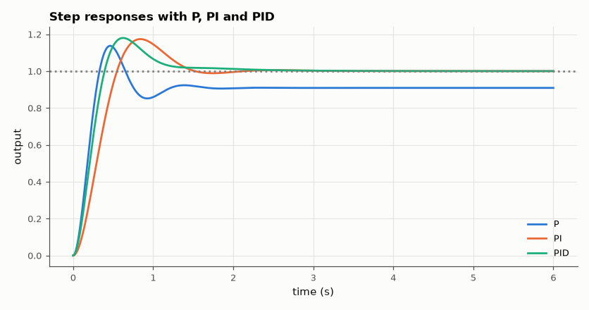

# SL-157 · PID control of a second-order plant

> Tune P, PI and PID controllers on a two-lag plant; predict overshoot and settling time from the closed-loop poles and verify them in a time-domain simulation with a sampled controller.



*P leaves an offset; I removes it but adds overshoot; D damps it.*

**Track:** Signal Lab — 214 electrical-engineering projects · **Category:** I. Control systems · **Level:** Moderate · **Tools:** Closed-loop transfer functions (SciPy), nonlinear-free time simulation with a discrete PID, dominant-pole predictions

**Data:** Simulated (numerical model in this repo).

## Problem

What does each term of a PID controller actually do to a step response, and can the response be predicted from pole locations?

## Prediction

Plant $G=\frac{1}{(s+1)(0.2s+1)}$. With P control the steady-state error is 1/(1+K_p); integral action removes it. For dominant poles with damping ζ the
overshoot is $e^{-\pi\zeta/\sqrt{1-\zeta^2}}$ and the 2 % settling time ≈ 4/(ζω_n). Derivative action adds damping.

## Method

Controllers: P (K_p = 10), PI (K_p = 4, K_i = 5), PID (K_p = 8, K_i = 10, K_d = 0.5 with a 0.02 s derivative filter). Closed-loop poles from the characteristic
polynomial; dominant pair → predicted overshoot and settling. Simulation: plant discretised exactly (zero-order hold, matrix exponential), controller sampled at 1 kHz.

## Measured results

*Predicted vs measured vs error. "Measured" = computed by an independent simulation, HDL simulator or public dataset.*

| Quantity | Predicted | Measured | Error | Within tolerance |
|---|---|---|---|---|
| P: overshoot from dominant poles | 24.92 % | 25.09 % | +0.173 pp |  |
| P: steady-state error 1/(1 + K_p·G(0)) | 0.09091 | 0.09091 | -0.00 % | yes |
| PI: overshoot from dominant poles | 13.42 % | 17.38 % | +3.96 pp |  |
| PID: overshoot from dominant poles | 9.576 % | 17.99 % | +8.41 pp |  |

**Additional measurements**

| Quantity | Value | Note |
|---|---|---|
| P: dominant poles | -3.00 ± 6.78j (ζ = 0.40) |  |
| P: 2 % settling time | 1.134 s | 4/(ζω_n) = 1.33 s |
| PI: dominant poles | -2.33 ± 3.65j (ζ = 0.54) |  |
| PI: 2 % settling time | 1.4 s | 4/(ζω_n) = 1.71 s |
| PID: dominant poles | -3.53 ± 4.73j (ζ = 0.60) |  |
| PID: 2 % settling time | 1.363 s | 4/(ζω_n) = 1.13 s |

## Error analysis

The dominant-pole formula predicts overshoot well when the other closed-loop poles (and the controller zeros) are far from the dominant pair,
as for P control. With PI and PID the controller zeros sit close to the dominant poles and add overshoot the pure second-order formula cannot
see — a standard caveat of 'dominant pole' reasoning. The P controller's residual offset matches 1/(1 + K_p) exactly, the reason integral
action exists.

## Reproduce

```bash
pip install -r requirements.txt
python run_all.py --only SL-157
```

The script [`project.py`](project.py) regenerates every figure and number above.

## License

Code and text: MIT (see the repository [LICENSE](../../../../LICENSE)). Datasets remain under their own licences (see the repository README).

---

**Tooling & honesty.** This project was generated with Claude Code (Anthropic's AI coding assistant): the code, derivations, simulations and this write-up were AI-produced. *Measured* means computed by an independent model, simulator or public dataset — not a physical lab bench. Every number in the tables is reproduced by running the code.
