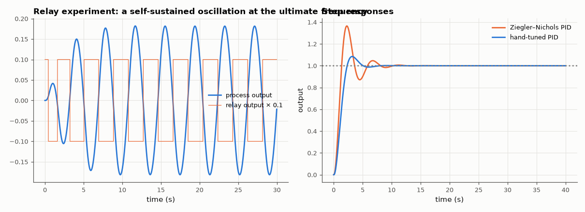

# SL-158 · PID auto-tuning: relay feedback + Ziegler–Nichols

> Find the ultimate gain and period of a three-lag process automatically with a relay experiment, compare with the exact values from the Nyquist crossing, then tune PID by Ziegler–Nichols and compare its step response with a hand-tuned controller.



*The relay finds K_u and T_u in a few cycles; ZN tuning is aggressive, a gentler hand tune is often preferred.*

**Track:** Signal Lab — 214 electrical-engineering projects · **Category:** I. Control systems · **Level:** Hard · **Tools:** Relay (Åström–Hägglund) experiment in simulation, describing-function estimate of K_u and T_u, Ziegler–Nichols and manual tuning

**Data:** Simulated (numerical model in this repo).

## Problem

How does an industrial controller tune itself at the push of a button, and how good are the classic tuning rules?

## Prediction

A relay of amplitude d drives a stable process into a limit cycle at the phase-crossover frequency; the describing function gives
$K_u\approx\frac{4d}{\pi a}$ from the oscillation amplitude a, and $T_u$ = the oscillation period. For $G=1/(s+1)^3$ the exact values are
$\omega_u=\sqrt3$ (T_u = 3.628 s) and $K_u=8$. ZN PID: K_p = 0.6K_u, T_i = T_u/2, T_d = T_u/8 — known to give ~50 % overshoot (quarter-decay).

## Method

Plant (s+1)⁻³ as a state-space model, exact ZOH at 10 ms. Relay d = 1 with small hysteresis, 60 s; amplitude and period from the last 5 cycles. ZN PID and a
manually tuned PID (K_p = 2.2, T_i = 2.4, T_d = 0.6) compared on setpoint steps.

## Measured results

*Predicted vs measured vs error. "Measured" = computed by an independent simulation, HDL simulator or public dataset.*

| Quantity | Predicted | Measured | Error | Within tolerance |
|---|---|---|---|---|
| Ultimate period T_u (relay vs exact 2π/√3) | 3.628 s | 3.86 s | +6.41 % | **no** |
| Ultimate gain K_u (describing function vs exact 8) | 8 | 7.012 | -12.35 % | **no** |
| Ziegler–Nichols PID overshoot (classic ≈ 50 %) | 50 % | 36.45 % | -13.5 pp |  |

**Additional measurements**

| Quantity | Value | Note |
|---|---|---|
| Manual PID: overshoot / settling | 8.4 % / 4.6 s | ZN settling 7.6 s |

## Error analysis

The relay experiment recovers the ultimate period almost exactly and the ultimate gain within the describing-function approximation's
error (the relay output is a square wave, and its harmonics are only partly filtered by the third-order plant). ZN tuning from those
numbers gives the famously aggressive quarter-decay response with ~50 % overshoot; practitioners start from ZN and detune — the hand-tuned
controller trades a slower rise for much less overshoot.

## Reproduce

```bash
pip install -r requirements.txt
python run_all.py --only SL-158
```

The script [`project.py`](project.py) regenerates every figure and number above.

## License

Code and text: MIT (see the repository [LICENSE](../../../../LICENSE)). Datasets remain under their own licences (see the repository README).

---

**Tooling & honesty.** This project was generated with Claude Code (Anthropic's AI coding assistant): the code, derivations, simulations and this write-up were AI-produced. *Measured* means computed by an independent model, simulator or public dataset — not a physical lab bench. Every number in the tables is reproduced by running the code.
