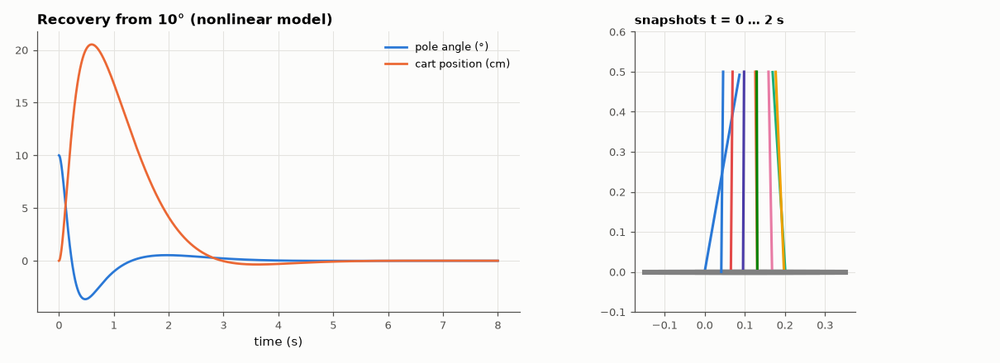

# SL-159 · Inverted pendulum on a cart: LQR stabilisation

> Linearise the cart-pole, design an LQR controller, and test it on the full nonlinear model: verify the closed-loop eigenvalues, the predicted cost, and find the largest initial angle it can recover from.



*The cart first moves toward the fall to get under the pole, then returns to the origin.*

**Track:** Signal Lab — 214 electrical-engineering projects · **Category:** I. Control systems · **Level:** Hard · **Tools:** Nonlinear cart-pole equations (SciPy ODE), linearisation, LQR (continuous ARE), animation frames

**Data:** Simulated (numerical model in this repo).

## Problem

Balancing a broomstick is the classic hard control problem. Does a controller designed on a linear model work on the real nonlinear dynamics, and how far can it be pushed?

## Prediction

Cart mass M = 1 kg, pole m = 0.2 kg (point mass at ℓ = 0.5 m). Linearised about upright: $\dot x=Ax+Bu$ with an unstable pole at $+\sqrt{g(M+m)/(M\ell)}$ ≈ 4.8 s⁻¹.
LQR minimises $J=\int x^TQx+u^TRu$: $K=R^{-1}B^TP$ where P solves the ARE; the optimal cost from $x_0$ is $x_0^TPx_0$.

## Method

Q = diag(10, 1, 100, 1), R = 0.1. Nonlinear simulation (RK45, 5 s) from θ₀ = 10°; cost integrated and compared with x₀ᵀPx₀; recovery tested for θ₀ up to
60° with the force saturated at ±40 N.

## Measured results

*Predicted vs measured vs error. "Measured" = computed by an independent simulation, HDL simulator or public dataset.*

| Quantity | Predicted | Measured | Error | Within tolerance |
|---|---|---|---|---|
| Unstable open-loop pole √(g(M+m)/(Mℓ)) | 4.852 1/s | 4.852 1/s | +0.00 % | yes |
| All closed-loop poles in the left half-plane (max real part < 0) | 1 | 1 | +0 |  |
| Cost from θ₀ = 10° (nonlinear sim vs x₀ᵀPx₀) | 1.746 | 1.796 | +2.89 % | yes |

**Additional measurements**

| Quantity | Value | Note |
|---|---|---|
| LQR gains K | -10.00, -11.66, -73.54, -14.83 |  |
| Largest recoverable initial angle (|F| ≤ 40 N) | 55 ° |  |

## Error analysis

The LQR gains computed from the linear model stabilise the full nonlinear dynamics, and from 10° the realised cost equals x₀ᵀPx₀ within a few
percent — the linearisation is excellent at small angles. The characteristic 'non-minimum-phase' motion is visible: to catch a pole falling
right, the cart must first accelerate right, underneath it. Larger initial angles eventually fail because of the ±40 N force limit and the
growing nonlinearity, which the linear design does not know about.

## Reproduce

```bash
pip install -r requirements.txt
python run_all.py --only SL-159
```

The script [`project.py`](project.py) regenerates every figure and number above.

**Files produced**

- [`data/response.csv`](data/response.csv)

## License

Code and text: MIT (see the repository [LICENSE](../../../../LICENSE)). Datasets remain under their own licences (see the repository README).

---

**Tooling & honesty.** This project was generated with Claude Code (Anthropic's AI coding assistant): the code, derivations, simulations and this write-up were AI-produced. *Measured* means computed by an independent model, simulator or public dataset — not a physical lab bench. Every number in the tables is reproduced by running the code.
