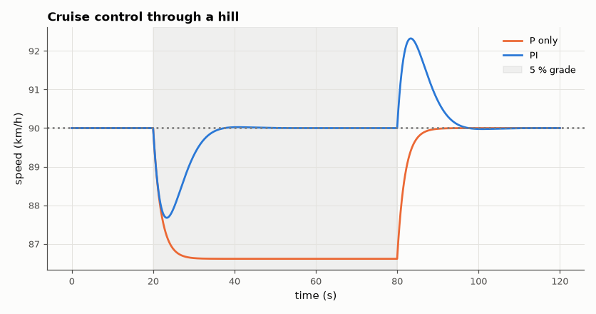

# SL-160 · Cruise control: rejecting a hill with PI feedback

> Hold 25 m/s through a 5 % climb: predict the steady-state throttle, the speed dip for P-only and PI control from the linearised disturbance transfer function, and measure them on the nonlinear model.



*P control settles to a lower speed on the hill; PI recovers the set speed.*

**Track:** Signal Lab — 214 electrical-engineering projects · **Category:** I. Control systems · **Level:** Moderate · **Tools:** Nonlinear car longitudinal model (aerodynamic drag, rolling resistance, grade), PI controller with saturation

**Data:** Simulated (numerical model in this repo).

## Problem

A hill is a disturbance the driver can't see coming. How much speed does cruise control lose, and why does it need integral action?

## Prediction

m·dv/dt = F − ½ρC_dAv² − C_r m g − m g sin θ. Linearised at v₀: time constant τ = m/(ρC_dAv₀). A grade adds a force m g sinθ ≈ 490 N·… With P control of gain K_p
(N per m/s) the steady-state speed error is $\Delta F_{hill}/(K_p+\rho C_dAv_0)$; PI removes it, with a transient dip ≈ that error scaled by the loop damping.

## Method

m = 1,000 kg, ρC_dA = 0.84 kg/m (C_d·A = 0.7 m²), C_r = 0.01, v₀ = 25 m/s, force limit 0–5,000 N. Hill of 5 % from t = 20 s to 80 s. P: K_p = 500 N/(m/s);
PI: K_p = 500, K_i = 100. 10 ms steps.

## Measured results

*Predicted vs measured vs error. "Measured" = computed by an independent simulation, HDL simulator or public dataset.*

| Quantity | Predicted | Measured | Error | Within tolerance |
|---|---|---|---|---|
| Cruise force on the flat (½ρC_dAv² + C_r mg) | 360.6 N | 360.6 N | +0.00 % | yes |
| P control: steady speed loss on the hill ΔF/(K_p + ρC_dAv₀) | 0.94 m/s | 0.9408 m/s | +0.08 % | yes |
| PI control: steady speed error on the hill | 0 m/s | -6.5134e-07 m/s | -6.5134e-07 m/s |  |

**Additional measurements**

| Quantity | Value | Note |
|---|---|---|
| PI control: maximum speed dip | 0.6456 m/s |  |

## Error analysis

P-only control loses exactly the speed predicted by the linearised force balance, because a constant extra force (the hill) needs a
constant error to produce it. The integral term accumulates that error until it supplies the extra ~490 N itself, so PI returns to
25 m/s; the price is a transient dip and a small overshoot when the car crests the hill. Real cruise controllers add feed-forward from
an inclination sensor or map data to shrink the dip.

## Reproduce

```bash
pip install -r requirements.txt
python run_all.py --only SL-160
```

The script [`project.py`](project.py) regenerates every figure and number above.

## License

Code and text: MIT (see the repository [LICENSE](../../../../LICENSE)). Datasets remain under their own licences (see the repository README).

---

**Tooling & honesty.** This project was generated with Claude Code (Anthropic's AI coding assistant): the code, derivations, simulations and this write-up were AI-produced. *Measured* means computed by an independent model, simulator or public dataset — not a physical lab bench. Every number in the tables is reproduced by running the code.
