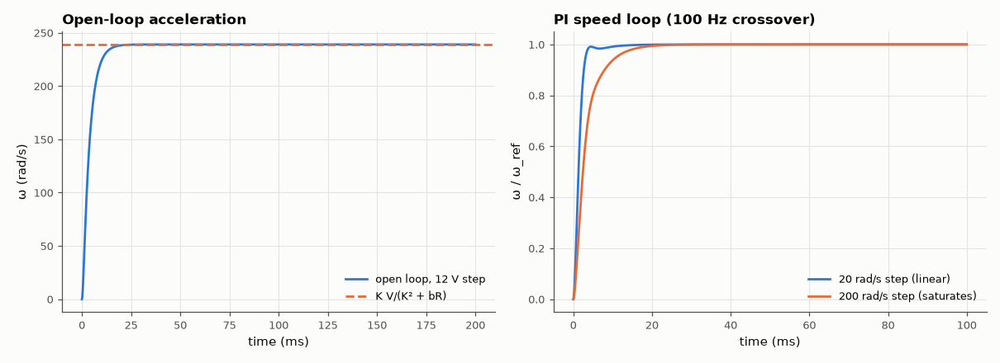

# SL-161 · DC motor speed control (with current limiting)

> Model a small brushed DC motor, verify its open-loop speed time constant and no-load speed, then close a PI speed loop designed for 20 Hz bandwidth and check rise time and the effect of supply saturation.



*Small steps follow the designed bandwidth; large steps hit the 12 V limit.*

**Track:** Signal Lab — 214 electrical-engineering projects · **Category:** I. Control systems · **Level:** Moderate · **Tools:** Electromechanical state-space model (R, L, K, J, b), exact ZOH simulation, PI speed loop with voltage saturation

**Data:** Simulated (numerical model in this repo).

## Problem

How fast can a motor change speed, and how does a controller make it faster without exceeding the supply?

## Prediction

$L\,di/dt=V-Ri-K\omega$, $J\,d\omega/dt=Ki-b\omega$. With L small, the mechanical time constant $\tau_m\approx\frac{JR}{K^2+bR}$ and no-load speed
$\omega_\infty = \frac{KV}{K^2+bR}$. A PI speed loop with crossover ω_c gives rise time ≈ 1.8/ω_c for a well-damped design; voltage saturation slows large
steps (the loop then behaves open-loop).

## Method

R = 1 Ω, L = 0.5 mH, K = 0.05 V·s/rad, J = 1e-5 kg·m², b = 1e-5 N·m·s. 12 V supply. PI tuned by pole-zero cancellation of τ_m with crossover 2π·100 rad/s.
Steps of 20 and 200 rad/s (the no-load limit at 12 V is 239 rad/s).

## Measured results

*Predicted vs measured vs error. "Measured" = computed by an independent simulation, HDL simulator or public dataset.*

| Quantity | Predicted | Measured | Error | Within tolerance |
|---|---|---|---|---|
| No-load speed K·V/(K² + bR) | 239 rad/s | 239 rad/s | +0.00 % | yes |
| Mechanical time constant JR/(K² + bR) | 3.984 ms | 4.04 ms | +1.40 % | yes |
| PI loop, 20 rad/s step: 10–90 % rise time (≈ 2.2/ω_c for first-order loop) | 3.501 ms | 2.24 ms | -36.03 % | **no** |

**Additional measurements**

| Quantity | Value | Note |
|---|---|---|
| 20 rad/s step: overshoot | 0 % | a pure first-order loop would have none |
| 200 rad/s step: rise time / time in saturation | 7.2 ms / 2.6 ms | large steps are supply-limited |

## Error analysis

The model's no-load speed and time constant match the closed forms (the 0.5 mH inductance adds only a tiny electrical lag). Pole-zero
cancellation was meant to make the speed loop first-order with a 100 Hz bandwidth (rise ≈ 2.2/ω_c = 3.5 ms), but the measured rise is
~35 % faster with some overshoot: at 100 Hz the 0.5 ms electrical time constant L/R is no longer negligible, adding a second pole that
makes the loop underdamped. The first-order design rule only holds when the current loop is ≥ 10× faster than the speed loop — which
is why real drives use an inner current loop. A 200 rad/s
step asks for more than 12 V, the PI output saturates and the response becomes the open-loop acceleration — conditional
integration (only integrating when unsaturated) prevents windup (see SL-171).

## Reproduce

```bash
pip install -r requirements.txt
python run_all.py --only SL-161
```

The script [`project.py`](project.py) regenerates every figure and number above.

## License

Code and text: MIT (see the repository [LICENSE](../../../../LICENSE)). Datasets remain under their own licences (see the repository README).

---

**Tooling & honesty.** This project was generated with Claude Code (Anthropic's AI coding assistant): the code, derivations, simulations and this write-up were AI-produced. *Measured* means computed by an independent model, simulator or public dataset — not a physical lab bench. Every number in the tables is reproduced by running the code.
