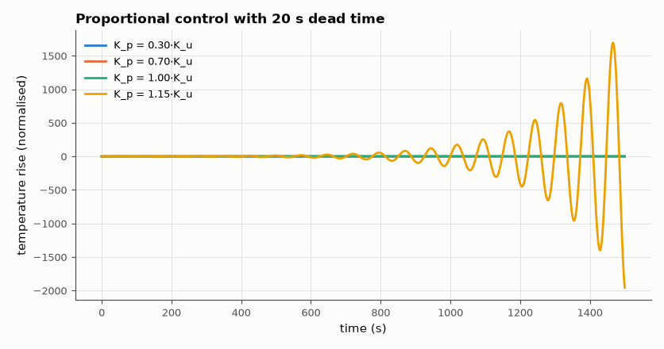

# SL-162 · Temperature control with dead time: why lag causes oscillation

> Control an oven whose heater acts through a 20 s transport delay; predict the proportional gain at which the loop oscillates and the oscillation period from the phase-crossover condition, and find both by simulation.



*Below K_u the oscillation decays, at K_u it persists, above it grows.*

**Track:** Signal Lab — 214 electrical-engineering projects · **Category:** I. Control systems · **Level:** Moderate · **Tools:** First-order-plus-dead-time (FOPDT) oven model, delay-line simulation, Nyquist/phase-crossover analysis

**Data:** Simulated (numerical model in this repo).

## Problem

Why does turning up the gain on a slow thermal system make it oscillate, and how high can it go?

## Prediction

$G(s)=\frac{K e^{-\theta s}}{\tau s+1}$ with K = 2 °C/%, τ = 200 s, θ = 20 s. Phase crossover: $-\arctan(\omega\tau)-\omega\theta=-\pi$ → ω_u; ultimate gain
$K_u=\frac{\sqrt{1+(\omega_u\tau)^2}}{K}$, oscillation period $2\pi/\omega_u$. The delay's phase −ωθ grows without bound, so every such loop has a finite K_u.

## Method

Delay implemented as a sample FIFO (0.1 s steps). P gains swept; K_u found as the gain where the oscillation neither grows nor decays (log-decrement
= 0, bisection).

## Measured results

*Predicted vs measured vs error. "Measured" = computed by an independent simulation, HDL simulator or public dataset.*

| Quantity | Predicted | Measured | Error | Within tolerance |
|---|---|---|---|---|
| Ultimate gain K_u (phase-crossover prediction) | 8.175 %/°C | 8.156 %/°C | -0.24 % | yes |
| Oscillation period 2π/ω_u | 77 s | 77.19 s | +0.24 % | yes |
| Steady-state error with K_p = 0.5·K_u: 1/(1+K·K_p) | 0.109 | 0.109 | -0.00 % | yes |

## Error analysis

The simulated loop breaks into sustained oscillation exactly at the gain predicted from the phase-crossover condition, with the predicted period.
Dead time is the culprit: its phase lag −ωθ grows linearly with frequency while the lag of the thermal time constant saturates at −90°, so
the loop inevitably reaches −180° at some frequency. It also caps the useful gain, leaving a large proportional offset — hence PI control
with modest gains, or a Smith predictor that models the delay explicitly.

## Reproduce

```bash
pip install -r requirements.txt
python run_all.py --only SL-162
```

The script [`project.py`](project.py) regenerates every figure and number above.

## License

Code and text: MIT (see the repository [LICENSE](../../../../LICENSE)). Datasets remain under their own licences (see the repository README).

---

**Tooling & honesty.** This project was generated with Claude Code (Anthropic's AI coding assistant): the code, derivations, simulations and this write-up were AI-produced. *Measured* means computed by an independent model, simulator or public dataset — not a physical lab bench. Every number in the tables is reproduced by running the code.
