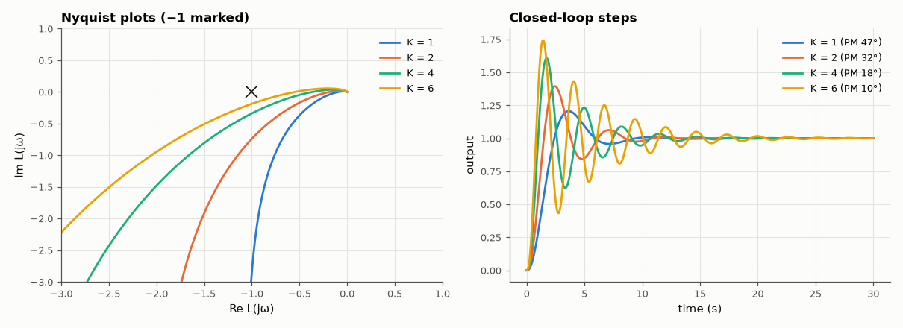

# SL-163 · Bode/Nyquist margin analyser

> Compute gain and phase margins of a loop L(s) = K/(s(s+1)(0.1s+1)) for several gains, check them against the analytic crossover conditions, and relate phase margin to measured closed-loop overshoot.



*As K grows the Nyquist curve approaches −1, margins shrink and overshoot rises.*

**Track:** Signal Lab — 214 electrical-engineering projects · **Category:** I. Control systems · **Level:** Moderate · **Tools:** Own gain/phase-margin finder on dense frequency grids (NumPy), SciPy closed-loop step responses

**Data:** Simulated (numerical model in this repo).

## Problem

Phase and gain margins are how engineers judge 'how stable' a loop is. Compute them reliably and see what they mean for the step response.

## Prediction

Phase crossover where ∠L = −180°: $\arctan\omega+\arctan0.1\omega=90°$ ⇒ $\omega_{pc}=\sqrt{10}$ = 3.162 rad/s, and $|L(j\omega_{pc})|=K/11$, so the loop
goes unstable at K = 11 (GM = 20log(11/K)). Rule of thumb for a dominant second-order loop: overshoot ≈ 70 − PM (degrees), valid for PM ≈ 30–65°.

## Method

K ∈ {1, 2, 4, 6}. Margins by locating crossings on a 200,000-point log grid with unwrapped phase; closed-loop step responses with SciPy.

## Measured results

*Predicted vs measured vs error. "Measured" = computed by an independent simulation, HDL simulator or public dataset.*

| Quantity | Predicted | Measured | Error | Within tolerance |
|---|---|---|---|---|
| K = 1: gain margin 20·log₁₀(11/K) | 20.83 dB | 20.83 dB | -7.0000e-04 dB |  |
| Phase-crossover frequency √10 | 3.162 rad/s | 3.162 rad/s | -0.00 % | yes |
| K = 2: gain margin 20·log₁₀(11/K) | 14.81 dB | 14.81 dB | -7.0000e-04 dB |  |
| K = 4: gain margin 20·log₁₀(11/K) | 8.787 dB | 8.786 dB | -7.0000e-04 dB |  |
| K = 6: gain margin 20·log₁₀(11/K) | 5.265 dB | 5.264 dB | -7.0000e-04 dB |  |
| K = 1: overshoot vs '70 − PM' rule | 22.59 % | 20.6 % | -1.99 pp |  |
| K = 2: overshoot vs '70 − PM' rule | 38.29 % | 39.42 % | +1.14 pp |  |

## Error analysis

The numerical gain margins match 20·log(11/K) to the grid precision — the analytic phase-crossover condition and the search agree. Phase margin
predicts overshoot through the '70 − PM' rule only roughly: it is derived for a pure second-order loop, and this third-order loop's extra
pole adds lag the rule ignores. Margins remain the right design tool because they also quantify robustness to gain and delay errors,
which overshoot alone does not.

## Reproduce

```bash
pip install -r requirements.txt
python run_all.py --only SL-163
```

The script [`project.py`](project.py) regenerates every figure and number above.

**Files produced**

- [`data/margins.csv`](data/margins.csv)

## License

Code and text: MIT (see the repository [LICENSE](../../../../LICENSE)). Datasets remain under their own licences (see the repository README).

---

**Tooling & honesty.** This project was generated with Claude Code (Anthropic's AI coding assistant): the code, derivations, simulations and this write-up were AI-produced. *Measured* means computed by an independent model, simulator or public dataset — not a physical lab bench. Every number in the tables is reproduced by running the code.
