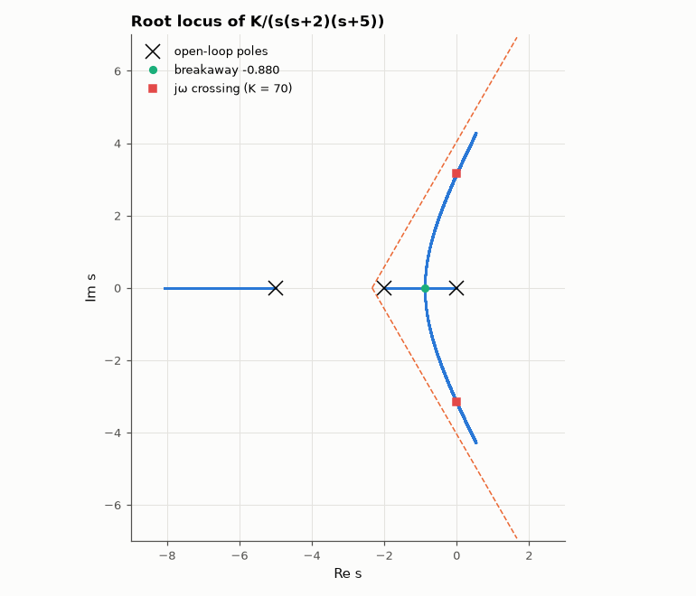

# SL-164 · Root locus: asymptotes, breakaway and the stability limit

> Trace the root locus of G = 1/(s(s+2)(s+5)), and check the plotted branches against the construction rules: asymptote centroid and angles, breakaway point from dK/ds = 0, and the jω-crossing gain from Routh.



*Numerically traced branches follow the asymptotes, break away at −0.88 and cross into instability at K = 70.*

**Track:** Signal Lab — 214 electrical-engineering projects · **Category:** I. Control systems · **Level:** Moderate · **Tools:** Closed-loop pole computation by polynomial roots over a gain sweep (NumPy), analytic root-locus rules

**Data:** Simulated (numerical model in this repo).

## Problem

How do closed-loop poles move as gain increases, and can a few hand rules predict the whole picture?

## Prediction

Poles 0, −2, −5; three asymptotes at ±60°, 180° from centroid σ = (0−2−5)/3 = −2.333. Breakaway where dK/ds = 0 for K = −s(s+2)(s+5):
$3s^2+14s+10=0$ ⇒ s = −0.880. Routh on $s^3+7s^2+10s+K$: instability at K = 70 with poles at ±j√10.

## Method

Gains 0…150 on a fine grid; closed-loop poles = roots of s³ + 7s² + 10s + K. Breakaway = where the two real poles merge; crossing = first K with a
right-half-plane pole.

## Measured results

*Predicted vs measured vs error. "Measured" = computed by an independent simulation, HDL simulator or public dataset.*

| Quantity | Predicted | Measured | Error | Within tolerance |
|---|---|---|---|---|
| Breakaway point (dK/ds = 0) | -0.8804 | -0.8801 | +2.4540e-04 |  |
| Gain at the jω-axis crossing (Routh: K = 70) | 70 | 70.01 | +0.01 % | yes |
| Crossing frequency √10 | 3.162 rad/s | 3.162 rad/s | +0.00 % | yes |
| Asymptote angle for large K | 60 ° | 60 ° | -0.002257 ° |  |

## Error analysis

Every construction rule is confirmed by brute-force root finding: the real-axis branches meet at the dK/ds = 0 breakaway, the complex branches
bend toward the ±60° asymptotes from the centroid −7/3, and the locus crosses the imaginary axis at exactly the Routh gain and frequency.
The rules are still worth knowing — they tell you in a minute where to put a zero (lead compensation) to bend the locus away from the axis.

## Reproduce

```bash
pip install -r requirements.txt
python run_all.py --only SL-164
```

The script [`project.py`](project.py) regenerates every figure and number above.

## License

Code and text: MIT (see the repository [LICENSE](../../../../LICENSE)). Datasets remain under their own licences (see the repository README).

---

**Tooling & honesty.** This project was generated with Claude Code (Anthropic's AI coding assistant): the code, derivations, simulations and this write-up were AI-produced. *Measured* means computed by an independent model, simulator or public dataset — not a physical lab bench. Every number in the tables is reproduced by running the code.
