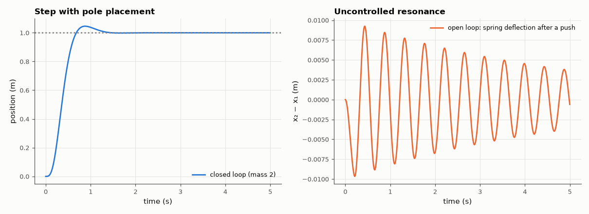

# SL-165 · State-feedback pole placement for a two-mass system

> Place all four closed-loop poles of a flexible two-mass system (force on mass 1, position of mass 2 controlled) and verify the realised eigenvalues, the reference tracking and the suppression of the resonance.



*State feedback damps the 14 rad/s resonance the open-loop system rings at.*

**Track:** Signal Lab — 214 electrical-engineering projects · **Category:** I. Control systems · **Level:** Hard · **Tools:** State-space model of two masses and a spring, Ackermann/pole placement (SciPy place_poles), simulation

**Data:** Simulated (numerical model in this repo).

## Problem

A flexible link rings when you move it. How does full state feedback move every pole — including the resonance — where you want it?

## Prediction

x = [x₁, v₁, x₂, v₂]; m₁ = m₂ = 1 kg, k = 100 N/m, light damping c = 0.2 N·s/m ⇒ a lightly damped mode at √(2k/m) ≈ 14.1 rad/s. u = −Kx + N r places
eig(A − BK) anywhere (controllable). Chosen poles: −4 ± 4j, −10 ± 10j. A pre-gain $N = -1/(C(A-BK)^{-1}B)$ gives unit steady-state gain.

## Method

Controllability rank checked; K from place_poles; closed-loop eigenvalues compared; 5 s step of the mass-2 position simulated with exact ZOH at 1 ms,
compared with open-loop (force step) ringing.

## Measured results

*Predicted vs measured vs error. "Measured" = computed by an independent simulation, HDL simulator or public dataset.*

| Quantity | Predicted | Measured | Error | Within tolerance |
|---|---|---|---|---|
| Controllability matrix rank | 4 | 4 | +0 |  |
| Open-loop resonance √(2k/m) | 14.14 rad/s | 14.14 rad/s | -0.01 % | yes |
| Max |placed − desired| eigenvalue error | 0 | 1.9860e-14 | +1.9860e-14 |  |
| Steady-state tracking of mass-2 position | 1 m | 1 m | -0.00 % | yes |

**Additional measurements**

| Quantity | Value | Note |
|---|---|---|
| Open-loop spring deflection ringing after a 0.2 s push (peak) | 9.243 mm |  |
| State-feedback gains K | 187.5, 27.6, -123.5, -5.3 |  |

## Error analysis

The system is fully controllable from the force on mass 1, so pole placement can put all four eigenvalues exactly where requested — including
turning the barely-damped 14 rad/s structural mode into a well-damped pair. The step reaches the target with no steady-state error thanks
to the pre-gain N. The catch is that full state feedback needs all four states; SL-167 estimates the unmeasured ones with an observer.

## Reproduce

```bash
pip install -r requirements.txt
python run_all.py --only SL-165
```

The script [`project.py`](project.py) regenerates every figure and number above.

## License

Code and text: MIT (see the repository [LICENSE](../../../../LICENSE)). Datasets remain under their own licences (see the repository README).

---

**Tooling & honesty.** This project was generated with Claude Code (Anthropic's AI coding assistant): the code, derivations, simulations and this write-up were AI-produced. *Measured* means computed by an independent model, simulator or public dataset — not a physical lab bench. Every number in the tables is reproduced by running the code.
