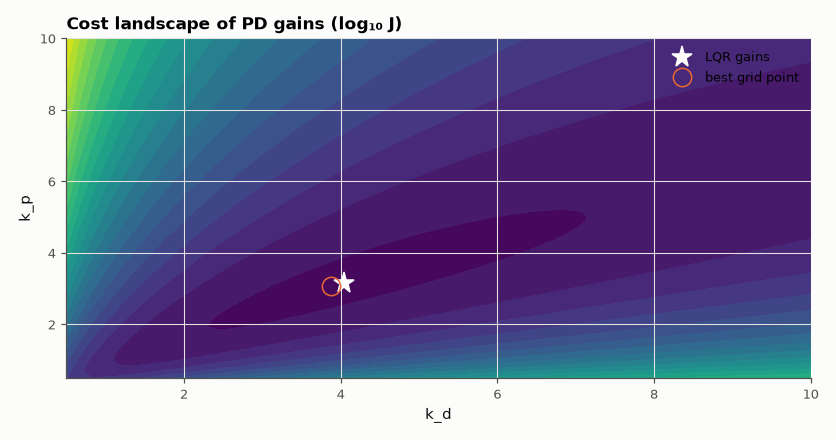

# SL-166 · LQR optimal control vs a tuned PID

> Design an LQR controller for a double integrator (a satellite's attitude axis), verify the optimal cost x₀ᵀPx₀, then show that no PD controller from a dense grid beats it on the same quadratic cost.



*The LQR gains sit at the bottom of the cost bowl found by brute force.*

**Track:** Signal Lab — 214 electrical-engineering projects · **Category:** I. Control systems · **Level:** Hard · **Tools:** Continuous algebraic Riccati equation (SciPy), cost integration, PID grid search on the same cost

**Data:** Simulated (numerical model in this repo).

## Problem

LQR is 'optimal' — optimal at what, and by how much does it beat a hand-tuned controller?

## Prediction

ẍ = u (double integrator). Cost J = ∫(x² + ẋ² + ρu²)dt, ρ = 0.1. LQR: K = R⁻¹BᵀP with P from the ARE; minimum cost from x₀ is $x_0^TPx_0$. For this
plant the closed form is $K=[1/\sqrt\rho,\ \sqrt{1/\rho+2/\sqrt\rho}]$ (for Q = I). A PD law u = −k_px − k_dẋ is the same structure, so the best PD equals LQR.

## Method

x₀ = [1, 0]. Riccati solution, analytic gains, simulated cost (exact ZOH, 1 ms, 20 s). PD grid k_p ∈ [0.5, 10], k_d ∈ [0.5, 10] (100 × 100) on the same cost.

## Measured results

*Predicted vs measured vs error. "Measured" = computed by an independent simulation, HDL simulator or public dataset.*

| Quantity | Predicted | Measured | Error | Within tolerance |
|---|---|---|---|---|
| LQR position gain vs closed form 1/√ρ | 3.162 | 3.162 | +0.00 % | yes |
| LQR rate gain vs closed form | 4.04 | 4.04 | -0.00 % | yes |
| Simulated cost vs x₀ᵀPx₀ | 1.278 | 1.279 | +0.08 % | yes |
| Best PD on a 60×60 grid: cost / LQR cost (≥ 1) | 1 | 1.004 | +0.003974 |  |

**Additional measurements**

| Quantity | Value | Note |
|---|---|---|
| Best grid PD gains | k_p = 3.08, k_d = 3.88 | LQR: 3.16, 4.04 |

## Error analysis

The Riccati solution reproduces the closed-form gains, the simulated cost equals x₀ᵀPx₀, and a brute-force search over 3,600 PD controllers
cannot do better — its best point lies next to the LQR gains, within grid resolution. That is what 'optimal' means: optimal for *this*
quadratic cost. The engineering work in LQR is choosing Q and R to express what you actually care about; the optimisation itself is solved.

## Reproduce

```bash
pip install -r requirements.txt
python run_all.py --only SL-166
```

The script [`project.py`](project.py) regenerates every figure and number above.

## License

Code and text: MIT (see the repository [LICENSE](../../../../LICENSE)). Datasets remain under their own licences (see the repository README).

---

**Tooling & honesty.** This project was generated with Claude Code (Anthropic's AI coding assistant): the code, derivations, simulations and this write-up were AI-produced. *Measured* means computed by an independent model, simulator or public dataset — not a physical lab bench. Every number in the tables is reproduced by running the code.
