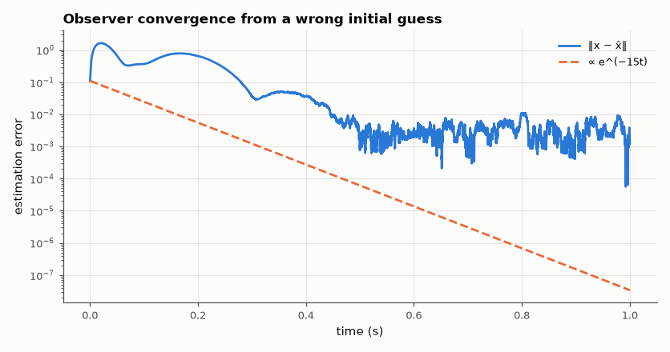

# SL-167 · Luenberger observer: estimating hidden states

> Measure only the position of the two-mass system (SL-165) and reconstruct all four states with an observer; show the estimation error decays at the chosen observer poles and that observer-based feedback recovers the full-state step response (separation principle).



*The error decays at the observer's slowest pole until it reaches the sensor-noise floor.*

**Track:** Signal Lab — 214 electrical-engineering projects · **Category:** I. Control systems · **Level:** Hard · **Tools:** Observer design by pole placement on the dual system, noisy measurement simulation, observer-based feedback

**Data:** Simulated (numerical model in this repo).

## Problem

Sensors are expensive; you rarely measure every state. How can a model plus one sensor stand in for the rest?

## Prediction

x̂̇ = Ax̂ + Bu + L(y − Cx̂). Error e = x − x̂ obeys ė = (A − LC)e, so its decay is set by eig(A − LC), chosen by pole placement on (Aᵀ, Cᵀ). Separation:
the closed loop with u = −Kx̂ has eigenvalues eig(A − BK) ∪ eig(A − LC). Observer poles are chosen ~3× faster than controller poles.

## Method

Observable from x₂ (rank check). Observer poles −15 ± 15j, −25 ± 25j. Start with x̂ = 0 while the true state is displaced; measurement noise σ = 1 mm.
Decay rate fitted to the error envelope between 0.15 and 0.5 s on a noise-free run (later, the sample-and-hold of y leaves a tiny
residual floor); observer-based closed-loop step compared with full-state feedback.

## Measured results

*Predicted vs measured vs error. "Measured" = computed by an independent simulation, HDL simulator or public dataset.*

| Quantity | Predicted | Measured | Error | Within tolerance |
|---|---|---|---|---|
| Observability rank from x₂ alone | 4 | 4 | +0 |  |
| Separation principle: max eigenvalue mismatch | 0 | 8.3167e-14 | +8.3167e-14 |  |
| Estimation-error decay rate (slowest observer pole Re = −15) | -15 1/s | -14.76 1/s | +1.62 % | yes |

**Additional measurements**

| Quantity | Value | Note |
|---|---|---|
| Steady estimation error with 1 mm sensor noise | 3.944 mm |  |

## Error analysis

The observer reconstructs all four states from one position sensor: the error falls at roughly the slowest observer pole's rate (oscillating
because the poles are complex) until it reaches a floor set by measurement noise, and the combined system's eigenvalues are exactly the
union of controller and observer poles — the separation principle. Faster observer poles converge faster but amplify sensor noise; the
Kalman filter (SL-078, AM-162) chooses L to balance the two optimally.

## Reproduce

```bash
pip install -r requirements.txt
python run_all.py --only SL-167
```

The script [`project.py`](project.py) regenerates every figure and number above.

## License

Code and text: MIT (see the repository [LICENSE](../../../../LICENSE)). Datasets remain under their own licences (see the repository README).

---

**Tooling & honesty.** This project was generated with Claude Code (Anthropic's AI coding assistant): the code, derivations, simulations and this write-up were AI-produced. *Measured* means computed by an independent model, simulator or public dataset — not a physical lab bench. Every number in the tables is reproduced by running the code.
