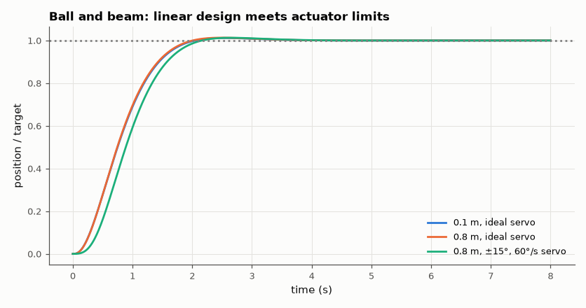

# SL-168 · Ball and beam: a nonlinear, open-loop-unstable plant

> Balance a ball on a tilting beam with a cascaded controller designed on the linearised double-integrator model, and compare the nonlinear response (including servo-rate limits) with the linear predictions.



*Small moves behave like the linear design; big moves saturate the beam angle and overshoot.*

**Track:** Signal Lab — 214 electrical-engineering projects · **Category:** I. Control systems · **Level:** Hard · **Tools:** Nonlinear rolling-ball model (SciPy ODE), cascaded PD control (inner beam angle, outer ball position), linearised predictions

**Data:** Simulated (numerical model in this repo).

## Problem

A rolling ball accelerates with the beam angle — a double integrator. How does cascaded control handle it, and when does the nonlinearity bite?

## Prediction

Solid ball rolling without slipping: $\ddot r=\frac{5}{7}(r\dot\theta^2-g\sin\theta)$ ≈ −(5g/7)θ for small angles. The outer PD loop commands θ_ref =
−(k_p e + k_d ė)/(5g/7) giving closed-loop poles s² + k_d s + k_p = 0; with k_p = 4, k_d = 3.2 (ζ = 0.8, ω_n = 2 rad/s) the 2 % settling time ≈ 4/(ζω_n) = 2.5 s
and overshoot 1.5 %, if the inner (servo) loop is much faster.

## Method

Beam angle driven by a servo modelled as a first-order lag (τ = 50 ms) with angle limit ±15° and rate limit 60°/s. Steps of 0.1 m and 0.8 m in ball position (0.8 m demands ~26° of tilt, beyond the 15° limit).

## Measured results

*Predicted vs measured vs error. "Measured" = computed by an independent simulation, HDL simulator or public dataset.*

| Quantity | Predicted | Measured | Error | Within tolerance |
|---|---|---|---|---|
| Small step (0.1 m), no limits: overshoot (ζ = 0.8) | 1.516 % | 1.17 % | -0.346 pp |  |
| Small step: 2 % settling time 4/(ζω_n) | 2.5 s | 1.83 s | -26.80 % | **no** |

**Additional measurements**

| Quantity | Value | Note |
|---|---|---|
| 0.8 m step: settling time, ideal servo / limited servo | 1.80 s / 1.96 s |  |
| 0.8 m step with limits: overshoot | 1.265 % | PD has no integrator, so saturation slows but does not wind up |

## Error analysis

For small moves the nonlinear plant behaves like the linear double integrator and the overshoot matches the ζ = 0.8 design; the 4/(ζω_n) settling estimate is
conservative (it bounds the envelope, and ζ = 0.8 is well damped). An 0.8 m move asks for ~26° of tilt; the 15° limit caps the ball's acceleration, so the move takes longer than the
linear design promises (with a PD outer loop there is no integrator to wind up, so it does not overshoot — add integral action and it would).
The linear prediction is only valid while the actuator stays inside its limits. Saturation-aware
designs (reference shaping, anti-windup, MPC — AM-168) exist precisely for this.

## Reproduce

```bash
pip install -r requirements.txt
python run_all.py --only SL-168
```

The script [`project.py`](project.py) regenerates every figure and number above.

## License

Code and text: MIT (see the repository [LICENSE](../../../../LICENSE)). Datasets remain under their own licences (see the repository README).

---

**Tooling & honesty.** This project was generated with Claude Code (Anthropic's AI coding assistant): the code, derivations, simulations and this write-up were AI-produced. *Measured* means computed by an independent model, simulator or public dataset — not a physical lab bench. Every number in the tables is reproduced by running the code.
