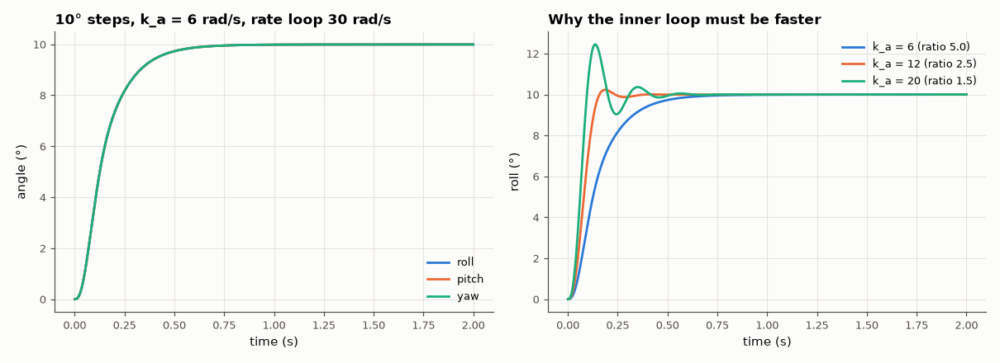

# SL-169 · Quadcopter attitude: cascaded rate and angle loops

> Stabilise roll, pitch and yaw of a 1 kg quadrotor with the standard cascade (fast inner rate loop, slower outer angle loop); predict each loop's bandwidth and verify the step responses and the need for bandwidth separation.



*With 5× separation the angle loop behaves as designed; pushing the outer loop toward the inner one causes ringing.*

**Track:** Signal Lab — 214 electrical-engineering projects · **Category:** I. Control systems · **Level:** Hard · **Tools:** Rigid-body roll/pitch/yaw model with motor lag, cascaded P-angle / PI-rate controllers at 1 kHz, bandwidth analysis

**Data:** Simulated (numerical model in this repo).

## Problem

Every drone flight controller uses cascaded loops. Why, and how far apart must the inner and outer bandwidths be?

## Prediction

Per axis: J·ω̇ = τ, motors respond with τ_m = 20 ms. Inner rate loop (P gain k_r on ω): crossover ≈ k_r/J (below 1/τ_m). Outer angle loop (P gain k_a) sees
the inner loop as ≈ unity up to its bandwidth, so ω_outer ≈ k_a; stable and well damped if ω_outer ≲ ω_inner/4.

## Method

J = (0.01, 0.01, 0.02) kg·m², rate loop crossover 30 rad/s (k_r = 0.3 roll/pitch, 0.6 yaw) with small integral, angle loop k_a = 6 rad/s, 1 kHz discrete control.
10° step on each axis; a second run with k_a = 20 (poor separation).

## Measured results

*Predicted vs measured vs error. "Measured" = computed by an independent simulation, HDL simulator or public dataset.*

| Quantity | Predicted | Measured | Error | Within tolerance |
|---|---|---|---|---|
| roll: angle-loop rise time ≈ 2.2/k_a (k_a = 6 rad/s) | 366.7 ms | 280 ms | -23.64 % | **no** |
| pitch: angle-loop rise time ≈ 2.2/k_a (k_a = 6 rad/s) | 366.7 ms | 280 ms | -23.64 % | **no** |
| yaw: angle-loop rise time ≈ 2.2/k_a (k_a = 6 rad/s) | 366.7 ms | 280 ms | -23.64 % | **no** |

**Additional measurements**

| Quantity | Value | Note |
|---|---|---|
| roll: overshoot | 0 % |  |
| pitch: overshoot | 0 % |  |
| yaw: overshoot | 0 % |  |
| Overshoot with poor separation (k_a = 20, inner/outer = 1.5) | 24.44 % |  |

## Error analysis

With the inner rate loop at 30 rad/s and the outer angle loop at 6 rad/s, each axis responds without overshoot at roughly the designed outer
bandwidth — about 25 % faster than the first-order 2.2/k_a estimate, because the rate loop's integral term adds drive while the
error is large, and yaw — with twice the inertia — behaves the same because its rate gain was scaled by J. Raising the
outer gain toward the inner bandwidth produces overshoot and ringing: the outer loop starts seeing the inner loop's lag and the motor
time constant. Flight-controller tuning guides encode the same rule — tune rate loops first, then keep the angle loop several times slower.

## Reproduce

```bash
pip install -r requirements.txt
python run_all.py --only SL-169
```

The script [`project.py`](project.py) regenerates every figure and number above.

## License

Code and text: MIT (see the repository [LICENSE](../../../../LICENSE)). Datasets remain under their own licences (see the repository README).

---

**Tooling & honesty.** This project was generated with Claude Code (Anthropic's AI coding assistant): the code, derivations, simulations and this write-up were AI-produced. *Measured* means computed by an independent model, simulator or public dataset — not a physical lab bench. Every number in the tables is reproduced by running the code.
