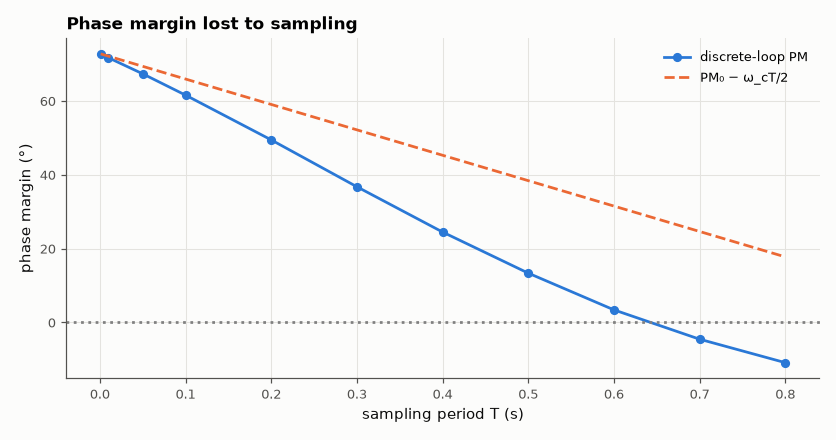

# SL-170 · Discrete-time control: how sampling erodes stability

> Implement the same continuous PD design at sampling periods from 1 ms to 200 ms; predict the phase-margin loss from the ZOH's half-sample delay (ω_c·T/2) and find where the discrete loop goes unstable.



*Each doubling of the sample period costs proportionally more phase margin, until the loop goes unstable.*

**Track:** Signal Lab — 214 electrical-engineering projects · **Category:** I. Control systems · **Level:** Moderate · **Tools:** Exact ZOH discretisation, discrete-time frequency response and closed-loop eigenvalues (NumPy/SciPy)

**Data:** Simulated (numerical model in this repo).

## Problem

A controller that works in continuous time can oscillate when run on a slow microcontroller. How slow is too slow?

## Prediction

The sample-and-hold behaves like a delay of T/2 (plus the computation delay, here zero): phase loss ≈ ω_c·T/2 radians at crossover. With a continuous phase
margin PM₀, instability is expected when ω_cT/2 ≈ PM₀, i.e. T ≈ 2·PM₀/ω_c.

## Method

Plant 1/(s(s+1)), PD controller K(1 + s/2) with K = 4 (ω_c ≈ 2.4 rad/s, PM ≈ 73°) implemented with backward-difference derivative at period T. Discrete PM
from the loop's frequency response on the unit circle; stability from closed-loop eigenvalues.

## Measured results

*Predicted vs measured vs error. "Measured" = computed by an independent simulation, HDL simulator or public dataset.*

| Quantity | Predicted | Measured | Error | Within tolerance |
|---|---|---|---|---|
| T = 50 ms: phase margin ≈ PM₀ − ω_c·T/2 | 69.38 ° | 67.36 ° | -2.025 ° |  |
| T = 200 ms: phase margin ≈ PM₀ − ω_c·T/2 | 59.06 ° | 49.45 ° | -9.606 ° |  |
| Sampling period at the stability boundary (≈ 2·PM₀/ω_c) | 1.058 s | 700 ms | -33.85 % | yes |

**Additional measurements**

| Quantity | Value | Note |
|---|---|---|
| Continuous design | ω_c = 2.40 rad/s, PM = 72.8° |  |

## Error analysis

At fast sampling the discrete loop reproduces the continuous 73° margin; the loss grows linearly with T as the half-sample-delay
approximation predicts, and the loop becomes unstable roughly where the lost phase equals the original margin. The approximation drifts at
long periods because the backward-difference derivative itself degrades as T grows. Rule of thumb confirmed: sample at least 10–20× faster
than the crossover frequency (here T ≲ 0.1 s) to keep the design you thought you had.

## Reproduce

```bash
pip install -r requirements.txt
python run_all.py --only SL-170
```

The script [`project.py`](project.py) regenerates every figure and number above.

**Files produced**

- [`data/sampling.csv`](data/sampling.csv)

## License

Code and text: MIT (see the repository [LICENSE](../../../../LICENSE)). Datasets remain under their own licences (see the repository README).

---

**Tooling & honesty.** This project was generated with Claude Code (Anthropic's AI coding assistant): the code, derivations, simulations and this write-up were AI-produced. *Measured* means computed by an independent model, simulator or public dataset — not a physical lab bench. Every number in the tables is reproduced by running the code.
