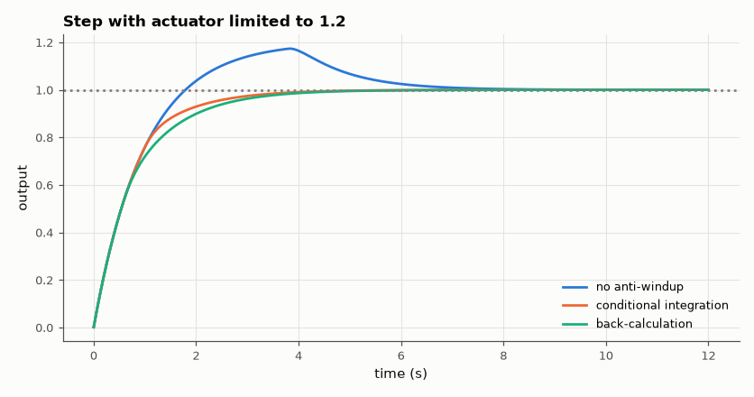

# SL-171 · Integrator windup and anti-windup strategies

> Show how a saturated actuator lets a PI integrator 'wind up' and cause large overshoot, predict the extra overshoot from the integrated error during saturation, and compare conditional integration and back-calculation fixes.



*Windup produces a large, slow overshoot; both anti-windup schemes remove it.*

**Track:** Signal Lab — 214 electrical-engineering projects · **Category:** I. Control systems · **Level:** Moderate · **Tools:** PI loop with actuator saturation on a first-order plant; clamping and back-calculation anti-windup

**Data:** Simulated (numerical model in this repo).

## Problem

When the actuator hits its limit the controller keeps integrating an error it can't act on. How bad is it, and which fix works best?

## Prediction

Plant G = 1/(s + 1) (τ = 1 s, gain 1), PI K_p = 5, K_i = 5, actuator limited to ±1.2 (just above the 1.0 needed at steady state). During saturation the
integrator accumulates ∫e dt; after leaving saturation it must be 'unwound' by an equal area of negative error, so overshoot area ≈ excess
integral. Back-calculation feeds (u_sat − u) back into the integrator with gain 1/T_t, T_t ≈ √(T_i·T_d) or ≈ T_i.

## Method

Unit step at t = 0, 10 ms steps. Variants: no anti-windup, conditional integration (freeze when saturated and error drives further), back-calculation
(T_t = 0.2 s). Measured overshoot, settling, and the negative-error area after saturation vs the integral accumulated during it.

## Measured results

*Predicted vs measured vs error. "Measured" = computed by an independent simulation, HDL simulator or public dataset.*

| Quantity | Predicted | Measured | Error | Within tolerance |
|---|---|---|---|---|
| No anti-windup: overshoot area ≈ error integrated beyond the linear integrator state | 413.2 ms | 441.8 ms | +6.91 % | yes |
| clamp: overshoot (should be ≪ windup case) | 0 % | 0 % | +0 pp |  |
| backcalc: overshoot (should be ≪ windup case) | 0 % | 0 % | +0 pp |  |

**Additional measurements**

| Quantity | Value | Note |
|---|---|---|
| No anti-windup: overshoot / settling | 17.4 % / 6.21 s |  |
| clamp: settling time | 3.254 s |  |
| backcalc: settling time | 3.617 s |  |

## Error analysis

While the actuator is pinned at its limit, the plain PI keeps integrating a large error; afterwards the output must overshoot until an equal area
of negative error unwinds the integrator — the measured overshoot area is of the same size as the error integrated during saturation. Both
anti-windup schemes stop that accumulation. Conditional integration is simplest; back-calculation also bleeds the integrator smoothly
toward a consistent value and is standard in industrial PID blocks.

## Reproduce

```bash
pip install -r requirements.txt
python run_all.py --only SL-171
```

The script [`project.py`](project.py) regenerates every figure and number above.

## License

Code and text: MIT (see the repository [LICENSE](../../../../LICENSE)). Datasets remain under their own licences (see the repository README).

---

**Tooling & honesty.** This project was generated with Claude Code (Anthropic's AI coding assistant): the code, derivations, simulations and this write-up were AI-produced. *Measured* means computed by an independent model, simulator or public dataset — not a physical lab bench. Every number in the tables is reproduced by running the code.
