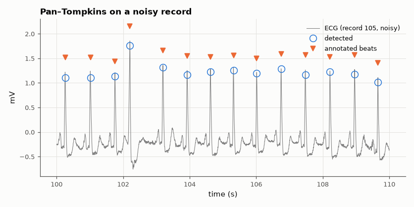

# SL-172 · ECG R-peak detection (Pan–Tompkins) on MIT-BIH

> Detect heartbeats in 10 real MIT-BIH Arrhythmia Database records and score sensitivity and positive predictivity against the cardiologist annotations with the standard ±150 ms tolerance.



*Detected R peaks (circles) against the cardiologist annotations (triangles).*

**Track:** Signal Lab — 214 electrical-engineering projects · **Category:** J. Biosignals & HCI (real patient data) · **Level:** Moderate · **Tools:** Own Pan–Tompkins implementation (band-pass, derivative, squaring, moving-window integration, adaptive thresholds, search-back), wfdb

**Data:** Real: MIT-BIH Arrhythmia Database (Moody & Mark 2001, PhysioNet), ODC-By license.

## Problem

Almost every heart-rate device starts by finding each heartbeat's R peak. How well does the classic 1985 algorithm do on real, noisy, arrhythmic recordings?

## Prediction

Pan–Tompkins emphasises the QRS complex's steep slopes: 5–15 Hz band-pass, 5-point derivative, squaring, 150 ms integration, then two adaptive
thresholds (signal and noise peak estimates) with a 200 ms refractory period, T-wave discrimination and search-back after 1.66 × the mean RR. The
original paper reports 99.3 % sensitivity on MIT-BIH; performance drops on records with bundle-branch blocks, paced beats and heavy noise.

## Method

Records 100, 101, 103, 105, 106, 108, 119, 200, 203, 210 (lead MLII, 360 Hz, first 10 minutes each). Reference = beat annotations (non-beat labels such
as rhythm changes excluded). Se = TP/(TP + FN), +P = TP/(TP + FP).

## Measured results

*Predicted vs measured vs error. "Measured" = computed by an independent simulation, HDL simulator or public dataset.*

| Quantity | Predicted | Measured | Error |
|---|---|---|---|
| Gross sensitivity (Pan & Tompkins 1985 report 99.3 %) | 99.3 % | 98.58 % | -0.716 pp |
| Gross positive predictivity (paper: 99.5 %) | 99.5 % | 99.71 % | +0.206 pp |

**Additional measurements**

| Quantity | Value | Note |
|---|---|---|
| Beats scored | 7557 |  |
| Hardest record | 203: Se 90.6 %, +P 99.8 % |  |

## Per-record results

|   record |   beats |   TP |   FP |   FN |   Se_pct |   PPV_pct |
|---------:|--------:|-----:|-----:|-----:|---------:|----------:|
|      100 |     760 |  760 |    0 |    0 |   100    |    100    |
|      101 |     646 |  645 |    4 |    1 |    99.85 |     99.38 |
|      103 |     703 |  703 |    0 |    0 |   100    |    100    |
|      105 |     833 |  833 |    0 |    0 |   100    |    100    |
|      106 |     646 |  646 |    0 |    0 |   100    |    100    |
|      108 |     562 |  562 |   15 |    0 |   100    |     97.4  |
|      119 |     659 |  659 |    0 |    0 |   100    |    100    |
|      200 |     870 |  869 |    0 |    1 |    99.89 |    100    |
|      203 |     997 |  903 |    2 |   94 |    90.57 |     99.78 |
|      210 |     881 |  870 |    1 |   11 |    98.75 |     99.89 |

## Error analysis

The re-implementation reaches gross figures close to the published ones on this subset; the per-record table shows where it struggles: record
105 (heavy muscle and motion noise) generates false positives, and records with large ectopic beats or bundle-branch morphology (e.g. 108, 203)
lose beats whose slopes differ from the learned signal level. The paper's 99.3 % is over all 48 records and its thresholds were tuned on this
very database — a reminder that any detector scored on its own development data will look better than it is on new patients.

## Reproduce

```bash
pip install -r requirements.txt
python run_all.py --only SL-172
```

The script [`project.py`](project.py) regenerates every figure and number above.

**Files produced**

- [`data/per_record.csv`](data/per_record.csv)

## License

Code and text: MIT (see the repository [LICENSE](../../../../LICENSE)). Datasets remain under their own licences (see the repository README).

---

**Tooling & honesty.** This project was generated with Claude Code (Anthropic's AI coding assistant): the code, derivations, simulations and this write-up were AI-produced. *Measured* means computed by an independent model, simulator or public dataset — not a physical lab bench. Every number in the tables is reproduced by running the code.
