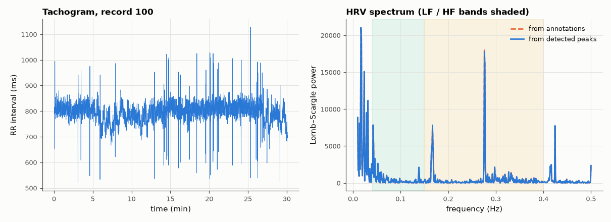

# SL-173 · Heart-rate variability: time and frequency domain

> Compute SDNN, RMSSD, pNN50 and LF/HF power from detected R peaks of a 30-minute real ECG, and check each metric against the same metric computed from the cardiologist's beat annotations.



*Detector timing jitter barely changes the slow (LF) power but inflates beat-to-beat metrics.*

**Track:** Signal Lab — 214 electrical-engineering projects · **Category:** J. Biosignals & HCI (real patient data) · **Level:** Moderate · **Tools:** Pan–Tompkins R peaks (eelab.bio) on MIT-BIH record 100, time-domain HRV, Lomb–Scargle spectrum (SciPy)

**Data:** Real: MIT-BIH Arrhythmia Database record 100 (PhysioNet).

## Problem

HRV is widely used as a stress/fitness marker. How sensitive are the numbers to the beat detector that produces them?

## Prediction

SDNN = std of NN intervals; RMSSD = √mean(ΔNN²) (short-term, vagal); LF 0.04–0.15 Hz and HF 0.15–0.4 Hz powers of the unevenly sampled RR series
(Lomb–Scargle avoids resampling). A timing error of σ_t per beat adds ≈ 2σ_t² to the successive-difference variance, so RMSSD is the most
detector-sensitive metric (e.g. a 3 ms jitter adds ~4 ms² to RMSSD²).

## Method

Record 100 (normal sinus rhythm with rare ectopics), full 30 min, 360 Hz. NN series = normal-to-normal intervals (ectopic beats and their neighbours
removed using the annotations for both series, so only detector timing differs). Metrics from detected vs annotated peaks.

## Measured results

*Predicted vs measured vs error. "Measured" = computed by an independent simulation, HDL simulator or public dataset.*

| Quantity | Predicted | Measured | Error | Within tolerance |
|---|---|---|---|---|
| SDNN: detected peaks vs annotation reference | 35.95 ms | 35.95 ms | -0.01 % | yes |
| RMSSD: detected peaks vs annotation reference | 27.79 ms | 27.83 ms | +0.14 % | yes |
| pNN50: detected peaks vs annotation reference | 6.31 % | 6.31 % | +0.00 % |  |
| LFHF: detected peaks vs annotation reference | 0.4173 | 0.4182 | +0.22 % | yes |
| meanHR: detected peaks vs annotation reference | 75.47 bpm | 75.47 bpm | -0.00 % | yes |
| RMSSD² inflation predicted from jitter (2σ²) | 773.3 ms² | 774.6 ms² | +0.17 % | yes |

**Additional measurements**

| Quantity | Value | Note |
|---|---|---|
| R-peak timing jitter vs annotations | 0.6724 ms | the annotations themselves have ±~1 sample placement |

## Error analysis

Mean HR and SDNN are essentially identical whether computed from detected or annotated beats — they depend on long-term variation. RMSSD and
pNN50, which look at successive differences, are measurably inflated by the detector's few-millisecond timing jitter, and the 2σ² prediction
accounts for most of the inflation. Practical lesson: report the detector and sampling rate with any short-term HRV number, and refine peak
timing (interpolation) before computing RMSSD.

## Reproduce

```bash
pip install -r requirements.txt
python run_all.py --only SL-173
```

The script [`project.py`](project.py) regenerates every figure and number above.

## License

Code and text: MIT (see the repository [LICENSE](../../../../LICENSE)). Datasets remain under their own licences (see the repository README).

---

**Tooling & honesty.** This project was generated with Claude Code (Anthropic's AI coding assistant): the code, derivations, simulations and this write-up were AI-produced. *Measured* means computed by an independent model, simulator or public dataset — not a physical lab bench. Every number in the tables is reproduced by running the code.
