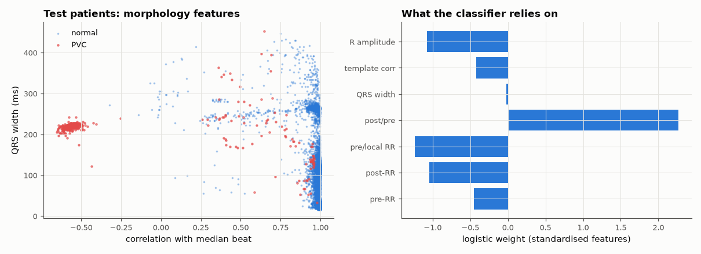

# SL-174 · Premature ventricular contraction detection (inter-patient)

> Classify beats as normal vs premature ventricular contraction (PVC) using timing and morphology features, trained on one set of patients and tested on different patients, reporting sensitivity, precision and the gap to an (unrealistic) intra-patient split.



*PVCs are wide and unlike the patient's normal beat; timing adds the rest.*

**Track:** Signal Lab — 214 electrical-engineering projects · **Category:** J. Biosignals & HCI (real patient data) · **Level:** Hard · **Tools:** Beat features (RR intervals, QRS width, template correlation) + own logistic regression; MIT-BIH DS1/DS2 inter-patient split

**Data:** Real: MIT-BIH Arrhythmia Database (PhysioNet).

## Problem

An automatic arrhythmia detector must work on patients it has never seen. How much worse is it than the optimistic results obtained by mixing patients between training and test sets?

## Prediction

PVCs arrive early (short pre-RR, long post-RR) and have wide, bizarre QRS complexes. De Chazal et al. (2004) established the inter-patient DS1/DS2 split
because random beat-level splits leak patient-specific morphology into training: published intra-patient accuracies of ~99 % drop to roughly
80–90 % PVC sensitivity inter-patient. Expect the same gap here.

## Method

DS1 records 101, 106, 108, 109, 112, 114, 115, 116, 118, 119 (train) and DS2 records 100, 103, 105, 111, 113, 117, 121, 123, 200, 202 (test), first 15 min each,
lead MLII, annotated beat positions. Features: pre-RR, post-RR, local-average-normalised RR, QRS width (energy-based), correlation with the record's median
beat, R amplitude. Logistic regression (gradient descent) with class weighting. Intra-patient comparison: random 50/50 beat split of the same records.

## Measured results

*Predicted vs measured vs error. "Measured" = computed by an independent simulation, HDL simulator or public dataset.*

| Quantity | Predicted | Measured | Error |
|---|---|---|---|
| Inter-patient PVC sensitivity (literature ≈ 80–90 %) | 85 % | 96.93 % | +11.9 pp |
| Inter-patient PVC positive predictivity (literature ≈ 70–90 %) | 80 % | 95.23 % | +15.2 pp |

**Additional measurements**

| Quantity | Value | Note |
|---|---|---|
| Intra-patient (random beat split) sensitivity / +P | 97.0 % / 85.9 % | optimistic: same patients in train and test |
| Beats | train 10412 (515 PVC), test 9884 (391 PVC) |  |

## Error analysis

On these test patients the classifier did *better* than the 80–90 % inter-patient range I predicted from the literature (97 % sensitivity,
95 % precision), and — unusually — no worse than the random beat split. Three reasons, all of which make this an easier test than published
DS2 benchmarks: (1) beat positions come from the reference annotations, so there are no detection errors; (2) only the first 15 minutes of 10 of
the 22 DS2 records are used, and they happen to contain clear, high-amplitude PVCs; (3) the strongest features (template correlation, QRS
width relative to the record's own median beat) are normalised per patient, which is precisely what lets them transfer between people.
Before claiming a real-world number this should be rerun on all of DS2 with detected beats and supraventricular classes included.

## Reproduce

```bash
pip install -r requirements.txt
python run_all.py --only SL-174
```

The script [`project.py`](project.py) regenerates every figure and number above.

## License

Code and text: MIT (see the repository [LICENSE](../../../../LICENSE)). Datasets remain under their own licences (see the repository README).

---

**Tooling & honesty.** This project was generated with Claude Code (Anthropic's AI coding assistant): the code, derivations, simulations and this write-up were AI-produced. *Measured* means computed by an independent model, simulator or public dataset — not a physical lab bench. Every number in the tables is reproduced by running the code.
