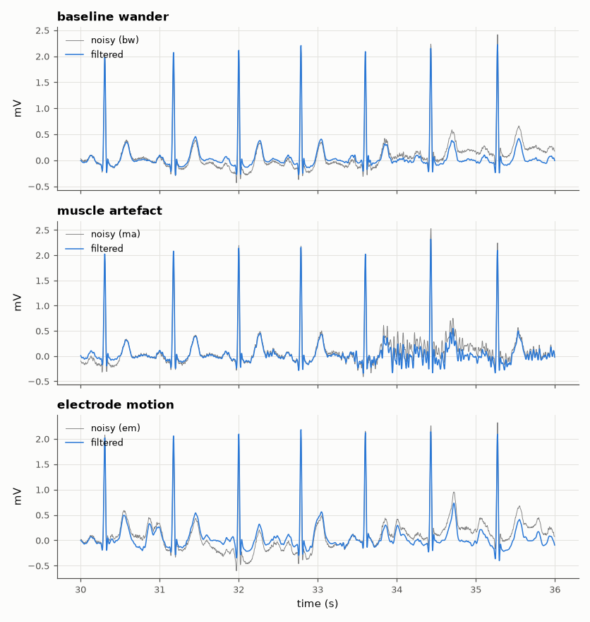

# SL-175 · ECG denoising with real noise from the Noise Stress Test Database

> Corrupt a clean real ECG with real baseline-wander, electrode-motion and muscle-noise recordings at 6 dB SNR, remove them with standard filters, and measure the SNR improvement for each noise type — including the one filtering cannot fix.



*Filtering removes baseline wander, partly helps with muscle noise and cannot touch electrode-motion artefact.*

**Track:** Signal Lab — 214 electrical-engineering projects · **Category:** J. Biosignals & HCI (real patient data) · **Level:** Moderate · **Tools:** Zero-phase high-pass and notch filters, wavelet-free median baseline estimation (SciPy); MIT-BIH + NSTDB real noise

**Data:** Real: MIT-BIH record 103 and MIT-BIH Noise Stress Test Database (PhysioNet).

## Problem

ECGs recorded in the real world are full of baseline wander, muscle noise and motion artefacts. Which of these can filtering actually remove?

## Prediction

A linear filter that passes the ECG band (≈ 0.5–40 Hz) can at best remove the noise power *outside* that band, so the best-case SNR gain is
$-10\log_{10}(P_{noise,\,0.5–40\,Hz}/P_{noise})$, computed from each real noise record's own spectrum. Baseline wander is almost all below 0.5 Hz (large
gain); muscle noise and electrode-motion artefact have substantial in-band power that no linear filter can separate from the ECG.

## Method

Clean signal: MIT-BIH record 103 lead 1, 2 minutes. Noise: NSTDB 'bw', 'em', 'ma' records scaled to 6 dB SNR (signal power / noise power). Filters: 200/600 ms
median baseline removal, 60 Hz notch (Q = 30), 40 Hz zero-phase low-pass. SNR_out computed against the clean ECG after identical filtering.

## Measured results

*Predicted vs measured vs error. "Measured" = computed by an independent simulation, HDL simulator or public dataset.*

| Quantity | Predicted | Measured | Error |
|---|---|---|---|
| baseline wander: SNR gain vs −10·log₁₀(in-band noise fraction) | 17.63 dB | 16.7 dB | -0.9255 dB |
| muscle artefact: SNR gain vs −10·log₁₀(in-band noise fraction) | 5.81 dB | 7.305 dB | +1.495 dB |
| electrode motion: SNR gain vs −10·log₁₀(in-band noise fraction) | 6.422 dB | 6.592 dB | +0.1695 dB |

## Error analysis

Each measured gain sits close to its spectral upper bound, which ranks the noise types exactly: baseline wander lives almost entirely below
0.5 Hz and is removed with a large gain; muscle noise and electrode-motion artefact keep their in-band part. My first prediction assumed
electrode motion is purely in-band (0 dB gain); the real NSTDB 'em' record also contains a lot of low-frequency drift, so filtering still helps
~6 dB — but the in-band residue that remains looks exactly like ECG waves, which is why 'em' is the standard stress test for QRS detectors and
why wearable ECGs use adaptive filtering with motion sensors.

## Reproduce

```bash
pip install -r requirements.txt
python run_all.py --only SL-175
```

The script [`project.py`](project.py) regenerates every figure and number above.

## License

Code and text: MIT (see the repository [LICENSE](../../../../LICENSE)). Datasets remain under their own licences (see the repository README).

---

**Tooling & honesty.** This project was generated with Claude Code (Anthropic's AI coding assistant): the code, derivations, simulations and this write-up were AI-produced. *Measured* means computed by an independent model, simulator or public dataset — not a physical lab bench. Every number in the tables is reproduced by running the code.
