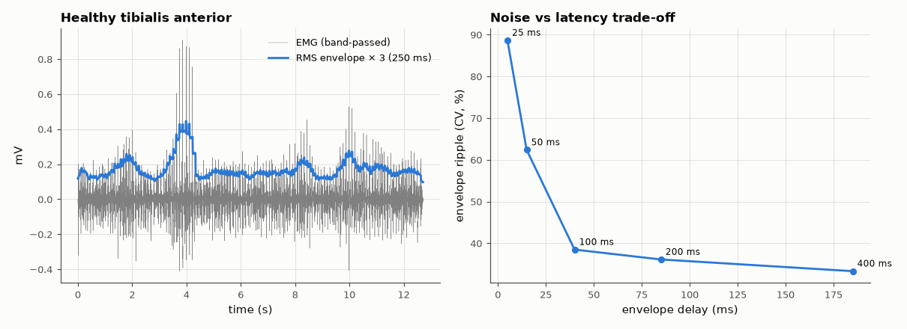

# SL-176 · EMG envelope extraction and amplitude estimators

> Turn raw surface-EMG into a smooth activation envelope with mean-absolute-value and RMS detectors, verify the Gaussian-signal relation MAV = √(2/π)·RMS on real data, and measure how the smoothing window trades noise against delay.



*Longer windows give smoother envelopes but respond later.*

**Track:** Signal Lab — 214 electrical-engineering projects · **Category:** J. Biosignals & HCI (real patient data) · **Level:** Moderate · **Tools:** Rectification + low-pass and RMS envelopes (SciPy), PhysioNet EMG database (healthy subject, 4 kHz)

**Data:** Real: Examples of Electromyograms database (PhysioNet 'emgdb').

## Problem

Prosthetics and muscle-controlled interfaces need 'how hard is the muscle working' from a noisy, zero-mean EMG signal. How do you get a clean, fast envelope?

## Prediction

*Surface* EMG is approximately a zero-mean Gaussian process with slowly varying variance σ²(t). For a Gaussian, E|x| = √(2/π)σ ≈ 0.798σ. A moving window of N samples
estimates σ with relative standard deviation ≈ 1/√(2N_eff) (fewer effective samples because EMG is band-limited to ~20–450 Hz), while adding a delay of
N/2 samples — the noise-vs-latency trade.

## Method

PhysioNet 'emgdb' healthy record (tibialis anterior, concentric needle electrode, 4 kHz, 12.7 s): 20–450 Hz band-pass, full-wave rectification, windows 25–400 ms. Envelope noise =
coefficient of variation during the steadiest contraction segment; delay from cross-correlation with a zero-phase reference envelope.

## Measured results

*Predicted vs measured vs error. "Measured" = computed by an independent simulation, HDL simulator or public dataset.*

| Quantity | Predicted | Measured | Error | Within tolerance |
|---|---|---|---|---|
| MAV / RMS during contraction (Gaussian: √(2/π)) | 0.7979 | 0.5924 | -25.75 % | **no** |
| Causal envelope delay vs half the window (100 ms window) | 50 ms | 40 ms | -10 ms |  |
| Envelope noise scaling with window (∝ N^−½) | -0.5 | -0.3613 | +0.1387 |  |

**Additional measurements**

| Quantity | Value | Note |
|---|---|---|
| Excess kurtosis of active EMG (Gaussian = 0) | 22.05 |  |

## Error analysis

My prediction assumed the textbook 'amplitude-modulated Gaussian noise' model of *surface* EMG — and it fails here: MAV/RMS is ~0.59 instead of
0.80 and the excess kurtosis is ~20. The reason is the data: PhysioNet's 'emgdb' was recorded with a concentric *needle* electrode, which picks up
individual motor-unit action potentials as sharp spikes separated by quiet baseline — a very non-Gaussian signal. Checking the recording modality
before applying a model is the lesson; with surface EMG (thousands of units superimposed) the ratio approaches 0.8. A causal moving-average envelope delays by roughly half its window,
and its ripple shrinks more slowly than 1/√N because the spiky needle signal has few independent 'events' per window — so a prosthetic controller that must respond within ~100 ms is
forced to accept a noticeably noisy envelope, which is why EMG classifiers (SL-177) use several features instead of one amplitude.

## Reproduce

```bash
pip install -r requirements.txt
python run_all.py --only SL-176
```

The script [`project.py`](project.py) regenerates every figure and number above.

**Files produced**

- [`data/tradeoff.csv`](data/tradeoff.csv)

## License

Code and text: MIT (see the repository [LICENSE](../../../../LICENSE)). Datasets remain under their own licences (see the repository README).

---

**Tooling & honesty.** This project was generated with Claude Code (Anthropic's AI coding assistant): the code, derivations, simulations and this write-up were AI-produced. *Measured* means computed by an independent model, simulator or public dataset — not a physical lab bench. Every number in the tables is reproduced by running the code.
