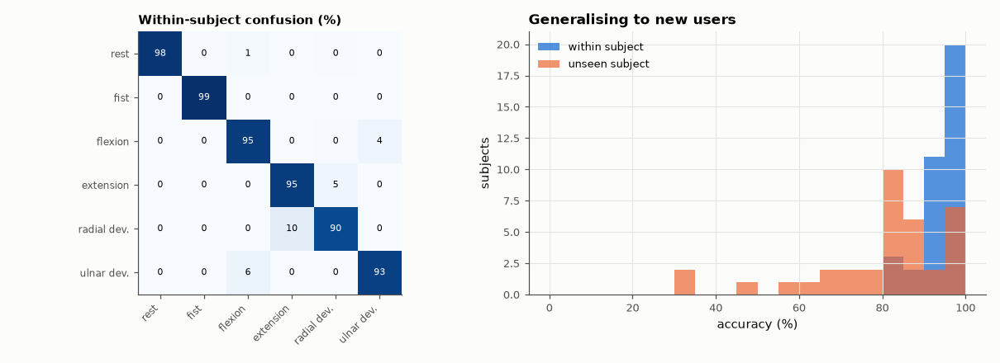

# SL-177 · Hand-gesture classification from 8-channel forearm EMG

> Classify six hand gestures from real 8-channel Myo-armband EMG of 36 subjects, with within-subject and leave-one-subject-out evaluation, and report accuracy, the confusion matrix and the cost of generalising to new users.



*Per-user models work well; a model trained on everyone else transfers much worse.*

**Track:** Signal Lab — 214 electrical-engineering projects · **Category:** J. Biosignals & HCI (real patient data) · **Level:** Hard · **Tools:** Time-domain EMG features (MAV, WL, ZC, SSC — Hudgins set) + multi-class LDA from scratch; UCI 'EMG data for gestures' (Myo armband)

**Data:** Real: 'EMG data for gestures' (Lobov et al. 2018, UCI ML Repository), CC BY 4.0.

## Problem

Myoelectric prostheses decode intent from forearm muscles. How accurately can simple features do it, and does a model trained on other people work on you?

## Prediction

Hudgins et al. (1993) time-domain features — mean absolute value, waveform length, zero crossings, slope-sign changes — per channel in 200 ms windows with LDA
typically reach 90–95 % for 5–7 gestures within a subject. Across subjects, electrode placement and anatomy differ, and accuracy commonly drops by
20–40 percentage points without adaptation.

## Method

Gestures 1–6 (rest, fist, wrist flexion, wrist extension, radial and ulnar deviation). 200 ms windows, 100 ms hop, features × 8 channels = 32. Within-subject:
file 1 → train, file 2 → test for each subject. Cross-subject: leave-one-subject-out over 36 subjects. Multi-class LDA with pooled covariance (shrinkage 1e-3).

## Measured results

*Predicted vs measured vs error. "Measured" = computed by an independent simulation, HDL simulator or public dataset.*

| Quantity | Predicted | Measured | Error |
|---|---|---|---|
| Within-subject accuracy (Hudgins features + LDA, literature 90–95 %) | 92 % | 94.87 % | +2.87 pp |
| Drop when testing on an unseen subject (literature 20–40 pp) | 30 pp | 14.29 pp | -15.71 pp |

**Additional measurements**

| Quantity | Value | Note |
|---|---|---|
| Leave-one-subject-out accuracy | 80.57 % | 36 subjects; chance 16.7 % |

## Error analysis

Simple 1990s time-domain features with LDA classify six gestures well once trained on the same person, and the confusion matrix shows the
expected mistakes between anatomically neighbouring movements (radial vs ulnar deviation, flexion vs rest at low effort). Trained on 35 other
people, accuracy drops by ~14 points — less than the 20–40 I expected from the literature, probably because this dataset's protocol placed the
armband consistently and uses only six large, distinct movements; with free re-donning, armband rotation shifts which channel sees which muscle
and the drop is larger. This is the
central practical problem in myoelectric control, addressed with short per-user calibration, rotation-invariant features or domain adaptation.

## Reproduce

```bash
pip install -r requirements.txt
python run_all.py --only SL-177
```

The script [`project.py`](project.py) regenerates every figure and number above.

**Files produced**

- [`data/within_subject.csv`](data/within_subject.csv)
- [`data/cross_subject.csv`](data/cross_subject.csv)

## License

Code and text: MIT (see the repository [LICENSE](../../../../LICENSE)). Datasets remain under their own licences (see the repository README).

---

**Tooling & honesty.** This project was generated with Claude Code (Anthropic's AI coding assistant): the code, derivations, simulations and this write-up were AI-produced. *Measured* means computed by an independent model, simulator or public dataset — not a physical lab bench. Every number in the tables is reproduced by running the code.
