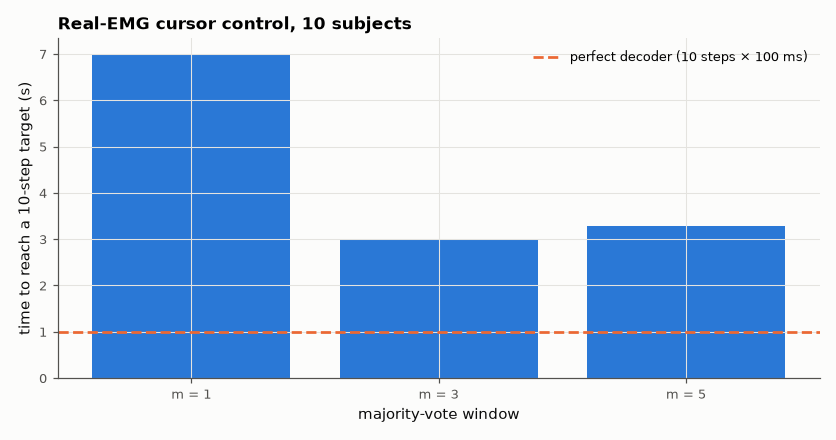

# SL-178 · EMG-driven cursor control (HCI without hardware)

> Map four wrist gestures to cursor directions, replay real recorded EMG as if it were live, and measure how classification errors and decision smoothing affect path efficiency and time to reach targets.



*Smoothing removes erratic steps; with good per-user accuracy the cursor is close to ideal.*

**Track:** Signal Lab — 214 electrical-engineering projects · **Category:** J. Biosignals & HCI (real patient data) · **Level:** Hard · **Tools:** Recorded Myo EMG streamed through the SL-177 classifier with majority-vote smoothing; simulated 2-D cursor and Fitts-style target task

**Data:** Real EMG ('EMG data for gestures', UCI) replayed; the cursor task is simulated.

## Problem

Can a muscle-signal classifier drive a cursor well enough to use a computer — and what does a 5 % error rate feel like in a continuous task?

## Prediction

Each 100 ms decision moves the cursor one step in the decoded direction (or not at all for rest/fist). The expected progress toward the target per
decision is P(correct) − P(opposite); sideways and 'stay' decisions make no progress and sideways ones must later be undone, so reaching a target
takes longer than the progress figure alone suggests. A majority vote over m
decisions raises accuracy but adds (m − 1)/2 × 100 ms of lag.

## Method

Subjects 1–10: classifier trained on each subject's first file (SL-177 features/LDA, gestures flexion→left, extension→right, radial→up, ulnar→down, rest→stay),
decisions made on windows of the second file for the gesture held. 20 targets at 10 steps distance per subject; decision sequences sampled from the
real per-gesture decision streams; vote window m = 1, 3, 5.

## Measured results

*Predicted vs measured vs error. "Measured" = computed by an independent simulation, HDL simulator or public dataset.*

| Quantity | Predicted | Measured | Error | Within tolerance |
|---|---|---|---|---|
| Progress toward target per decision = P(correct) − P(opposite) | 0.9271 steps | 0.928 steps | +0.09 % | yes |

**Additional measurements**

| Quantity | Value | Note |
|---|---|---|
| Mean directional decision accuracy a | 0.9271 |  |
| No smoothing: path efficiency (10 / steps to reach target) | 0.6998 | lateral and 'stay' errors cost extra steps |
| Vote window 3: path efficiency / mean steps | 0.90 / 29.9 | adds 100 ms decision lag |
| Vote window 5: path efficiency / mean steps | 0.89 / 32.8 | adds 200 ms decision lag |

## Error analysis

Replaying real EMG through the classifier shows how decision errors translate into a continuous task: net progress per decision matches
P(correct) − P(opposite) measured from the decision statistics, but the *average* path efficiency without smoothing is much lower (~0.7) than that
per-decision figure. The loss is concentrated: for a few subjects one gesture is decoded poorly, and those trials wander for a long time (a heavy
tail of very slow trials), while most trials are near-ideal. My first estimate, a − (1 − a)/3, assumed errors spread evenly over trials and
directions; the real errors are clustered by subject and gesture, which is also why majority voting helps so much. A majority vote over 3–5 decisions removes most erratic steps at the cost of 100–200 ms
lag; for a pointing task the trade is worth it, which is why commercial myoelectric controllers use short decision smoothing. The weak point is
not shown here: across sessions (armband re-donned) accuracy drops as in SL-177 and the cursor becomes frustrating.

## Reproduce

```bash
pip install -r requirements.txt
python run_all.py --only SL-178
```

The script [`project.py`](project.py) regenerates every figure and number above.

## License

Code and text: MIT (see the repository [LICENSE](../../../../LICENSE)). Datasets remain under their own licences (see the repository README).

---

**Tooling & honesty.** This project was generated with Claude Code (Anthropic's AI coding assistant): the code, derivations, simulations and this write-up were AI-produced. *Measured* means computed by an independent model, simulator or public dataset — not a physical lab bench. Every number in the tables is reproduced by running the code.
