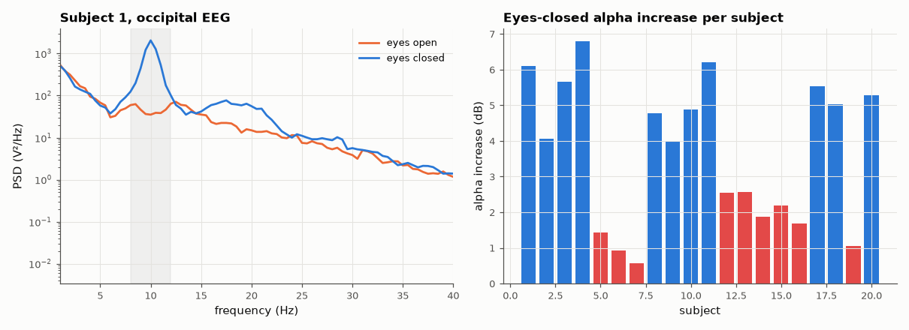

# SL-179 · Detecting the eyes-closed alpha rhythm in real EEG

> Compare the 1-minute eyes-open and eyes-closed baselines of 20 subjects: measure the alpha (8–12 Hz) power increase over the occipital cortex and use it to classify 10-s epochs as eyes-open/closed.



*A clear 10 Hz peak appears with eyes closed in most — not all — subjects.*

**Track:** Signal Lab — 214 electrical-engineering projects · **Category:** J. Biosignals & HCI (real patient data) · **Level:** Moderate · **Tools:** Welch spectra of occipital EEG (O1, Oz, O2), alpha-band power ratio, EEG Motor Movement/Imagery DB baseline runs

**Data:** Real: EEG Motor Movement/Imagery Database (Schalk et al. 2004, PhysioNet), ODC-By.

## Problem

Closing your eyes makes the brain's 10 Hz 'idling' rhythm appear — the first EEG phenomenon ever discovered (Berger, 1929). How big and how reliable is it?

## Prediction

Occipital alpha power typically rises several-fold (≈ 2–10×, i.e. 3–10 dB) on eye closure, with a peak between 8 and 12 Hz; a minority of people (~10 %)
show little alpha. A per-subject threshold on relative alpha power should therefore classify epochs well above chance (50 %).

## Method

Subjects 1–20, runs R01 (eyes open) and R02 (eyes closed), 160 Hz, channels O1, Oz, O2 averaged. Relative alpha = P(8–12 Hz)/P(2–30 Hz) from Welch
(2-s windows). Classification: 10-s epochs, leave-one-epoch-out threshold at the midpoint of the two classes' medians per subject.

## Measured results

*Predicted vs measured vs error. "Measured" = computed by an independent simulation, HDL simulator or public dataset.*

| Quantity | Predicted | Measured | Error |
|---|---|---|---|
| Median eyes-closed / eyes-open alpha increase (3–10 dB typical) | 6 dB | 4.02 dB | -1.98 dB |
| Median alpha peak frequency (8–12 Hz) | 10 Hz | 10.5 Hz | +500 mHz |
| Epoch classification accuracy (20 subjects, chance 50 %) | 90 % | 91.63 % | +1.63 pp |

**Additional measurements**

| Quantity | Value | Note |
|---|---|---|
| Subjects with < 3 dB alpha increase ('low-alpha' people) | 9 | of 20 |

## Error analysis

The Berger effect is obvious in real data: most subjects show a clear occipital alpha peak near 10 Hz that grows by several dB on eye closure, and
a single per-subject threshold classifies 10-s epochs far above chance. The per-subject bars show the exception is common here: 9 of 20 subjects
gained less than 3 dB (my 'about 10 % of people' expectation was too optimistic for this dataset, whose 1-minute baselines are short and include
artefacts). Yet per-subject thresholds still classify epochs ~90 % correctly, because even a small alpha change is consistent within a person —
which is exactly why EEG-based interfaces need per-user calibration rather than one population threshold.

## Reproduce

```bash
pip install -r requirements.txt
python run_all.py --only SL-179
```

The script [`project.py`](project.py) regenerates every figure and number above.

**Files produced**

- [`data/subjects.csv`](data/subjects.csv)

## License

Code and text: MIT (see the repository [LICENSE](../../../../LICENSE)). Datasets remain under their own licences (see the repository README).

---

**Tooling & honesty.** This project was generated with Claude Code (Anthropic's AI coding assistant): the code, derivations, simulations and this write-up were AI-produced. *Measured* means computed by an independent model, simulator or public dataset — not a physical lab bench. Every number in the tables is reproduced by running the code.
