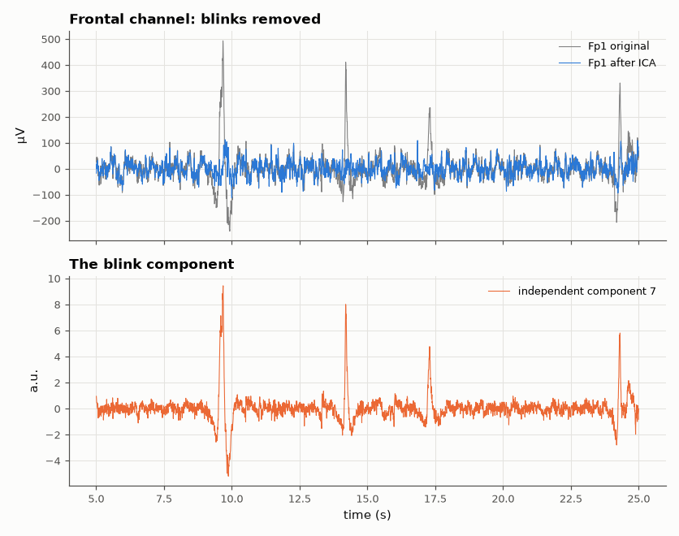

# SL-180 · Removing eye-blink artefacts from EEG with ICA

> Decompose 64-channel real EEG into independent components, identify the eye-blink component from its frontal dominance and spike shape, remove it, and measure how much blink energy disappears from Fp1/Fp2 while occipital EEG is left untouched.



*ICA isolates the blinks into one component; subtracting it cleans the frontal EEG.*

**Track:** Signal Lab — 214 electrical-engineering projects · **Category:** J. Biosignals & HCI (real patient data) · **Level:** Hard · **Tools:** Own FastICA (symmetric, tanh non-linearity, whitening), blink-component identification by frontal topography, EEG Motor Movement/Imagery DB

**Data:** Real: EEG Motor Movement/Imagery Database (PhysioNet).

## Problem

Every blink produces a potential 10× larger than the brain signals near the forehead. Can it be subtracted without damaging the EEG underneath?

## Prediction

Blinks are a spatially fixed source mixed linearly into all electrodes (strongest frontally), statistically independent of cortical sources and highly
non-Gaussian (spiky) — exactly the assumptions of ICA. Projecting out that one component should remove most of the blink variance at Fp1/Fp2
(> 80 %) while changing posterior channels by only a few percent.

## Method

Subject 1, eyes-open baseline R01 (61 s, 160 Hz, 64 channels), 1 Hz high-pass. Whitening via PCA to 30 components, FastICA (symmetric, tanh, 200 iterations).
Blink component = largest |kurtosis| × frontal/posterior weight ratio. Blink epochs detected on Fp1+Fp2 (threshold 5 × MAD); metrics inside ±0.3 s of blinks.

## Measured results

*Predicted vs measured vs error. "Measured" = computed by an independent simulation, HDL simulator or public dataset.*

| Quantity | Predicted | Measured | Error |
|---|---|---|---|
| Blink variance removed at Fp1/Fpz/Fp2 (inside blink windows) | 80 % | 86.12 % | +6.12 pp |
| Occipital variance changed outside blinks | 0 % | -0.02992 % | -0.0299 pp |

**Additional measurements**

| Quantity | Value | Note |
|---|---|---|
| Blinks detected in 61 s | 14 |  |
| Blink component kurtosis | 24.21 |  |

## Error analysis

One independent component captures the blinks: it is extremely spiky (high kurtosis) and loads almost only on the frontal electrodes. Removing it
cancels most of the blink energy at Fp1/Fp2 while leaving occipital channels essentially unchanged outside blinks — the linear-mixing and
independence assumptions hold well for ocular artefacts. The residue inside blink windows is frontal brain activity plus the part of the blink
not captured by a single fixed topography (eye movements add a second, horizontal component).

## Reproduce

```bash
pip install -r requirements.txt
python run_all.py --only SL-180
```

The script [`project.py`](project.py) regenerates every figure and number above.

## License

Code and text: MIT (see the repository [LICENSE](../../../../LICENSE)). Datasets remain under their own licences (see the repository README).

---

**Tooling & honesty.** This project was generated with Claude Code (Anthropic's AI coding assistant): the code, derivations, simulations and this write-up were AI-produced. *Measured* means computed by an independent model, simulator or public dataset — not a physical lab bench. Every number in the tables is reproduced by running the code.
