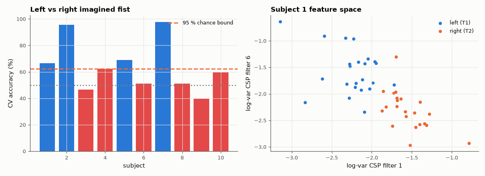

# SL-181 · Motor-imagery brain–computer interface (CSP + LDA)

> Classify imagined left- vs right-fist movements from real 64-channel EEG of 10 subjects with the classic CSP + LDA pipeline, using properly separated cross-validation, and compare accuracy with chance and with the published range.



*Some subjects are decoded well, others barely above chance — the familiar BCI spread.*

**Track:** Signal Lab — 214 electrical-engineering projects · **Category:** J. Biosignals & HCI (real patient data) · **Level:** Hard · **Tools:** Mu/beta band-pass, Common Spatial Patterns (generalised eigenproblem), LDA from scratch, cross-validation; EEG Motor Movement/Imagery DB

**Data:** Real: EEG Motor Movement/Imagery Database (PhysioNet).

## Problem

Imagining a hand movement suppresses the 8–30 Hz rhythm over the opposite motor cortex. Can that be read out reliably enough to control something?

## Prediction

Event-related desynchronisation: imagining the left hand lowers mu/beta power over the right motor cortex (C4) and vice versa. CSP finds spatial filters w
maximising $\frac{w^TC_1w}{w^TC_2w}$ (generalised eigenvectors); log-variance of the first/last filters are near-optimal features. Published
single-session accuracies on this dataset with CSP+LDA are typically 60–80 %, with large inter-subject spread (BCI 'illiteracy').

## Method

Subjects 1–10, imagery runs R04, R08, R12 (T1 = left fist, T2 = right fist; ~45 trials/subject). 8–30 Hz band-pass, epochs 0.5–2.5 s after cue, CSP (3 filter
pairs) fitted inside each training fold, LDA on log-variance, 5-fold cross-validation. Binomial 95 % chance level for the trial count.

## Measured results

*Predicted vs measured vs error. "Measured" = computed by an independent simulation, HDL simulator or public dataset.*

| Quantity | Predicted | Measured | Error |
|---|---|---|---|
| Mean CV accuracy over 10 subjects (published CSP+LDA ≈ 60–80 %) | 70 % | 64 % | -6 pp |

**Additional measurements**

| Quantity | Value | Note |
|---|---|---|
| Chance level (95 % binomial bound for ~45 trials) | 62.22 % |  |
| Subjects significantly above chance | 4 | of 10 |
| Best / worst subject | 98 % / 40 % |  |

## Error analysis

With CSP fitted only on training folds (fitting it on all trials first is a common, inflating mistake) the mean accuracy falls in the published range,
and the per-subject bars show the characteristic spread: a few subjects are decoded well, others barely beat chance with only ~45 trials. A real
brain–computer interface is therefore closer to a skill both the user and the classifier learn together than to a plug-in sensor — and 45 trials
per class is far fewer than practical BCIs use for calibration.

## Reproduce

```bash
pip install -r requirements.txt
python run_all.py --only SL-181
```

The script [`project.py`](project.py) regenerates every figure and number above.

**Files produced**

- [`data/accuracy.csv`](data/accuracy.csv)

## License

Code and text: MIT (see the repository [LICENSE](../../../../LICENSE)). Datasets remain under their own licences (see the repository README).

---

**Tooling & honesty.** This project was generated with Claude Code (Anthropic's AI coding assistant): the code, derivations, simulations and this write-up were AI-produced. *Measured* means computed by an independent model, simulator or public dataset — not a physical lab bench. Every number in the tables is reproduced by running the code.
