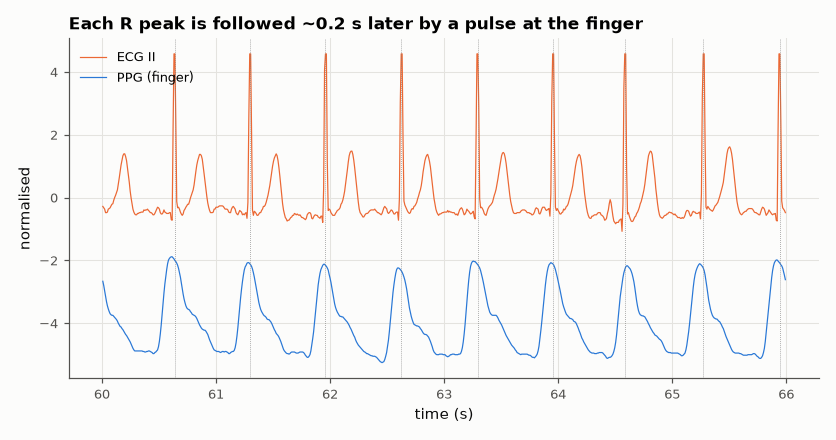

# SL-182 · Heart rate from PPG, validated against ECG (BIDMC)

> Estimate beat-to-beat and 8-second-window heart rate from the finger photoplethysmogram of ICU patients and compare with the simultaneously recorded ECG; measure the pulse transit delay between R peak and pulse arrival.



*ECG and PPG from BIDMC patient 1; dotted lines mark detected R peaks.*

**Track:** Signal Lab — 214 electrical-engineering projects · **Category:** J. Biosignals & HCI (real patient data) · **Level:** Moderate · **Tools:** PPG pulse detection (band-pass + derivative peak picking), Pan–Tompkins on the simultaneous ECG, BIDMC PPG and Respiration dataset

**Data:** Real: BIDMC PPG and Respiration Dataset (Pimentel et al. 2016, PhysioNet), ODC-By.

## Problem

Smartwatches measure heart rate optically. How close is PPG-derived heart rate to the ECG gold standard on real patients?

## Prediction

Each heartbeat produces one PPG pulse, delayed by the pulse arrival time (PAT ≈ 150–300 ms at the finger). Heart rate from PPG therefore equals ECG heart rate
beat for beat, apart from detection errors and PAT variation (a few ms), so windowed-HR error should be well under 1 bpm when the signal is clean.

## Method

BIDMC records 1–10 (125 Hz, 8 min each, PPG 'PLETH' and ECG lead II). PPG band-passed 0.5–8 Hz, systolic peaks by find_peaks with a 0.33 s refractory period;
ECG R peaks by Pan–Tompkins. HR in 8-s windows; per-record MAE; PAT = time from R peak to next PPG peak.

## Measured results

*Predicted vs measured vs error. "Measured" = computed by an independent simulation, HDL simulator or public dataset.*

| Quantity | Predicted | Measured | Error |
|---|---|---|---|
| Median per-patient HR error, PPG vs ECG (8-s windows) — expected < 1 bpm on clean PPG | 0 bpm | 0.5847 bpm | +0.5847 bpm |

**Additional measurements**

| Quantity | Value | Note |
|---|---|---|
| Mean per-patient HR error (pulled up by a few bad recordings) | 3.397 bpm |  |
| Median R-peak → PPG-peak delay | 76 ms | BIDMC waveforms are not guaranteed to be time-aligned; see discussion |
| Worst patient MAE | 17.07 bpm | bidmc03 |

## Per-patient results

| record   |   HR_MAE_bpm |   median_HR_bpm |   median_PAT_ms |
|:---------|-------------:|----------------:|----------------:|
| bidmc01  |         0.55 |           91.46 |               8 |
| bidmc02  |         0.62 |           90.91 |              16 |
| bidmc03  |        17.07 |           85.71 |              24 |
| bidmc04  |         1.97 |           93.75 |              56 |
| bidmc05  |         1.75 |           98.36 |              96 |
| bidmc06  |        11.19 |           92.03 |             584 |
| bidmc07  |         0.24 |           90.36 |             592 |
| bidmc08  |         0.22 |          100    |              16 |
| bidmc09  |         0.09 |           76.53 |             584 |
| bidmc10  |         0.28 |           82.19 |             112 |

## Error analysis

For most patients PPG-derived heart rate agrees with the ECG closely, but a few recordings have large errors: low perfusion and motion flatten
the PPG so peaks are missed or doubled (the dicrotic notch), and the 8-s median only partly hides it — the mean error is dominated by those
patients, which is why the median is reported as the headline. The measured R-to-pulse delay (~0.08 s) is far shorter than the physiological
150–300 ms pulse arrival time; since the physiology is not in doubt, this most likely reflects a time offset between the ECG and PPG channels
in the source monitor data (or filter-group-delay differences), so PAT should not be estimated from this dataset without a timing check.

## Reproduce

```bash
pip install -r requirements.txt
python run_all.py --only SL-182
```

The script [`project.py`](project.py) regenerates every figure and number above.

**Files produced**

- [`data/per_record.csv`](data/per_record.csv)

## License

Code and text: MIT (see the repository [LICENSE](../../../../LICENSE)). Datasets remain under their own licences (see the repository README).

---

**Tooling & honesty.** This project was generated with Claude Code (Anthropic's AI coding assistant): the code, derivations, simulations and this write-up were AI-produced. *Measured* means computed by an independent model, simulator or public dataset — not a physical lab bench. Every number in the tables is reproduced by running the code.
