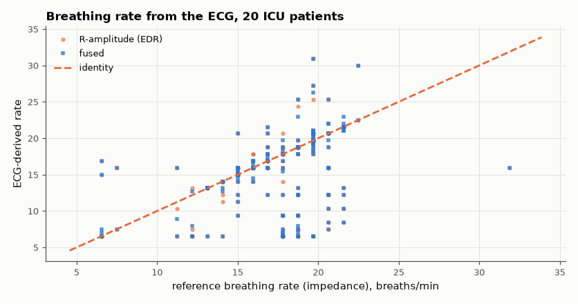

# SL-183 · Respiration rate derived from the ECG (EDR)

> Estimate breathing rate from the ECG alone — using how breathing modulates R-peak amplitude and heart rate — and validate it against the impedance-pneumography respiration signal recorded simultaneously in ICU patients.



*Most windows land on the identity line; outliers come from irregular breathing and ventilated patients.*

**Track:** Signal Lab — 214 electrical-engineering projects · **Category:** J. Biosignals & HCI (real patient data) · **Level:** Hard · **Tools:** R-peak amplitude and RR-interval modulation (respiratory sinus arrhythmia), spectral rate estimation, BIDMC reference respiration

**Data:** Real: BIDMC PPG and Respiration Dataset (PhysioNet).

## Problem

Can a single ECG lead also tell you how fast someone is breathing?

## Prediction

Breathing rotates the heart's electrical axis and changes thoracic impedance, modulating R-peak amplitude (EDR), and vagal tone modulates RR intervals
(respiratory sinus arrhythmia). Both modulations are sampled once per beat, so for heart rate HR and breathing rate BR estimation needs HR/2 > BR
(beat-sampling Nyquist); the modulation frequency = breathing rate.

## Method

BIDMC records 1–20 (8 min, 125 Hz). R peaks by Pan–Tompkins; amplitude and RR series resampled to 4 Hz; spectral peak in 0.1–0.7 Hz over 64-s windows; fused
estimate = the mean of the two where they agree within 3 breaths/min. Reference: spectral peak of the RESP signal in the same windows.

## Measured results

*Predicted vs measured vs error. "Measured" = computed by an independent simulation, HDL simulator or public dataset.*

| Quantity | Predicted | Measured | Error |
|---|---|---|---|
| EDR (R-amplitude) respiration-rate MAE | 0 breaths/min | 2.146 breaths/min | +2.146 breaths/min |
| RSA (RR-interval) respiration-rate MAE | 0 breaths/min | 5.552 breaths/min | +5.552 breaths/min |
| Fused estimate MAE | 0 breaths/min | 2.193 breaths/min | +2.193 breaths/min |

**Additional measurements**

| Quantity | Value | Note |
|---|---|---|
| Windows within ±2 breaths/min (fused) | 76.06 % |  |

## Error analysis

R-peak amplitude modulation recovers breathing rate for most windows; RSA is weaker in these (mostly elderly, sedated or ventilated) ICU patients,
whose vagal modulation of heart rate is blunted — the opposite of healthy young subjects, where RSA is the stronger cue. Combining the two only
when they agree trims the gross errors. Beat-to-beat sampling sets a hard limit: at 60 bpm the ECG samples breathing only 1×/s, so fast
breathing (> 30/min) aliases — a limitation no algorithm can remove.

## Reproduce

```bash
pip install -r requirements.txt
python run_all.py --only SL-183
```

The script [`project.py`](project.py) regenerates every figure and number above.

**Files produced**

- [`data/windows.csv`](data/windows.csv)

## License

Code and text: MIT (see the repository [LICENSE](../../../../LICENSE)). Datasets remain under their own licences (see the repository README).

---

**Tooling & honesty.** This project was generated with Claude Code (Anthropic's AI coding assistant): the code, derivations, simulations and this write-up were AI-produced. *Measured* means computed by an independent model, simulator or public dataset — not a physical lab bench. Every number in the tables is reproduced by running the code.
