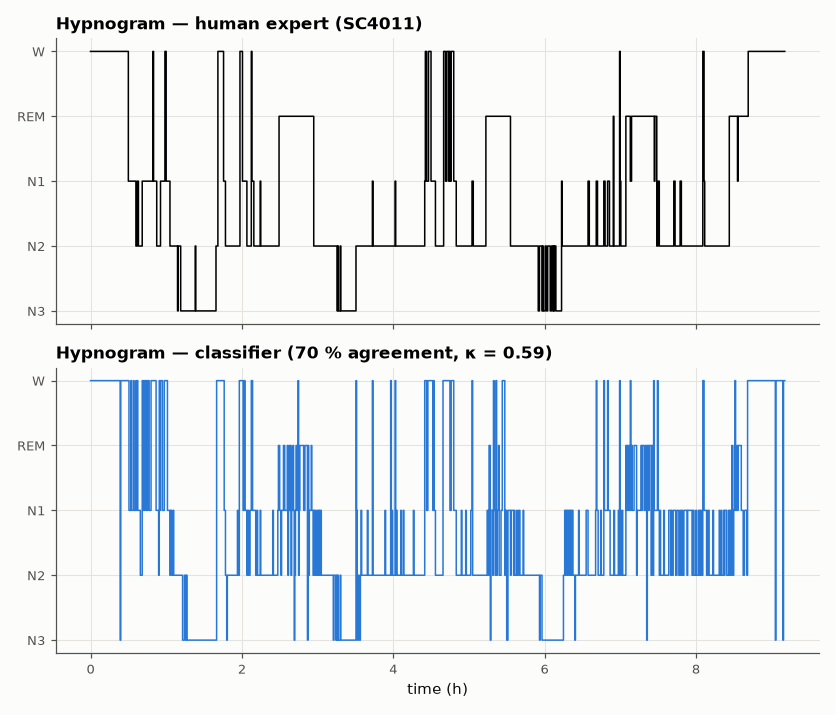

# SL-184 · Sleep-stage scoring from EEG (Sleep-EDF)

> Score Wake, N1, N2, N3 and REM on whole-night recordings using band powers of the Fpz-Cz and Pz-Oz EEG, EOG and chin EMG; train on one night, test on a different subject's night, and compare with human inter-scorer agreement.



*The classifier reproduces the night's architecture; errors cluster in N1 and at stage transitions.*

**Track:** Signal Lab — 214 electrical-engineering projects · **Category:** J. Biosignals & HCI (real patient data) · **Level:** Hard · **Tools:** 30-s epoch spectral features (δ, θ, α, σ, β band powers, EOG & EMG power) + softmax classifier; Sleep-EDF Expanded cassette recordings

**Data:** Real: Sleep-EDF Database Expanded (Kemp et al. 2000, PhysioNet), ODC-By.

## Problem

Sleep technicians label every 30 s of a night by eye. How far does a simple spectral classifier get toward that?

## Prediction

N3 = slow waves (δ 0.5–4 Hz) dominate; N2 = spindles (σ 12–15 Hz) and K-complexes; REM = mixed-frequency EEG with rapid eye movements and low chin EMG;
Wake = α/β with high EMG; N1 = transitional (hardest). Human scorers agree on ~80 % of epochs (κ ≈ 0.75); simple feature-based classifiers typically
reach 70–80 % on unseen subjects, with N1 the worst class.

## Method

Train: SC4001 night 1; test: SC4011 night 1 (different subject). Epochs from 30 min before sleep onset to 30 min after the last sleep epoch. Features: log relative
band powers of both EEG channels (Welch, 4-s segments), EOG power 0.5–5 Hz, EMG (1 Hz envelope channel) mean; standardised; softmax regression with
class weighting. Accuracy, per-class recall and Cohen's κ.

## Measured results

*Predicted vs measured vs error. "Measured" = computed by an independent simulation, HDL simulator or public dataset.*

| Quantity | Predicted | Measured | Error |
|---|---|---|---|
| Accuracy on an unseen subject's night (simple classifiers: 70–80 %) | 75 % | 70.15 % | -4.85 pp |
| Cohen's κ (human inter-scorer ≈ 0.75) | 0.75 | 0.5872 | -0.1628 |

**Additional measurements**

| Quantity | Value | Note |
|---|---|---|
| Recall W | 98.08 % | 156 epochs |
| Recall N1 | 55.96 % | 109 epochs |
| Recall N2 | 72.78 % | 562 epochs |
| Recall N3 | 91.43 % | 105 epochs |
| Recall REM | 31.76 % | 170 epochs |

## Error analysis

Trained on one night and tested on another person, band powers alone recover the sleep architecture — sleep onset, cycles of N2/N3 and REM — with
70 % agreement (κ = 0.59) — at the low end of my 70–80 % guess and well below human κ ≈ 0.75. Wake and N3 are recognised well; the worst
class is REM (recall ≈ 32 %), not N1 as I expected: REM EEG looks spectrally like N1/light N2, and the features that define REM — bursts of
rapid eye movements and chin-muscle atonia — are poorly captured by a 30-s EOG power and a single EMG level that varies between subjects (training on
one person's EMG scale and testing on another's hurts). N1 (≈ 56 %) is also weak, as for human scorers. Deep-learning sleep scorers gain mostly by using context from
neighbouring epochs, since stage transitions follow strong sequential rules the per-epoch classifier ignores.

## Reproduce

```bash
pip install -r requirements.txt
python run_all.py --only SL-184
```

The script [`project.py`](project.py) regenerates every figure and number above.

**Files produced**

- [`data/confusion.csv`](data/confusion.csv)

## License

Code and text: MIT (see the repository [LICENSE](../../../../LICENSE)). Datasets remain under their own licences (see the repository README).

---

**Tooling & honesty.** This project was generated with Claude Code (Anthropic's AI coding assistant): the code, derivations, simulations and this write-up were AI-produced. *Measured* means computed by an independent model, simulator or public dataset — not a physical lab bench. Every number in the tables is reproduced by running the code.
